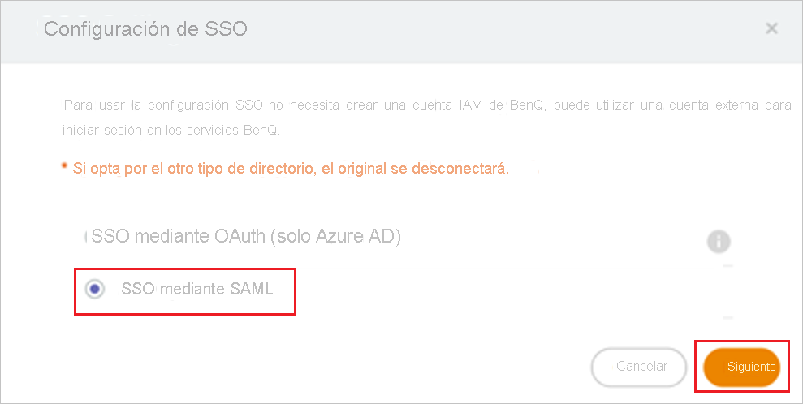
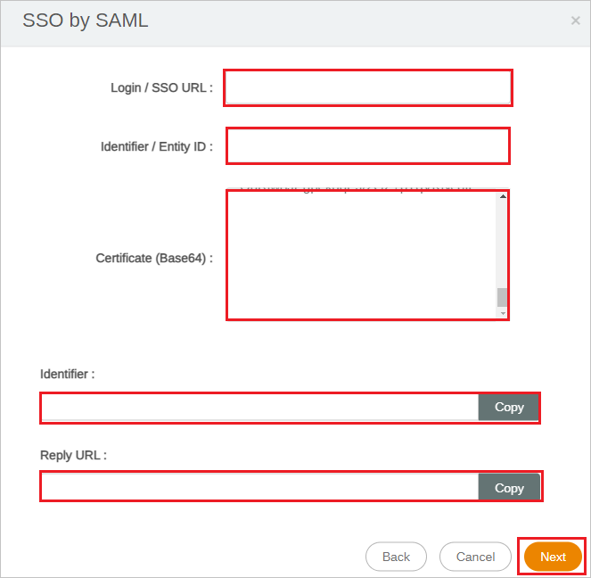

# Tutorial: Integración del inicio de sesión único de Azure AD con BenQ IAM

En este tutorial, aprenderá a integrar BenQ IAM con Azure Active Directory (Azure AD). Al integrar BenQ IAM con Azure AD, puede hacer lo siguiente:

* Controlar en Azure AD quién tiene acceso a BenQ IAM.
* Permitir que los usuarios inicien sesión automáticamente en BenQ IAM con sus cuentas de Azure AD.
* Administrar las cuentas desde una ubicación central (Azure Portal).

## Requisitos previos

Para empezar, necesita los siguientes elementos:

* Una suscripción de Azure AD. Si no tiene una suscripción, puede crear una [cuenta gratuita](https://azure.microsoft.com/free/).
* Suscripción habilitada para el inicio de sesión único (SSO) en BenQ IAM.

## Descripción del escenario

En este tutorial, va a configurar y probar el inicio de sesión único de Azure AD en un entorno de prueba.

* BenQ IAM admite el inicio de sesión único iniciado por **SP e IDP**

## Adición de BenQ IAM desde la galería

Para configurar la integración de BenQ IAM en Azure AD, tendrá que agregarlo desde la galería a la lista de aplicaciones SaaS administradas.

1. Inicie sesión en Azure Portal con una cuenta personal, profesional o educativa de Microsoft.
1. En el panel de navegación de la izquierda, seleccione el servicio **Azure Active Directory**.
1. Vaya a **Aplicaciones empresariales** y seleccione **Todas las aplicaciones**.
1. Para agregar una nueva aplicación, seleccione **Nueva aplicación**.
1. En la sección **Agregar desde la galería**, escriba en el cuadro de búsqueda.
1. Seleccione **BenQ IAM** en el panel de resultados y agregue la aplicación. Espere unos segundos mientras la aplicación se agrega al inquilino.

## Configuración y prueba del inicio de sesión único de Azure AD para BenQ IAM

Configure y pruebe el inicio de sesión único de Azure AD con BenQ IAM mediante un usuario de prueba llamado **B.Simon**. Para que el inicio de sesión único funcione, es necesario establecer una relación de vinculación entre un usuario de Azure AD y el usuario relacionado de BenQ IAM.

Para configurar y probar el inicio de sesión único de Azure AD con BenQ IAM, haga lo siguiente:

1. **[Configuración del inicio de sesión único de Azure AD](#configure-azure-ad-sso)** , para permitir que los usuarios puedan utilizar esta característica.
    1. **[Creación de un usuario de prueba de Azure AD](#create-an-azure-ad-test-user)**, para probar el inicio de sesión único de Azure AD con B.Simon.
    1. **[Asignación del usuario de prueba de Azure AD](#assign-the-azure-ad-test-user)** , para habilitar a B.Simon para que use el inicio de sesión único de Azure AD.
1. **[Configuración del inicio de sesión único en BenQ IAM](#configure-benq-iam-sso)** : para configurar los valores de inicio de sesión único en la aplicación.
    1. **[Creación de un usuario de prueba en BenQ IAM](#create-benq-iam-test-user)**: para tener un homólogo de B.Simon en BenQ IAM vinculado a la representación del usuario en Azure AD.
1. **[Prueba del inicio de sesión único](#test-sso)** : para comprobar si la configuración funciona.

## Configuración del inicio de sesión único de Azure AD

Siga estos pasos para habilitar el inicio de sesión único de Azure AD en Azure Portal.

1. En Azure Portal, en la página de integración de la aplicación **BenQ IAM**, busque la sección **Administrar** y seleccione **Inicio de sesión único**.
1. En la página **Seleccione un método de inicio de sesión único**, elija **SAML**.
1. En la página **Configuración del inicio de sesión único con SAML**, haga clic en el icono de lápiz de **Configuración básica de SAML** para editar la configuración.

   

1. En la sección **Configuración básica de SAML**, si desea configurar la aplicación en modo iniciado por **IDP**, realice los siguientes pasos:

    a. En el cuadro de texto **Identificador**, escriba una dirección URL con el patrón siguiente: `https://service-portal.benq.com/saml/init/<ID>`

    b. En el cuadro de texto **URL de respuesta**, escriba una dirección URL con el siguiente patrón: `https://service-portal.benq.com/saml/consume/<ID>`

1. Haga clic en **Establecer direcciones URL adicionales** y siga este paso si desea configurar la aplicación en el modo iniciado por **SP**:

    En el cuadro de texto **URL de inicio de sesión**, escriba la dirección URL: `https://service-portal.benq.com/login`

    > [!NOTE]
    > Estos valores no son reales. Actualice estos valores con el identificador y la URL de respuesta reales. Póngase en contacto con el [equipo de soporte técnico de BenQ IAM](mailto:benqcare.us@benq.com) para obtener estos valores. También puede hacer referencia a los patrones que se muestran en la sección **Configuración básica de SAML** de Azure Portal.

1. La aplicación BenQ IAM espera las aserciones de SAML en un formato específico, lo que requiere que se agreguen asignaciones de atributos personalizados a la configuración de los atributos del token SAML. La siguiente captura de muestra la lista de atributos predeterminados.

    

1. Además de lo anterior, la aplicación BenQ IAM espera que se devuelvan algunos atributos más, que se muestran a continuación, en la respuesta de SAML. Estos atributos también se rellenan previamente, pero puede revisarlos según sus requisitos.
    
    | Nombre | Atributo de origen |
    | ------| --------- |
    | DisplayName | user.displayname |
    | externalId | user.objectid |

1. En la página **Configurar el inicio de sesión único con SAML**, en la sección **Certificado de firma de SAML**, busque **Certificado (Base64)** y seleccione **Descargar** para descargarlo y guardarlo en el equipo.

    

1. En la sección **Configurar BenQ IAM**, copie las direcciones URL que necesite.

    

### Creación de un usuario de prueba de Azure AD

En esta sección, va a crear un usuario de prueba llamado B.Simon en Azure Portal.

1. En el panel izquierdo de Azure Portal, seleccione **Azure Active Directory**, **Usuarios** y **Todos los usuarios**.
1. Seleccione **Nuevo usuario** en la parte superior de la pantalla.
1. En las propiedades del **usuario**, siga estos pasos:
   1. En el campo **Nombre**, escriba `B.Simon`.  
   1. En el campo **Nombre de usuario**, escriba username@companydomain.extension. Por ejemplo, `B.Simon@contoso.com`.
   1. Active la casilla **Show password** (Mostrar contraseña) y, después, anote el valor que se muestra en el cuadro **Contraseña**.
   1. Haga clic en **Crear**.

### Asignación del usuario de prueba de Azure AD

En esta sección, va a permitir que B.Simon acceda a BenQ IAM mediante el inicio de sesión único de Azure.

1. En Azure Portal, seleccione sucesivamente **Aplicaciones empresariales** y **Todas las aplicaciones**.
1. En la lista de aplicaciones, seleccione **BenQ IAM**.
1. En la página de información general de la aplicación, busque la sección **Administrar** y seleccione **Usuarios y grupos**.
1. Seleccione **Agregar usuario**. A continuación, en el cuadro de diálogo **Agregar asignación**, seleccione **Usuarios y grupos**.
1. En el cuadro de diálogo **Usuarios y grupos**, seleccione **B.Simon** de la lista de usuarios y haga clic en el botón **Seleccionar** de la parte inferior de la pantalla.
1. Si espera que se asigne un rol a los usuarios, puede seleccionarlo en la lista desplegable **Seleccionar un rol**. Si no se ha configurado ningún rol para esta aplicación, verá seleccionado el rol "Acceso predeterminado".
1. En el cuadro de diálogo **Agregar asignación**, haga clic en el botón **Asignar**.

## Configuración del inicio de sesión único de BenQ IAM

1. Inicie sesión en BenQ IAM con la cuenta de administrador de BenQ y haga clic en **SSO Setting** (Configuración de SSO) en la sección Account Management (Administración de cuentas).

    

1. Seleccione **SSO by SAML** (SSO mediante SAML) como configuración de SSO en el menú emergente y haga clic en **Next** (Siguiente).

    

1. Realice los siguientes pasos en la página **SSO Setting** (Configuración de SSO).

    

    a. En el cuadro de texto **Login/SSO URL** (Inicio de sesión/Dirección URL de inicio de sesión único), pegue el valor de **URL de inicio de sesión** que copió de Azure Portal.

    b. En el cuadro de texto **Identifier/Entity ID** (Identificador/Id. de entidad), pegue el valor de **Identificador** que ha copiado de Azure Portal.

    c. En el Bloc de notas abra el archivo del **certificado (Base64)** que descargó de Azure Portal, copie el contenido y péguelo en el cuadro de texto **Certificate(Base64)** (Certificado [Base64]).

    d. Copie el valor de **Identifier** (Identificador) y péguelo en el cuadro de texto **Identificador** de la sección **Configuración básica de SAML** en Azure Portal.

    e. Copie el valor de la **dirección URL de respuesta** y péguelo en el cuadro de texto **Dirección URL de respuesta**, en la sección **Configuración básica de SAML** de Azure Portal.

    f. Haga clic en **Next**.

### Creación de un usuario de prueba de BenQ IAM

En esta sección, creará un usuario llamado Britta Simon en BenQ IAM. Trabaje con el [equipo de soporte técnico de BenQ IAM](mailto:benqcare.us@benq.com) para agregar los usuarios a la plataforma de BenQ IAM. Los usuarios se tienen que crear y activar antes de usar el inicio de sesión único.

## Prueba de SSO

En esta sección, probará la configuración de inicio de sesión único de Azure AD con las siguientes opciones. 

#### Iniciado por SP:

* Haga clic en **Probar esta aplicación** en Azure Portal. Esta acción le redirigirá a la dirección URL de inicio de sesión de BenQ IAM, donde puede iniciar el flujo de inicio de sesión.  

* Vaya directamente a la dirección URL de inicio de sesión de BenQ IAM y comience el flujo de inicio de sesión desde allí.

#### Iniciado por IDP:

* En Azure Portal, haga clic en **Probar esta aplicación**. Al hacerlo, debería iniciar sesión automáticamente en la instancia de BenQ IAM en la que configuró el inicio de sesión único. 

También puede usar Aplicaciones de Microsoft para probar la aplicación en cualquier modo. Al hacer clic en el icono de BenQ IAM en Aplicaciones, si se ha configurado en modo SP, se le redirigirá a la página de inicio de sesión de la aplicación para comenzar el flujo de inicio de sesión; y si se ha configurado en modo IDP, se debería iniciar sesión automáticamente en la instancia de BenQ IAM para la que haya configurado el inicio de sesión único. Para más información acerca de Aplicaciones, consulte [Inicio de sesión e inicio de aplicaciones desde el portal Aplicaciones](https://support.microsoft.com/account-billing/sign-in-and-start-apps-from-the-my-apps-portal-2f3b1bae-0e5a-4a86-a33e-876fbd2a4510).

## Pasos siguientes

Una vez que haya configurado BenQ IAM, puede aplicar el control de sesión, que protege a la organización frente a la filtración e infiltración de información confidencial en tiempo real. El control de sesión procede del acceso condicional. [Aprenda a aplicar el control de sesión con Microsoft Defender para aplicaciones en la nube](/cloud-app-security/proxy-deployment-aad).
