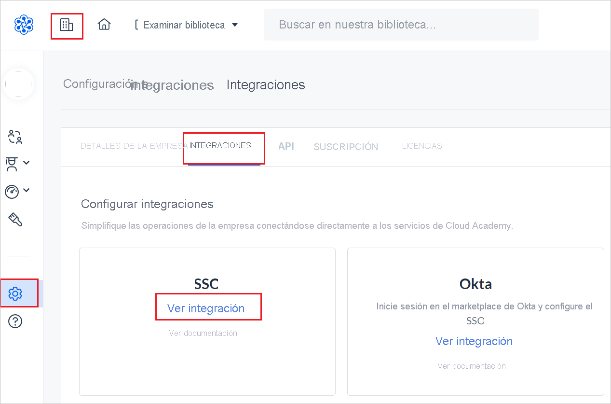
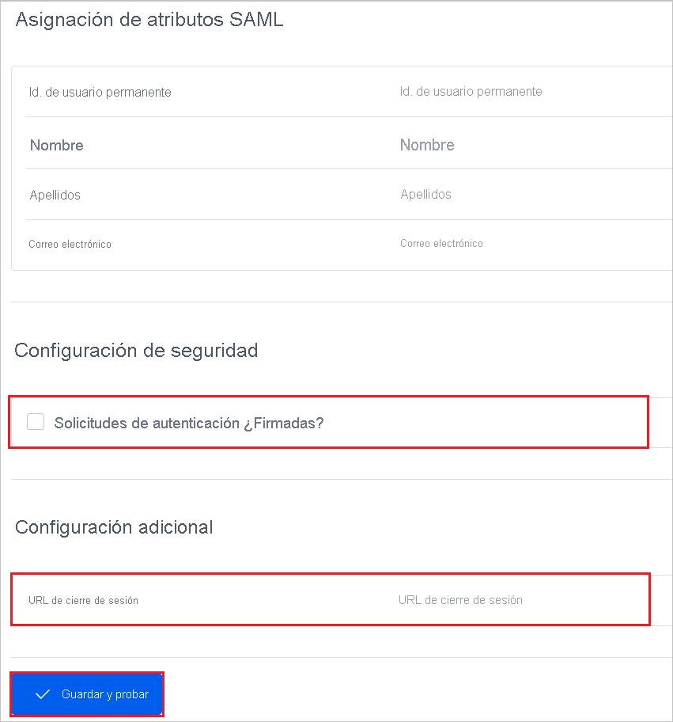

# Tutorial: Integración del inicio de sesión único de Azure Active Directory con Cloud Academy - SSO

En este tutorial aprenderá a integrar Cloud Academy - SSO con Azure Active Directory (Azure AD). Al integrar Cloud Academy - SSO con Azure AD, puede hacer lo siguiente:

* Usar Azure AD para controlar quién puede acceder a Cloud Academy - SSO.
* Permitir que los usuarios inicien sesión automáticamente en Cloud Academy - SSO con sus cuentas de Azure AD.
* Administrar sus cuentas en una ubicación central: Azure Portal.

## Requisitos previos

Para empezar, necesita los siguientes elementos:

* Una suscripción de Azure AD. Si no tiene una suscripción, puede crear una [cuenta gratuita](https://azure.microsoft.com/free/).
* Una suscripción habilitada para el inicio de sesión único (SSO) en Cloud Academy - SSO.

## Descripción del tutorial

En este tutorial, va a configurar y probar el inicio de sesión único de Azure AD en un entorno de prueba.

* Cloud Academy - SSO admite el inicio de sesión único iniciado por **SP**.
* Cloud Academy - SSO admite el aprovisionamiento de usuarios **Just-In-Time**.
* Cloud Academy - SSO admite el [Aprovisionamiento automatizado de usuarios](cloud-academy-sso-provisioning-tutorial.md).

## Adición de Cloud Academy - SSO desde la galería

Para configurar la integración de Cloud Academy - SSO en Azure AD, es preciso agregar Cloud Academy - SSO desde la galería a la lista de aplicaciones SaaS administradas:

1. Inicie sesión en Azure Portal con una cuenta profesional o educativa o con una cuenta Microsoft personal.
1. En el panel izquierdo, seleccione **Azure Active Directory**.
1. Vaya a **Aplicaciones empresariales** y seleccione **Todas las aplicaciones**.
1. Para agregar una aplicación, seleccione **Nueva aplicación**.
1. En la sección **Agregar desde la galería**, escriba **Cloud Academy - SSO** en el cuadro de búsqueda.
1. Seleccione **Cloud Academy - SSO** en el panel de resultados y, a continuación, agregue la aplicación. Espere unos segundos mientras la aplicación se agrega al inquilino.

## Configuración y prueba del inicio de sesión único de Azure AD SSO para Cloud Academy - SSO

Configure y pruebe el inicio de sesión único de Azure AD con Cloud Academy - SSO mediante un usuario de prueba llamado **B.Simon**. Para que el inicio de sesión único funcione, es necesario establecer una relación de vinculación entre un usuario de Azure AD y el usuario correspondiente de Cloud Academy - SSO.

Para configurar y probar el inicio de sesión único de Azure AD con Cloud Academy - SSO, complete los siguientes pasos generales:

1. **[Configuración del inicio de sesión único de Azure AD](#configure-azure-ad-sso)** , para que los usuarios puedan utilizar esta característica.
    1. **[Creación de un usuario de prueba de Azure AD](#create-an-azure-ad-test-user)** para probar el inicio de sesión único de Azure AD.
    1. **[Concesión de acceso al usuario de prueba](#grant-access-to-the-test-user)** , para que el usuario pueda usar el inicio de sesión único de Azure AD.
1. **[Configuración del inicio de sesión único para Cloud Academy - SSO](#configure-single-sign-on-for-cloud-academy)** en la aplicación.
    1. **[Creación de un usuario de prueba de Cloud Academy - SSO](#create-a-cloud-academy-test-user)** como homólogo de la representación del usuario en Azure AD.
1. **[Prueba del inicio de sesión único](#test-sso)** para comprobar que la configuración funciona.

## Configuración del inicio de sesión único de Azure AD

Siga estos pasos para habilitar el inicio de sesión único de Azure AD en Azure Portal:

1. En Azure Portal, en la página de integración de la aplicación **Cloud Academy - SSO**, busque la sección **Administrar** y seleccione **Inicio de sesión único**.
1. En la página **Seleccione un método de inicio de sesión único**, elija **SAML**.
1. En la página **Configuración del inicio de sesión único con SAML**, seleccione el botón de lápiz para **Configuración básica de SAML** para editar la configuración:

   

1. En la sección **Configuración básica de SAML**, siga estos pasos:

    a. En el cuadro de texto **URL de inicio de sesión**, escriba una de las siguientes direcciones URL:
    
    | URL de inicio de sesión |
    |--------------|
    | `https://cloudacademy.com/login/enterprise/` |
    | `https://app.qa.com/login/enterprise/` |
    |
    
    b. En el cuadro de texto **URL de respuesta**, escriba una de las siguientes direcciones URL:
    
    | URL de respuesta |
    |--------------|
    | `https://cloudacademy.com/labs/social/complete/saml/` |
    | `https://app.qa.com/labs/social/complete/saml/` |
    |
1. En la página **Configuración del inicio de sesión único con SAML**, en la sección **Certificado de firma de SAML**, seleccione el botón de copia para copiar la **Dirección URL de metadatos de federación de aplicación**. Guarde la dirección URL.

    

### Creación de un usuario de prueba de Azure AD

En esta sección, se crea un usuario llamado B.Simon en Azure Portal.

1. En el panel izquierdo de Azure Portal, seleccione **Azure Active Directory**. Seleccione **Usuarios** y, a continuación, seleccione **Todos los usuarios**.
1. Seleccione **Nuevo usuario** en la parte superior de la pantalla.
1. En las propiedades de **usuario**, realice estos pasos:
   1. En el cuadro **Nombre**, escriba **B.Simon**.  
   1. En el cuadro **Nombre de usuario**, escriba \<username>@\<companydomain>.\<extension>. Por ejemplo, `B.Simon@contoso.com`.
   1. Seleccione **Mostrar contraseña** y, a continuación, anote el valor que se muestra en el cuadro **Contraseña**.
   1. Seleccione **Crear**.

### Concesión de acceso al usuario de prueba

En esta sección, va a permitir que B.Simon acceda a Cloud Academy - SSO mediante el inicio de sesión único de Azure.

1. En Azure Portal, seleccione **Aplicaciones empresariales** y, a continuación, seleccione **Todas las aplicaciones**.
1. En la lista de aplicaciones, seleccione **Cloud Academy - SSO**.
1. En la sección **Administrar** de la página de información general de la aplicación, seleccione **Usuarios y grupos**:
1. Seleccione **Agregar usuario** y, a continuación, seleccione **Usuarios y grupos** en el cuadro de diálogo **Agregar asignación**:
1. En el cuadro de diálogo **Usuarios y grupos**, seleccione **B.Simon** en la lista **Usuarios** y haga clic en el botón **Seleccionar** en la parte inferior de la pantalla.
1. Si espera que se asigne un rol a los usuarios, puede seleccionarlo en la lista desplegable **Seleccionar un rol**. Si no se ha configurado ningún rol para esta aplicación, verá seleccionado el rol "Acceso predeterminado".
1. En el cuadro de diálogo **Agregar asignación**, seleccione **Asignar**.

## Configuración del inicio de sesión único para Cloud Academy

1. En otra ventana del explorador, inicie sesión en el sitio de la compañía de Cloud Academy - SSO como administrador.

1. En la página principal, haga clic en el icono del **Equipo de integración de Azure** y, a continuación, seleccione **Configuración** en el menú izquierdo.

1. En la pestaña **INTEGRACIONES**, seleccione la tarjeta **SSO**.

    

1. Haga clic en **Comenzar a configurar** para configurar el SSO.

    

1. Complete los siguientes pasos en la página Configuración general:

    

    a. En el cuadro **SSO URL (ubicación)** , pegue la dirección URL de inicio de sesión que copió de Azure Portal.

    c. Abra el certificado Base 64 descargado desde Azure Portal en el Bloc de notas. Pegue su contenido en el cuadro **Certificate** (Certificado).

    d. En el cuadro **Dominios de correo electrónico**, escriba todos los valores de dominio que usa la empresa para los correos electrónicos de usuario.

1. Realice en la página siguiente los pasos que se indican a continuación:

    

    a. En la sección **Asignación de atributos de SAML**, rellene los campos obligatorios con los valores de atributo de origen.

    b. En la sección **Configuración de seguridad**, active la casilla **¿Están las solicitudes de autenticación firmadas?** para establecer este valor en **True**.

    c. En la sección **Configuración adicional (opcional)** , complete el cuadro **Dirección URL de cierre de sesión** con el valor de URL de cierre de sesión que copió de Azure Portal.

1. Haga clic en **Guardar y probar**.

> [!NOTE]
> Para más información sobre cómo configurar Cloud Academy - SSO, consulte [Configuración del inicio de sesión único](https://support.cloudacademy.com/hc/articles/360043908452-Setting-Up-Single-Sign-On).

### Creación de un usuario de prueba de Cloud Academy

En esta sección, se creará un usuario llamado a Britta Simon en Cloud Academy - SSO. Cloud Academy - SSO admite el aprovisionamiento de usuarios Just-In-Time, que está habilitado de forma predeterminada. No hay ningún elemento de acción para usted en esta sección. Si el usuario no existe aún en Cloud Academy SSO, se creará uno después de la autenticación.

Druva también admite el aprovisionamiento automático de usuarios. [Aquí](./cloud-academy-sso-provisioning-tutorial.md) puede encontrar más detalles sobre cómo configurar el aprovisionamiento automático de usuarios.

## Prueba de SSO 

En esta sección, probará la configuración de inicio de sesión único de Azure AD con las siguientes opciones. 

* Haga clic en **Probar esta aplicación** en Azure Portal. Esta acción le redirigirá a la dirección URL de inicio de sesión de Cloud Academy - SSO, desde donde puede poner en marcha el flujo de inicio de sesión. 

* Acceda directamente a la URL de inicio de sesión de Cloud Academy - SSO y ponga en marcha el flujo de inicio de sesión desde ahí.

* Puede usar Mis aplicaciones de Microsoft. Al hacer clic en el icono de Cloud Academy - SSO en Mis aplicaciones, se le redirigirá a la dirección URL de inicio de sesión de la aplicación. Para más información acerca de Aplicaciones, consulte [Inicio de sesión e inicio de aplicaciones desde el portal Aplicaciones](https://support.microsoft.com/account-billing/sign-in-and-start-apps-from-the-my-apps-portal-2f3b1bae-0e5a-4a86-a33e-876fbd2a4510).

## Pasos siguientes

Una vez haya configurado Cloud Academy - SSO, puede aplicar el control de sesión, que protege su organización en tiempo real frente a la filtración e infiltración de información confidencial. El control de sesión procede del acceso condicional. [Aprenda a aplicar el control de sesión con Microsoft Cloud App Security](/cloud-app-security/proxy-deployment-any-app).
