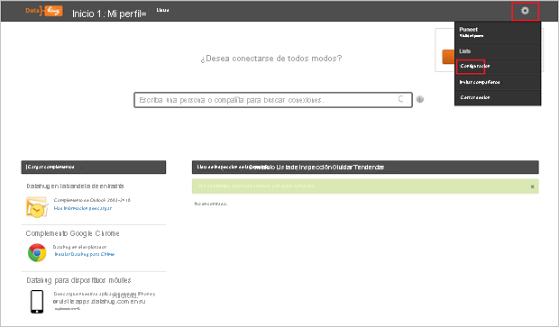
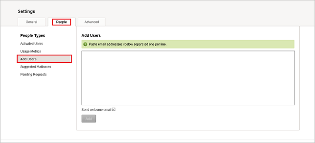

# Tutorial: Integración de Azure Active Directory con Datahug

En este tutorial, obtendrá información sobre cómo integrar Datahug con Azure Active Directory (Azure AD). Al integrar Datahug con Azure AD, puede hacer lo siguiente:

* Controlar en Azure AD quién tiene acceso a Datahug.
* Permitir que los usuarios puedan iniciar sesión automáticamente en Datahug con sus cuentas de Azure AD.
* Administrar las cuentas desde una ubicación central (Azure Portal).

## Requisitos previos

Para empezar, necesita los siguientes elementos:

* Una suscripción de Azure AD. Si no tiene una suscripción, puede crear una [cuenta gratuita](https://azure.microsoft.com/free/).
* Una suscripción habilitada para inicio de sesión único (SSO) en Datahug.

## Descripción del escenario

En este tutorial, puede configurar y probar el inicio de sesión único de Azure AD en un entorno de prueba.

* Datahug admite el inicio de sesión único iniciado por **SP** e **IDP**.

## Adición de Datahug desde la galería

Para configurar la integración de Datahug en Azure AD, deberá agregar Datahug desde la galería a la lista de aplicaciones SaaS administradas.

1. Inicie sesión en Azure Portal con una cuenta personal, profesional o educativa de Microsoft.
1. En el panel de navegación de la izquierda, seleccione el servicio **Azure Active Directory**.
1. Vaya a **Aplicaciones empresariales** y seleccione **Todas las aplicaciones**.
1. Para agregar una nueva aplicación, seleccione **Nueva aplicación**.
1. En la sección **Agregar desde la galería**, escriba **Datahug** en el cuadro de búsqueda.
1. Seleccione **Datahug** en el panel de resultados y, a continuación, agregue la aplicación. Espere unos segundos mientras la aplicación se agrega al inquilino.

## Configuración y prueba del inicio de sesión único de Azure AD para Datahug

Configure y pruebe el inicio de sesión único de Azure AD con Datahug mediante un usuario de prueba llamado **B.Simon**. Para que el inicio de sesión único funcione, es preciso establecer una relación de vinculación entre un usuario de Azure AD y el usuario correspondiente de Datahug.

Para configurar y probar el inicio de sesión único de Azure AD con Datahug, realice los siguientes pasos:

1. **[Configuración del inicio de sesión único de Azure AD](#configure-azure-ad-sso)** , para permitir que los usuarios puedan utilizar esta característica.
    1. **[Creación de un usuario de prueba de Azure AD](#create-an-azure-ad-test-user)**, para probar el inicio de sesión único de Azure AD con B.Simon.
    1. **[Asignación del usuario de prueba de Azure AD](#assign-the-azure-ad-test-user)** , para habilitar a B.Simon para que use el inicio de sesión único de Azure AD.
1. **[Configuración del inicio de sesión único en Datahug](#configure-datahug-sso)** : para configurar los valores de inicio de sesión único en la aplicación.
    1. **[Creación de un usuario de prueba en Datahug](#create-datahug-test-user)** : para tener un homólogo de B.Simon en Datahug que esté vinculado a la representación del usuario de Azure AD.
1. **[Prueba del inicio de sesión único](#test-sso)** : para comprobar si la configuración funciona.

## Configuración del inicio de sesión único de Azure AD

Siga estos pasos para habilitar el inicio de sesión único de Azure AD en Azure Portal.

1. En Azure Portal, en la página de integración de la aplicación **Datahug**, busque la sección **Administrar** y seleccione **Inicio de sesión único**.
1. En la página **Seleccione un método de inicio de sesión único**, elija **SAML**.
1. En la página **Configuración del inicio de sesión único con SAML**, haga clic en el icono de lápiz de **Configuración básica de SAML** para editar la configuración.

   

4. En la sección **Configuración básica de SAML**, si desea configurar la aplicación en el modo iniciado por **IDP** siga estos pasos:

    a. En el cuadro de texto **Identificador**, escriba una dirección URL con el patrón siguiente: `https://apps.datahug.com/identity/<uniqueID>`

    b. En el cuadro de texto **URL de respuesta**, escriba una dirección URL con el siguiente patrón: `https://apps.datahug.com/identity/<uniqueID>/acs`

5. Haga clic en **Establecer direcciones URL adicionales** y siga este paso si desea configurar la aplicación en el modo iniciado por **SP**:

    En el cuadro de texto **URL de inicio de sesión**, escriba la dirección URL: `https://apps.datahug.com/`

    > [!NOTE]
    > Estos valores no son reales. Actualice estos valores con el identificador y la URL de respuesta reales. Póngase en contacto con el [equipo de soporte técnico de Datahug](https://www.sap.com/corporate/en/company/office-locations.html) para obtener estos valores. También puede hacer referencia a los patrones que se muestran en la sección **Configuración básica de SAML** de Azure Portal.

6. En la página **Configurar el inicio de sesión único con SAML**, en la sección **Certificado de firma de SAML**, haga clic en **Descargar** para descargar el **XML de metadatos de federación** de las opciones proporcionadas según sus requisitos y guárdelo en el equipo.

    

7. En la sección **Certificado de firma de SAML**, haga clic en el botón **Editar** para abrir el cuadro de diálogo **Certificado de firma de SAML** y realice los pasos siguientes.

    

    a. Seleccione **Firmar aserción SAML** en **Opción de firmar**.

    b. Seleccione **SHA-1** en **Algoritmo de firma**.
    
    c. Haga clic en **Save**(Guardar).

8. En la sección **Set up Datahug** (Configurar Datahug), copie las direcciones URL adecuadas según sus necesidades.

    

### Creación de un usuario de prueba de Azure AD 

En esta sección, va a crear un usuario de prueba llamado B.Simon en Azure Portal.

1. En el panel izquierdo de Azure Portal, seleccione **Azure Active Directory**, **Usuarios** y **Todos los usuarios**.
1. Seleccione **Nuevo usuario** en la parte superior de la pantalla.
1. En las propiedades del **usuario**, siga estos pasos:
   1. En el campo **Nombre**, escriba `B.Simon`.  
   1. En el campo **Nombre de usuario**, escriba username@companydomain.extension. Por ejemplo, `B.Simon@contoso.com`.
   1. Active la casilla **Show password** (Mostrar contraseña) y, después, anote el valor que se muestra en el cuadro **Contraseña**.
   1. Haga clic en **Crear**.

### Asignación del usuario de prueba de Azure AD

En esta sección, va a permitir que B.Simon acceda a Datahug mediante el inicio de sesión único de Azure.

1. En Azure Portal, seleccione sucesivamente **Aplicaciones empresariales** y **Todas las aplicaciones**.
1. En la lista de aplicaciones, seleccione **Datahug**.
1. En la página de información general de la aplicación, busque la sección **Administrar** y seleccione **Usuarios y grupos**.
1. Seleccione **Agregar usuario**. A continuación, en el cuadro de diálogo **Agregar asignación**, seleccione **Usuarios y grupos**.
1. En el cuadro de diálogo **Usuarios y grupos**, seleccione **B.Simon** de la lista de usuarios y haga clic en el botón **Seleccionar** de la parte inferior de la pantalla.
1. Si espera que se asigne un rol a los usuarios, puede seleccionarlo en la lista desplegable **Seleccionar un rol**. Si no se ha configurado ningún rol para esta aplicación, verá seleccionado el rol "Acceso predeterminado".
1. En el cuadro de diálogo **Agregar asignación**, haga clic en el botón **Asignar**.

## Configuración del inicio de sesión único de Datahug

Para configurar el inicio de sesión único en **Datahug**, es preciso enviar el **XML de metadatos de federación** descargado y las direcciones URL apropiadas copiadas de Azure Portal al [equipo de soporte técnico de Datahug](https://www.sap.com/corporate/en/company/office-locations.html). Dicho equipo lo configura para establecer la conexión de SSO de SAML correctamente en ambos lados.

### Creación de un usuario de prueba en Datahug

Para permitir que los usuarios de Azure AD inicien sesión en Datahug, tienen que aprovisionarse en Datahug.  
En Datahug, el aprovisionamiento es una tarea manual.

**Para aprovisionar una cuenta de usuario, realice estos pasos:**

1. Inicie sesión en su sitio de la compañía de Datahug como administrador.

2. Mantenga el puntero sobre el **engranaje** de la esquina superior derecha y haga clic en **Settings** (Configuración).
   
    

3. Seleccione **People** (Personas) y haga clic en la pestaña **Add Users** (Agregar usuarios).

    

4. Escriba la dirección de correo electrónico de la persona para quien quiere crear una cuenta y haga clic en **Agregar**.

    

    > [!NOTE] 
    > Puede enviar un correo electrónico de registro seleccionando la casilla de verificación **Send welcome email** (Enviar mensaje de correo de bienvenida).  
    > Si está creando una cuenta para Salesforce, no envíe el mensaje de correo de bienvenida.

## Prueba de SSO

En esta sección, probará la configuración de inicio de sesión único de Azure AD con las siguientes opciones. 

#### Iniciado por SP:

* Haga clic en **Probar esta aplicación** en Azure Portal. Esto le redirigirá a la dirección URL de inicio de sesión de Datahug, donde puede iniciar el flujo de inicio de sesión.  

* Vaya directamente a la dirección URL de inicio de sesión de Datahug e inicie el flujo de inicio de sesión desde allí.

#### Iniciado por IDP:

* Haga clic en **Probar esta aplicación** en Azure Portal; debería iniciar sesión automáticamente en la instancia de Datahug para la que ha configurado el inicio de sesión único. 

También puede usar Aplicaciones de Microsoft para probar la aplicación en cualquier modo. Al hacer clic en el icono de Datahug en Aplicaciones, si se ha configurado en modo SP, se le redirigirá a la página de inicio de sesión de la aplicación para comenzar el flujo de inicio de sesión; y si se ha configurado en modo IDP, se debería iniciar sesión automáticamente en la instancia de Datahug para la que ha configurado el inicio de sesión único. Para más información acerca de Aplicaciones, consulte [Inicio de sesión e inicio de aplicaciones desde el portal Aplicaciones](https://support.microsoft.com/account-billing/sign-in-and-start-apps-from-the-my-apps-portal-2f3b1bae-0e5a-4a86-a33e-876fbd2a4510).

## Pasos siguientes

Una vez configurado Datahug, puede aplicar el control de sesión, que protege la filtración e infiltración de la información confidencial de la organización en tiempo real. El control de sesión procede del acceso condicional. [Aprenda a aplicar el control de sesión con las aplicaciones de Microsoft Defender para la nube](/cloud-app-security/proxy-deployment-aad).
