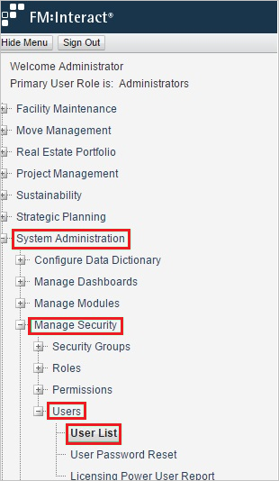
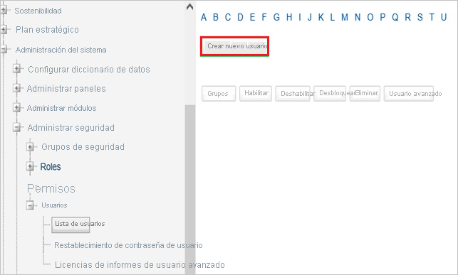
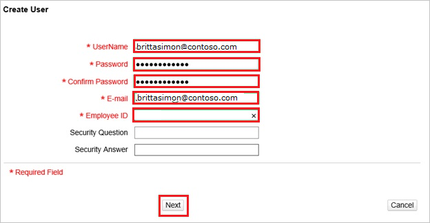

# Tutorial: Integración del inicio de sesión único de Azure AD con FM:Systems

En este tutorial, aprenderá a integrar FM:Systems con Azure Active Directory (Azure AD). Al integrar FM:Systems con Azure AD, puede hacer lo siguiente:

* Controlar en Azure AD quién tiene acceso a FM:Systems.
* Permitir que los usuarios inicien sesión automáticamente en FM:Systems con sus cuentas de Azure AD.
* Administrar las cuentas desde una ubicación central (Azure Portal).

## Requisitos previos

Para configurar la integración de Azure AD con FM:Systems se necesitan los siguientes elementos:

* Una suscripción de Azure AD. Si no dispone de un entorno de Azure AD, puede obtener [una cuenta gratuita](https://azure.microsoft.com/free/).
* Una suscripción habilitada para el inicio de sesión único en FM:Systems.

## Descripción del escenario

En este tutorial, puede configurar y probar el inicio de sesión único de Azure AD en un entorno de prueba.

* FM:Systems admite el inicio de sesión único iniciado por **IDP**.

> [!NOTE]
> El identificador de esta aplicación es un valor de cadena fijo, por lo que solo se puede configurar una instancia en un inquilino.

## Adición de FM:Systems desde la galería

Para configurar la integración de FM:Systems en Azure AD, es preciso agregar FM:Systems desde la galería a la lista de aplicaciones SaaS administradas.

1. Inicie sesión en Azure Portal con una cuenta personal, profesional o educativa de Microsoft.
1. En el panel de navegación de la izquierda, seleccione el servicio **Azure Active Directory**.
1. Vaya a **Aplicaciones empresariales** y seleccione **Todas las aplicaciones**.
1. Para agregar una nueva aplicación, seleccione **Nueva aplicación**.
1. En la sección **Agregar desde la galería**, escriba **FM:Systems** en el cuadro de búsqueda.
1. Seleccione **FM:Systems** en el panel de resultados y agregue la aplicación. Espere unos segundos mientras la aplicación se agrega al inquilino.

## Configuración y prueba del inicio de sesión único de Azure AD para FM:Systems

Configure y pruebe el inicio de sesión único de Azure AD con FM:Systems mediante un usuario de prueba llamado **B.Simon**. Para que el inicio de sesión único funcione, es preciso establecer una relación de vinculación entre un usuario de Azure AD y el usuario correspondiente de FM:Systems.

Para configurar y probar el inicio de sesión único de Azure AD con FM:Systems, siga estos pasos:

1. **[Configuración del inicio de sesión único de Azure AD](#configure-azure-ad-sso)** , para permitir que los usuarios puedan utilizar esta característica.
    1. **[Creación de un usuario de prueba de Azure AD](#create-an-azure-ad-test-user)**, para probar el inicio de sesión único de Azure AD con B.Simon.
    1. **[Asignación del usuario de prueba de Azure AD](#assign-the-azure-ad-test-user)** , para habilitar a B.Simon para que use el inicio de sesión único de Azure AD.
1. **[Configuración del inicio de sesión único en FM:Systems](#configure-fmsystems-sso)** , para configurar los valores de inicio de sesión único en la aplicación.
    1. **[Creación del usuario de prueba en FM:Systems](#create-fmsystems-test-user)** : para tener un homólogo de B.Simon en FM:Systems vinculado a la representación del usuario en Azure AD.
1. **[Prueba del inicio de sesión único](#test-sso)** : para comprobar si la configuración funciona.

## Configuración del inicio de sesión único de Azure AD

Siga estos pasos para habilitar el inicio de sesión único de Azure AD en Azure Portal.

1. En Azure Portal, en la página de integración de la aplicación **FM:Systems**, busque la sección **Administrar** y seleccione **Inicio de sesión único**.
1. En la página **Seleccione un método de inicio de sesión único**, elija **SAML**.
1. En la página **Configuración del inicio de sesión único con SAML**, haga clic en el icono de lápiz de **Configuración básica de SAML** para editar la configuración.

   

4. En la sección **Configuración básica de SAML**, siga estos pasos:

    En el cuadro de texto **URL de respuesta**, escriba una dirección URL con el siguiente patrón: `https://<companyname>.fmshosted.com/fminteract/ConsumerService2.aspx`
    
    > [!NOTE]
    > Este valor no es real. Actualice este valor con la dirección URL de respuesta real. Póngase en contacto con el [equipo de soporte técnico para clientes de FM:Systems](https://fmsystems.com/support-services/) para obtener el valor. También puede hacer referencia a los patrones que se muestran en la sección **Configuración básica de SAML** de Azure Portal.

5. En la página **Configurar el inicio de sesión único con SAML**, en la sección **Certificado de firma de SAML**, haga clic en **Descargar** para descargar el **XML de metadatos de federación** de las opciones proporcionadas según sus requisitos y guárdelo en el equipo.

    

6. En la sección **Set up FM:Systems** (Configurar FM:Systems), copie las direcciones URL que necesite.

    

### Creación de un usuario de prueba de Azure AD 

En esta sección, va a crear un usuario de prueba llamado B.Simon en Azure Portal.

1. En el panel izquierdo de Azure Portal, seleccione **Azure Active Directory**, **Usuarios** y **Todos los usuarios**.
1. Seleccione **Nuevo usuario** en la parte superior de la pantalla.
1. En las propiedades del **usuario**, siga estos pasos:
   1. En el campo **Nombre**, escriba `B.Simon`.  
   1. En el campo **Nombre de usuario**, escriba username@companydomain.extension. Por ejemplo, `B.Simon@contoso.com`.
   1. Active la casilla **Show password** (Mostrar contraseña) y, después, anote el valor que se muestra en el cuadro **Contraseña**.
   1. Haga clic en **Crear**.

### Asignación del usuario de prueba de Azure AD

En esta sección, va a permitir que B.Simon acceda a FM:Systems mediante el inicio de sesión único de Azure.

1. En Azure Portal, seleccione sucesivamente **Aplicaciones empresariales** y **Todas las aplicaciones**.
1. En la lista de aplicaciones, seleccione **FM:Systems**.
1. En la página de información general de la aplicación, busque la sección **Administrar** y seleccione **Usuarios y grupos**.
1. Seleccione **Agregar usuario**. A continuación, en el cuadro de diálogo **Agregar asignación**, seleccione **Usuarios y grupos**.
1. En el cuadro de diálogo **Usuarios y grupos**, seleccione **B.Simon** de la lista de usuarios y haga clic en el botón **Seleccionar** de la parte inferior de la pantalla.
1. Si espera que se asigne un rol a los usuarios, puede seleccionarlo en la lista desplegable **Seleccionar un rol**. Si no se ha configurado ningún rol para esta aplicación, verá seleccionado el rol "Acceso predeterminado".
1. En el cuadro de diálogo **Agregar asignación**, haga clic en el botón **Asignar**.

## Configuración del inicio de sesión único de FM:Systems

Para configurar el inicio de sesión único en **FM:Systems**, es preciso enviar el **XML de metadatos de federación** descargado y las direcciones URL apropiadas copiadas de Azure Portal al [equipo de soporte técnico de FM:Systems](https://fmsystems.com/support-services/). Dicho equipo lo configura para establecer la conexión de SSO de SAML correctamente en ambos lados.

### Creación del usuario de prueba en FM: Systems

1. En una ventana del explorador web, inicie sesión en el sitio de la compañía FM:Systems como administrador.

2. Vaya a **System Administration \> Manage Security \> Users \> User list** (Administración del sistema > Administrar seguridad > Usuarios > Lista de usuarios).
   
    

3. Haga clic en **Crear nuevo usuario**.
   
    

4. En la sección **Crear usuario** , lleve a cabo estos pasos:
   
    
   
    a. Escriba el valor de **UserName** (Nombre de usuario), **Password** (Contraseña), **Confirm Password** (Confirmar contraseña), **E-mail** (Correo electrónico) y **Employee ID** (Id. de empleado) de una cuenta de Azure Active Directory válida que desee aprovisionar en los cuadros de texto relacionados.
   
    b. Haga clic en **Next**.

## Prueba de SSO

En esta sección, probará la configuración de inicio de sesión único de Azure AD con las siguientes opciones.

* Haga clic en Probar esta aplicación en Azure Portal. Se debería iniciar sesión automáticamente en la instancia de FM:Systems para la que ha configurado el inicio de sesión único.

* Puede usar Mis aplicaciones de Microsoft. Al hacer clic en el icono de FM:Systems en Aplicaciones, debería iniciar sesión automáticamente en la instancia de FM:Systems para la que ha configurado el inicio de sesión único. Para más información acerca de Aplicaciones, consulte [Inicio de sesión e inicio de aplicaciones desde el portal Aplicaciones](../user-help/my-apps-portal-end-user-access.md).

## Pasos siguientes

Una vez configurado FM:Systems, puede aplicar el control de sesión, que protege su organización en tiempo real frente a la filtración e infiltración de información confidencial. El control de sesión procede del acceso condicional. [Aprenda a aplicar el control de sesión con las aplicaciones de Microsoft Defender para la nube](/cloud-app-security/proxy-deployment-aad).
