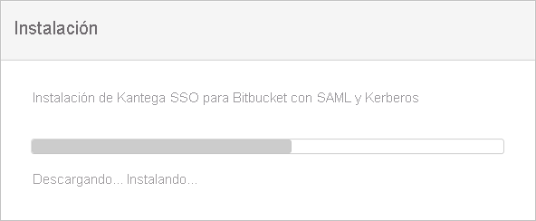
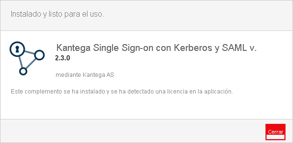
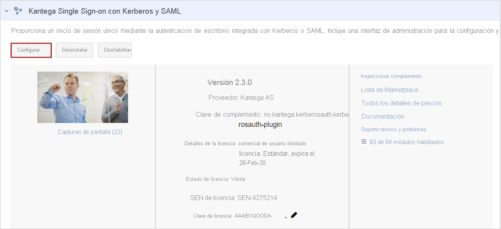
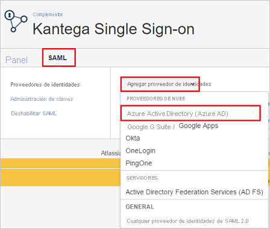
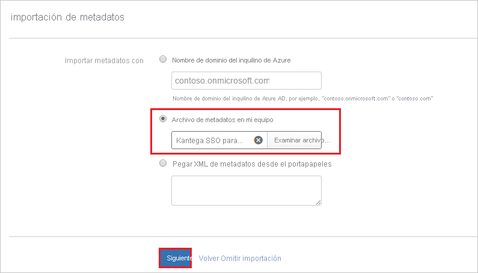
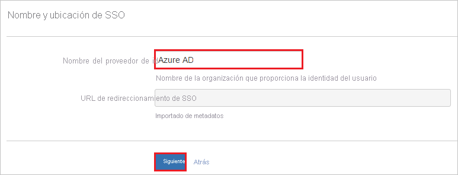
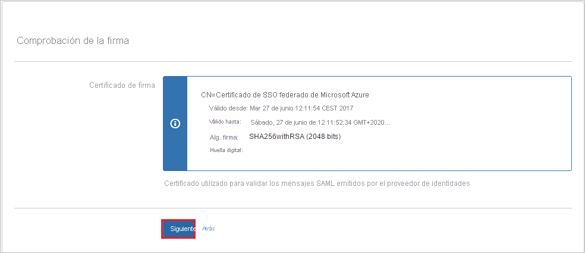
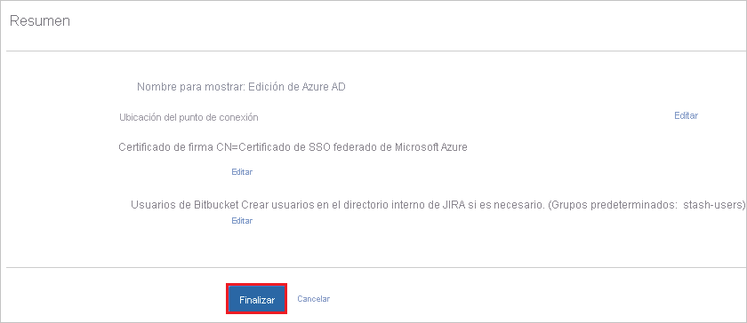

# Tutorial: Integración del inicio de sesión único de Azure AD con Kantega SSO for Bitbucket

En este tutorial aprenderá a integrar Kantega SSO para Bitbucket con Azure Active Directory (Azure AD). Al integrar Bitbucket SSO for Bitbucket con Azure AD, puede hacer lo siguiente:

* Controlar en Azure AD quién tiene acceso a Kantega SSO para Bitbucket.
* Permitir que los usuarios inicien sesión automáticamente en Kantega SSO for Bitbucket con sus cuentas de Azure AD.
* Administrar las cuentas desde una ubicación central (Azure Portal).

## Requisitos previos

Para configurar la integración de Azure AD con Kantega SSO para Bitbucket, necesita los siguientes elementos:

* Una suscripción de Azure AD. Si no dispone de un entorno de Azure AD, puede obtener [una cuenta gratuita](https://azure.microsoft.com/free/).
* Suscripción de Kantega SSO for Bitbucket con el inicio de sesión único habilitado

## Descripción del escenario

En este tutorial, puede configurar y probar el inicio de sesión único de Azure AD en un entorno de prueba.

* Kantega SSO for Bitbucket admite el inicio de sesión único iniciado por **SP e IDP**.

## Incorporación de Kantega SSO for Bitbucket desde la galería

Para configurar la integración de Kantega SSO para Bitbucket en Azure AD, tiene que agregar Kantega SSO para Bitbucket desde la galería a la lista de aplicaciones SaaS administradas.

1. Inicie sesión en Azure Portal con una cuenta personal, profesional o educativa de Microsoft.
1. En el panel de navegación de la izquierda, seleccione el servicio **Azure Active Directory**.
1. Vaya a **Aplicaciones empresariales** y seleccione **Todas las aplicaciones**.
1. Para agregar una nueva aplicación, seleccione **Nueva aplicación**.
1. En la sección **Agregar desde la galería**, escriba **Kantega SSO for Bitbucket** en el cuadro de búsqueda.
1. Seleccione **Kantega SSO for Bitbucket** en el panel de resultados y agregue la aplicación. Espere unos segundos mientras la aplicación se agrega al inquilino.

## Configuración y prueba del inicio de sesión único de Azure AD para Kantega SSO for Bitbucket

Configure y pruebe el inicio de sesión único de Azure AD con Kantega SSO for Bitbucket mediante un usuario de prueba llamado **B.Simon**. Para que el inicio de sesión único funcione, es necesario establecer una relación de vínculo entre un usuario de Azure AD y el usuario relacionado de Kantega SSO for Bitbucket.

Para configurar y probar el inicio de sesión único de Azure AD con Kantega SSO for Bitbucket, complete los siguientes pasos:

1. **[Configuración del inicio de sesión único de Azure AD](#configure-azure-ad-sso)** , para permitir que los usuarios puedan utilizar esta característica.
    1. **[Creación de un usuario de prueba de Azure AD](#create-an-azure-ad-test-user)**, para probar el inicio de sesión único de Azure AD con B.Simon.
    1. **[Asignación del usuario de prueba de Azure AD](#assign-the-azure-ad-test-user)** , para habilitar a B.Simon para que use el inicio de sesión único de Azure AD.
1. **[Configuración del inicio de sesión único de Kantega SSO for Bitbucket](#configure-kantega-sso-for-bitbucket-sso)** : para configurar los valores de inicio de sesión único en la aplicación.
    1. **[Creación de un usuario de prueba de Kantega SSO for Bitbucket](#create-kantega-sso-for-bitbucket-test-user)** : para tener un homólogo de B.Simon en Kantega SSO for Bitbucket que esté vinculado a la representación del usuario en Azure AD.
1. **[Prueba del inicio de sesión único](#test-sso)** : para comprobar si la configuración funciona.

## Configuración del inicio de sesión único de Azure AD

Siga estos pasos para habilitar el inicio de sesión único de Azure AD en Azure Portal.

1. En Azure Portal, en la página de integración de la aplicación **Kantega SSO for Bitbucket**, busque la sección **Administrar** y seleccione **Inicio de sesión único**.
1. En la página **Seleccione un método de inicio de sesión único**, elija **SAML**.
1. En la página **Configuración del inicio de sesión único con SAML**, haga clic en el icono de lápiz de **Configuración básica de SAML** para editar la configuración.

   

4. En la sección **Configuración básica de SAML**, si desea configurar la aplicación en el modo iniciado por **IDP** siga estos pasos:

    a. En el cuadro de texto **Identificador**, escriba una dirección URL con el patrón siguiente: `https://<server-base-url>/plugins/servlet/no.kantega.saml/sp/<uniqueid>/login`

    b. En el cuadro de texto **URL de respuesta**, escriba una dirección URL con el siguiente patrón: `https://<server-base-url>/plugins/servlet/no.kantega.saml/sp/<uniqueid>/login`

5. Haga clic en **Establecer direcciones URL adicionales** y siga este paso si desea configurar la aplicación en el modo iniciado por **SP**:

    En el cuadro de texto **URL de inicio de sesión**, escriba una dirección URL con el siguiente patrón: `https://<server-base-url>/plugins/servlet/no.kantega.saml/sp/<uniqueid>/login`

    > [!NOTE]
    > Estos valores no son reales. Actualice estos valores con los valores reales de Identificador, URL de respuesta y URL de inicio de sesión. Estos valores se reciben durante la configuración del complemento de Bitbucket, que se explica más adelante en el tutorial.

6. En la página **Configurar el inicio de sesión único con SAML**, en la sección **Certificado de firma de SAML**, haga clic en **Descargar** para descargar el **XML de metadatos de federación** de las opciones proporcionadas según sus requisitos y guárdelo en el equipo.

    

7. En la sección **Set up Kantega SSO for Bitbucket** (Configurar Kantega SSO para Bitbucket), copie las direcciones URL adecuadas según sus necesidades.

    

### Creación de un usuario de prueba de Azure AD

En esta sección, va a crear un usuario de prueba llamado B.Simon en Azure Portal.

1. En el panel izquierdo de Azure Portal, seleccione **Azure Active Directory**, **Usuarios** y **Todos los usuarios**.
1. Seleccione **Nuevo usuario** en la parte superior de la pantalla.
1. En las propiedades del **usuario**, siga estos pasos:
   1. En el campo **Nombre**, escriba `B.Simon`.  
   1. En el campo **Nombre de usuario**, escriba username@companydomain.extension. Por ejemplo, `B.Simon@contoso.com`.
   1. Active la casilla **Show password** (Mostrar contraseña) y, después, anote el valor que se muestra en el cuadro **Contraseña**.
   1. Haga clic en **Crear**.

### Asignación del usuario de prueba de Azure AD

En esta sección va a permitir que B.Simon acceda a Kantega SSO for Bitbucket mediante el inicio de sesión único de Azure.

1. En Azure Portal, seleccione sucesivamente **Aplicaciones empresariales** y **Todas las aplicaciones**.
1. En la lista de aplicaciones, seleccione **Kantega SSO para Bitbucket**.
1. En la página de información general de la aplicación, busque la sección **Administrar** y seleccione **Usuarios y grupos**.
1. Seleccione **Agregar usuario**. A continuación, en el cuadro de diálogo **Agregar asignación**, seleccione **Usuarios y grupos**.
1. En el cuadro de diálogo **Usuarios y grupos**, seleccione **B.Simon** de la lista de usuarios y haga clic en el botón **Seleccionar** de la parte inferior de la pantalla.
1. Si espera que se asigne un rol a los usuarios, puede seleccionarlo en la lista desplegable **Seleccionar un rol**. Si no se ha configurado ningún rol para esta aplicación, verá seleccionado el rol "Acceso predeterminado".
1. En el cuadro de diálogo **Agregar asignación**, haga clic en el botón **Asignar**.

## Configuración del inicio de sesión único en Kantega SSO for Bitbucket

1. En otra ventana del explorador web, inicie sesión como administrador en el portal de administración de Bitbucket.

1. Haga clic en el icono de engranaje y, luego, en **Find new add-ons** (Buscar nuevos complementos).

    

1. Busque **Kantega SSO para Bitbucket (SAML & Kerberos)** y haga clic en el botón **Instalar** para instalar el nuevo complemento SAML.

    

1. Se inicia la instalación del complemento.

    

1. Una vez completada la instalación. Haga clic en **Cerrar**.

    

1. Haga clic en **Administrar**.

    

1. Haga clic en **Configurar** para configurar el nuevo complemento.

    

1. En la sección **SAML**. Seleccione **Azure Active Directory (Azure AD)** en la lista desplegable **Agregar proveedor de identidades**.

    

1. Seleccione el nivel de suscripción **Básica**.

    

1. En la sección **Agregar propiedades**, siga estos pasos:

    

    a. Copie el valor de **URI de id. de aplicación** y úselo en los campos **Identificador, URL de respuesta y URL de inicio de sesión** de la sección **Configuración básica de SAML**  de Azure Portal.

    b. Haga clic en **Next**.

1. En la sección **Importar metadatos**, siga estos pasos:

    

    a. Seleccione **Archivo de metadatos en el equipo** y cargue el archivo de metadatos que descargó desde Azure Portal.

    b. Haga clic en **Next**.

1. En la sección **Name and SSO location** (Nombre y ubicación de SSO), siga estos pasos:

    

    a. Agregue el nombre del proveedor de identidades en el cuadro de texto **Nombre del proveedor de identidades** (por ejemplo, Azure AD).

    b. Haga clic en **Next**.

1. Compruebe el certificado de firma y haga clic en **Siguiente**.

    

1. En la sección **Cuentas de usuario de Bitbucket**, siga estos pasos:

    

    a. Seleccione **Create users in Bitbucket's internal Directory if needed** (Crear usuarios en el directorio interno de Bitbucket si es necesario) y escriba el nombre adecuado del grupo de usuarios (puede ser un número múltiple de grupos separados por coma).

    b. Haga clic en **Next**.

1. Haga clic en **Finalizar**

    

1. En la sección **Known domains for Azure AD** (Dominios conocidos para Azure AD), siga estos pasos:

    

    a. Seleccione **Known domains** (Dominios conocidos) en el panel izquierdo de la página.

    b. Escriba el nombre de dominio en el cuadro de texto **Known domains** (Dominios conocidos).

    c. Haga clic en **Save**(Guardar).

### Creación de un usuario de prueba de Kantega SSO para Bitbucket

Para permitir que los usuarios de Azure AD inicien sesión en Bitbucket, deben aprovisionarse a Bitbucket. En el caso de Kantega SSO para Bitbucket, el aprovisionamiento es una tarea manual.

**Para aprovisionar una cuenta de usuario, realice estos pasos:**

1. Inicie sesión en su sitio de la compañía de Bitbucket como administrador.

1. Haga clic en el icono de configuración.

     

1. En la sección de la pestaña **Administración**, haga clic en **Usuarios**.

    

1. Haga clic en **Crear usuario**.

         

1. En la página del cuadro de diálogo **Crear usuario**, realice los pasos siguientes:

     

    a. En el cuadro de texto **Nombre de usuario**, escriba el correo electrónico de un usuario, por ejemplo, Brittasimon@contoso.com.

    b. En el cuadro de texto **Nombre completo**, escriba el nombre completo de un usuario, por ejemplo, Britta Simon.

    c. En el cuadro de texto **Dirección de correo electrónico**, escriba la dirección de correo electrónico de un usuario, por ejemplo, Brittasimon@contoso.com.

    d. En el cuadro de texto **Contraseña**, escriba la contraseña del usuario.

    e. En el cuadro de texto **Confirmar contraseña**, escriba nuevamente la contraseña de usuario.

    f. Haga clic en **Crear usuario**.

## Prueba de SSO

En esta sección, probará la configuración de inicio de sesión único de Azure AD con las siguientes opciones. 

#### Iniciado por SP:

* Haga clic en **Probar esta aplicación** en Azure Portal. Esta acción le redirigirá a la URL de inicio de sesión de Kantega SSO for Bitbucket, desde donde puede comenzar el flujo de inicio de sesión.  

* Acceda directamente a la URL de inicio de sesión de Kantega SSO for Bitbucket y ponga en marcha el flujo de inicio de sesión desde allí.

#### Iniciado por IDP:

* Haga clic en **Probar esta aplicación** en Azure Portal. Se debería iniciar sesión automáticamente en la instancia de Kantega SSO for Bitbucket para la que configuró el inicio de sesión único. 

También puede usar Aplicaciones de Microsoft para probar la aplicación en cualquier modo. Al hacer clic en el icono de Kantega SSO for Bitbucket en Aplicaciones, si se ha configurado en modo SP, se le redirigirá a la página de inicio de sesión de la aplicación para comenzar el flujo de inicio de sesión; y si se ha configurado en modo IDP, se debería iniciar sesión automáticamente en la instancia de Kantega SSO for Bitbucket para la que ha configurado el inicio de sesión único. Para más información acerca de Aplicaciones, consulte [Inicio de sesión e inicio de aplicaciones desde el portal Aplicaciones](../user-help/my-apps-portal-end-user-access.md).

## Pasos siguientes

Una vez que haya configurado Kantega SSO for Bitbucket, puede aplicar el control de sesión, que protege su organización en tiempo real frente a la filtración e infiltración de información confidencial. El control de sesión procede del acceso condicional. [Aprenda a aplicar el control de sesión con Microsoft Defender para aplicaciones en la nube](/cloud-app-security/proxy-deployment-aad).
