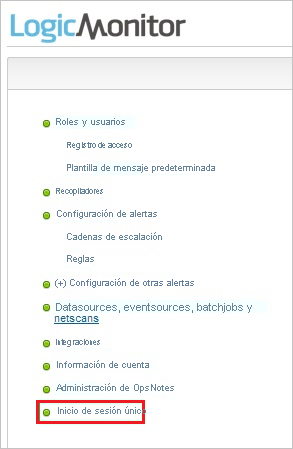
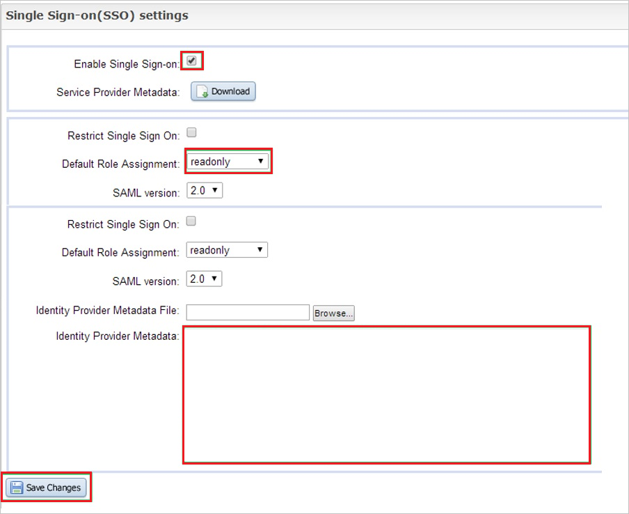

# Tutorial: Integración del inicio de sesión único de Azure AD con LogicMonitor

En este tutorial, aprenderá a integrar LogicMonitor con Azure Active Directory (Azure AD). Al integrar LogicMonitor con Azure AD, podrá hacer lo siguiente:

* Controlar en Azure AD quién tiene acceso a LogicMonitor.
* Permitir que los usuarios inicien sesión automáticamente en LogicMonitor con sus cuentas de Azure AD.
* Administrar las cuentas desde una ubicación central (Azure Portal).

## Requisitos previos

Para empezar, necesita los siguientes elementos:

* Una suscripción de Azure AD. Si no tiene una suscripción, puede crear una [cuenta gratuita](https://azure.microsoft.com/free/).
* Una suscripción habilitada para el inicio de sesión único (SSO) en LogicMonitor.

## Descripción del escenario

En este tutorial, puede configurar y probar el inicio de sesión único de Azure AD en un entorno de prueba.

* LogicMonitor admite el inicio de sesión único iniciado por **SP**.

## Incorporación de LogicMonitor desde la galería

Para configurar la integración de LogicMonitor en Azure AD, deberá agregar LogicMonitor desde la galería a la lista de aplicaciones SaaS administradas.

1. Inicie sesión en Azure Portal con una cuenta personal, profesional o educativa de Microsoft.
1. En el panel de navegación de la izquierda, seleccione el servicio **Azure Active Directory**.
1. Vaya a **Aplicaciones empresariales** y seleccione **Todas las aplicaciones**.
1. Para agregar una nueva aplicación, seleccione **Nueva aplicación**.
1. En la sección **Agregar desde la galería**, escriba **LogicMonitor** en el cuadro de búsqueda.
1. Seleccione **LogicMonitor** en el panel de resultados y agregue la aplicación. Espere unos segundos mientras la aplicación se agrega al inquilino.

## Configuración y prueba del inicio de sesión único de Azure AD para LogicMonitor

Configure y pruebe el inicio de sesión único de Azure AD con LogicMonitor mediante un usuario de prueba llamado **B.Simon**. Para que el inicio de sesión único funcione, es preciso establecer una relación de vinculación entre un usuario de Azure AD y el usuario relacionado de LogicMonitor.

Para configurar y probar el inicio de sesión único de Azure AD con LogicMonitor, siga estos pasos:

1. **[Configuración del inicio de sesión único de Azure AD](#configure-azure-ad-sso)** , para permitir que los usuarios puedan utilizar esta característica.
    1. **[Creación de un usuario de prueba de Azure AD](#create-an-azure-ad-test-user)** , para probar el inicio de sesión único de Azure AD con B.Simon.
    1. **[Asignación del usuario de prueba de Azure AD](#assign-the-azure-ad-test-user)** , para habilitar a B.Simon para que use el inicio de sesión único de Azure AD.
1. **[Configuración del inicio de sesión único de LogicMonitor](#configure-logicmonitor-sso)** , para configurar los valores de inicio de sesión único en la aplicación.
    1. **[Creación de un usuario de prueba en LogicMonitor](#create-logicmonitor-test-user)** , para tener un usuario equivalente a B.Simon en LogicMonitor que esté vinculado a su representación de usuario en Azure AD.
1. **[Prueba del inicio de sesión único](#test-sso)** : para comprobar si la configuración funciona.

## Configuración del inicio de sesión único de Azure AD

Siga estos pasos para habilitar el inicio de sesión único de Azure AD en Azure Portal.

1. En Azure Portal, en la página de integración de la aplicación **LogicMonitor**, busque la sección **Administrar** y seleccione **Inicio de sesión único**.
1. En la página **Seleccione un método de inicio de sesión único**, elija **SAML**.
1. En la página **Configuración del inicio de sesión único con SAML**, haga clic en el icono de lápiz de **Configuración básica de SAML** para editar la configuración.

   

4. En la sección **Configuración básica de SAML**, siga estos pasos:

    a. En el cuadro de texto **Identificador (id. de entidad)** , escriba una dirección URL con el siguiente patrón: `https://<companyname>.logicmonitor.com`
    
    b. En el cuadro de texto **Dirección URL de respuesta (URL del Servicio de consumidor de aserciones)** , escriba la siguiente URL: `https://companyname.logicmonitor.com/santaba/saml/SSO/` 
  
    c. En el cuadro de texto **URL de inicio de sesión**, escriba una dirección URL con el siguiente patrón: `https://<companyname>.logicmonitor.com`

    > [!NOTE]
    > Estos valores no son reales. Actualice estos valores con el identificador y la dirección URL de inicio de sesión reales. Póngase en contacto con el [equipo de atención al cliente de LogicMonitor](https://www.logicmonitor.com/contact/) para obtener estos valores. También puede hacer referencia a los patrones que se muestran en la sección **Configuración básica de SAML** de Azure Portal.

5. En la página **Configurar el inicio de sesión único con SAML**, en la sección **Certificado de firma de SAML**, haga clic en **Descargar** para descargar el **XML de metadatos de federación** de las opciones proporcionadas según sus requisitos y guárdelo en el equipo.

    

6. En la sección **Set up LogicMonitor** (Configurar LogicMonitor), copie las direcciones URL que necesite.

    

### Creación de un usuario de prueba de Azure AD

En esta sección, va a crear un usuario de prueba llamado B.Simon en Azure Portal.

1. En el panel izquierdo de Azure Portal, seleccione **Azure Active Directory**, **Usuarios** y **Todos los usuarios**.
1. Seleccione **Nuevo usuario** en la parte superior de la pantalla.
1. En las propiedades del **usuario**, siga estos pasos:
   1. En el campo **Nombre**, escriba `B.Simon`.  
   1. En el campo **Nombre de usuario**, escriba username@companydomain.extension. Por ejemplo, `B.Simon@contoso.com`.
   1. Active la casilla **Show password** (Mostrar contraseña) y, después, anote el valor que se muestra en el cuadro **Contraseña**.
   1. Haga clic en **Crear**.

### Asignación del usuario de prueba de Azure AD

En esta sección, va a permitir que B.Simon acceda a LogicMonitor mediante el inicio de sesión único de Azure.

1. En Azure Portal, seleccione sucesivamente **Aplicaciones empresariales** y **Todas las aplicaciones**.
1. En la lista de aplicaciones, seleccione **LogicMonitor**.
1. En la página de información general de la aplicación, busque la sección **Administrar** y seleccione **Usuarios y grupos**.
1. Seleccione **Agregar usuario**. A continuación, en el cuadro de diálogo **Agregar asignación**, seleccione **Usuarios y grupos**.
1. En el cuadro de diálogo **Usuarios y grupos**, seleccione **B.Simon** de la lista de usuarios y haga clic en el botón **Seleccionar** de la parte inferior de la pantalla.
1. Si espera que se asigne un rol a los usuarios, puede seleccionarlo en la lista desplegable **Seleccionar un rol**. Si no se ha configurado ningún rol para esta aplicación, verá seleccionado el rol "Acceso predeterminado".
1. En el cuadro de diálogo **Agregar asignación**, haga clic en el botón **Asignar**.

## Configuración del inicio de sesión único de LogicMonitor

1. Inicie sesión en el sitio de la empresa **LogicMonitor** como administrador.

2. En el menú de la parte superior, haga clic en **Configuración**.

    

3. En la barra de navegación del lado izquierdo, haga clic en **Inicio de sesión único**.

    

4. En la sección **Configuración de inicio de sesión único (SSO)**, siga estos pasos:

    

    a. Seleccione **Habilitar inicio de sesión único**.

    b. Como **Asignación de roles predeterminada**, seleccione **readonly**.

    c. Abra el archivo de metadatos descargado en el Bloc de notas y pegue el contenido del archivo en el cuadro de texto **Metadatos del proveedor de identidades**.

    d. Haga clic en **Guardar cambios**.

### Creación de un usuario de prueba en LogicMonitor

Para que los usuarios de Azure AD puedan inician sesión, deben aprovisionarse para la aplicación LogicMonitor con sus nombres de usuario de Azure Active Directory.

**Siga estos pasos para configurar el aprovisionamiento de usuario:**

1. Inicie sesión como administrador en el sitio de la compañía de LogicMonitor.

2. En el menú en la parte superior, haga clic en **Configuración** y luego en **Roles y usuarios**.

    

3. Haga clic en **Agregar**.

4. En la sección **Agregar una cuenta**, siga estos pasos:

    

    a. En los cuadros de texto correspondientes, escriba los valores de **Nombre de usuario**, **Correo electrónico**, **Contraseña** y **Vuelva a escribir contraseña** del usuario de Azure Active Directory que quiera aprovisionar.

    b. Seleccione **Roles**, **Ver permisos** y **Estado**.

    c. Haga clic en **Enviar**.

> [!NOTE]
> Puede usar cualquier otra API o herramienta de creación de cuentas de usuario de LogicMonitor que proporcione LogicMonitor para aprovisionar cuentas de usuario de Azure Active Directory.

## Prueba de SSO

En esta sección, probará la configuración de inicio de sesión único de Azure AD con las siguientes opciones. 

* Haga clic en **Probar esta aplicación** en Azure Portal. Esta acción le redirigirá a la dirección URL de inicio de sesión de LogicMonitor, desde donde puede poner en marcha el flujo de inicio de sesión. 

* Vaya directamente a la URL de inicio de sesión de LogicMonitor y ponga en marcha el flujo de inicio de sesión desde allí.

* Puede usar Mis aplicaciones de Microsoft. Al hacer clic en el icono de LogicMonitor en Mis aplicaciones, debería iniciar sesión automáticamente en la instancia de LogicMonitor para la que configuró el inicio de sesión único. Para más información acerca de Aplicaciones, consulte [Inicio de sesión e inicio de aplicaciones desde el portal Aplicaciones](https://support.microsoft.com/account-billing/sign-in-and-start-apps-from-the-my-apps-portal-2f3b1bae-0e5a-4a86-a33e-876fbd2a4510).

## Pasos siguientes

Una vez que se ha configurado LogicMonitor, puede aplicar el control de sesión, que protege su organización en tiempo real frente a la filtración e infiltración de información confidencial. El control de sesión procede del acceso condicional. [Aprenda a aplicar el control de sesión con Microsoft Cloud App Security](/cloud-app-security/proxy-deployment-any-app).