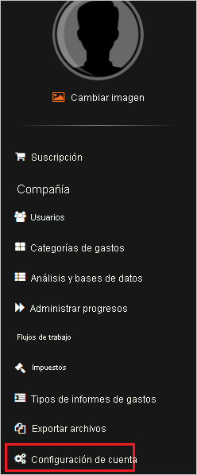
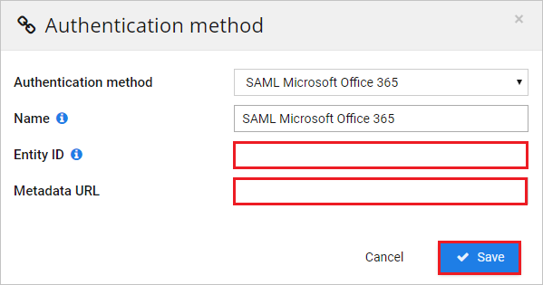

# Tutorial: Integración del inicio de sesión único de Azure AD con Informes de gastos de N2F

En este tutorial, aprenderá a integrar Informes de gastos de N2F con Azure Active Directory (Azure AD). Al integrar Informes de gastos de N2F con Azure AD, puede hacer lo siguiente:

* Controlar en Azure AD quién tiene acceso a Informes de gastos de N2F.
* Permitir que los usuarios inicien sesión automáticamente en Informes de gastos de N2F con sus cuentas de Azure AD.
* Administrar las cuentas desde una ubicación central (Azure Portal).

## Requisitos previos

Para empezar, necesita los siguientes elementos:

* Una suscripción de Azure AD. Si no tiene una suscripción, puede crear una [cuenta gratuita](https://azure.microsoft.com/free/).
* Suscripción habilitada para el inicio de sesión único en Informes de gastos de N2F.

## Descripción del escenario

En este tutorial, puede configurar y probar el inicio de sesión único de Azure AD en un entorno de prueba.

* Informes de gastos de N2F admite el inicio de sesión único iniciado por **SP** e **IDP**.

## Incorporación de Informes de gastos de N2F desde la galería

Para configurar la integración de los informes de gastos de N2F con Azure AD, es preciso agregar dichos informes desde la galería a la lista de aplicaciones SaaS administradas.

1. Inicie sesión en Azure Portal con una cuenta personal, profesional o educativa de Microsoft.
1. En el panel de navegación de la izquierda, seleccione el servicio **Azure Active Directory**.
1. Vaya a **Aplicaciones empresariales** y seleccione **Todas las aplicaciones**.
1. Para agregar una nueva aplicación, seleccione **Nueva aplicación**.
1. En la sección **Agregar desde la galería**, escriba **Informes de gastos de N2F** en el cuadro de búsqueda.
1. Seleccione **Informes de gastos de N2F** en el panel de resultados y agregue la aplicación. Espere unos segundos mientras la aplicación se agrega al inquilino.

## Configuración y prueba del inicio de sesión único de Azure AD para Informes de gastos de N2F

Configure y pruebe el inicio de sesión único de Azure AD con Informes de gastos de N2F utilizando un usuario de prueba llamado **B. Simon**. Para que el inicio de sesión único funcione, es necesario establecer una relación de vinculación entre un usuario de Azure AD y el usuario relacionado de Informes de gastos de N2F.

Para configurar y probar el inicio de sesión único de Azure AD con Informes de gastos de N2F, siga estos pasos:

1. **[Configuración del inicio de sesión único de Azure AD](#configure-azure-ad-sso)** , para permitir que los usuarios puedan utilizar esta característica.
    1. **[Creación de un usuario de prueba de Azure AD](#create-an-azure-ad-test-user)**, para probar el inicio de sesión único de Azure AD con B.Simon.
    1. **[Asignación del usuario de prueba de Azure AD](#assign-the-azure-ad-test-user)** , para habilitar a B.Simon para que use el inicio de sesión único de Azure AD.
1. **[Configuración del inicio de sesión único de Informes de gastos de N2F](#configure-n2f---expense-reports-sso)** : para configurar los valores de inicio de sesión único en la aplicación.
    1. **[Creación de un usuario de prueba de Informes de gastos de N2F](#create-n2f---expense-reports-test-user)** : para tener un homólogo de B. Simon en Informes de gastos de N2F que esté vinculado a la representación del usuario en Azure AD.
1. **[Prueba del inicio de sesión único](#test-sso)** : para comprobar si la configuración funciona.

## Configuración del inicio de sesión único de Azure AD

Siga estos pasos para habilitar el inicio de sesión único de Azure AD en Azure Portal.

1. En Azure Portal, en la página de integración de la aplicación **Informes de gastos de N2F**, busque la sección **Administrar** y seleccione **Inicio de sesión único**.
1. En la página **Seleccione un método de inicio de sesión único**, elija **SAML**.
1. En la página **Configuración del inicio de sesión único con SAML**, haga clic en el icono de lápiz de **Configuración básica de SAML** para editar la configuración.

   

4. En la sección **Configuración básica de SAML**, si desea configurar la aplicación en modo iniciado por **IDP**, no es necesario realizar ningún paso porque la aplicación ya está integrada previamente con Azure.

5. Haga clic en **Establecer direcciones URL adicionales** y siga este paso si desea configurar la aplicación en el modo iniciado por **SP**:

    En el cuadro de texto **URL de inicio de sesión**, escriba la dirección URL: `https://www.n2f.com/app/`

6. En la página **Configurar el inicio de sesión único con SAML**, en la sección **Certificado de firma de SAML**, haga clic en el botón de copia para copiar **Dirección URL de metadatos de federación de aplicación** y guárdela en su equipo.

    

7. En la sección **Set up myPolicies** (Configurar myPolicies), copie las direcciones URL que necesite.

    

### Creación de un usuario de prueba de Azure AD 

En esta sección, va a crear un usuario de prueba llamado B.Simon en Azure Portal.

1. En el panel izquierdo de Azure Portal, seleccione **Azure Active Directory**, **Usuarios** y **Todos los usuarios**.
1. Seleccione **Nuevo usuario** en la parte superior de la pantalla.
1. En las propiedades del **usuario**, siga estos pasos:
   1. En el campo **Nombre**, escriba `B.Simon`.  
   1. En el campo **Nombre de usuario**, escriba username@companydomain.extension. Por ejemplo, `B.Simon@contoso.com`.
   1. Active la casilla **Show password** (Mostrar contraseña) y, después, anote el valor que se muestra en el cuadro **Contraseña**.
   1. Haga clic en **Crear**.

### Asignación del usuario de prueba de Azure AD

En esta sección, permitirá que B. Simon use el inicio de sesión único de Azure concediéndole acceso a Informes de gastos de N2F.

1. En Azure Portal, seleccione sucesivamente **Aplicaciones empresariales** y **Todas las aplicaciones**.
1. En la lista de aplicaciones, seleccione **Informes de gastos de N2F**.
1. En la página de información general de la aplicación, busque la sección **Administrar** y seleccione **Usuarios y grupos**.
1. Seleccione **Agregar usuario**. A continuación, en el cuadro de diálogo **Agregar asignación**, seleccione **Usuarios y grupos**.
1. En el cuadro de diálogo **Usuarios y grupos**, seleccione **B.Simon** de la lista de usuarios y haga clic en el botón **Seleccionar** de la parte inferior de la pantalla.
1. Si espera que se asigne un rol a los usuarios, puede seleccionarlo en la lista desplegable **Seleccionar un rol**. Si no se ha configurado ningún rol para esta aplicación, verá seleccionado el rol "Acceso predeterminado".
1. En el cuadro de diálogo **Agregar asignación**, haga clic en el botón **Asignar**.

## Configuración del inicio de sesión único de Informes de gastos de N2F

1. En otra ventana del explorador web, inicie sesión como administrador en el sitio de la compañía de Informes de gastos de N2F.

2. Haga clic en **Settings** (Configuración) y seleccione **Advance Settings** (Configuración avanzada) en la lista desplegable.

    

3. Seleccione la pestaña **Account settings** (Configuración de la cuenta).

    

4. Seleccione **Authentication** (Autenticación) y luego seleccione la pestaña **+ Add an authentication method** (+Agregar un método de autenticación).

    

5. Seleccione **SAML Microsoft Office 365** como método de autenticación.

    

6. En la sección **Authentication method** (Método deautenticación), realice los pasos siguientes:

    

    a. En el cuadro de texto **Identificador de entidad**, pegue el valor de **Identificador de Azure AD** que copió de Azure Portal.

    b. En el cuadro de texto **Metadata URL** (Dirección URL de metadatos), pegue el valor de **App Federation Metadata Url** (Dirección URL de metadatos de federación de aplicaciones) que copió de Azure Portal.

    c. Haga clic en **Save**(Guardar).

### Creación de un usuario de prueba de Informes de gastos de N2F

Para permitir que los usuarios de Azure AD inicien sesión en Informes de gastos de N2F, deben aprovisionarse en esta aplicación. En el caso de Informes de gastos de N2F, el aprovisionamiento es una tarea manual.

**Para aprovisionar una cuenta de usuario, realice estos pasos:**

1. Inicie sesión como administrador en el sitio de la compañía de Informes de gastos de N2F.

2. Haga clic en **Settings** (Configuración) y seleccione **Advance Settings** (Configuración avanzada) en la lista desplegable.

    

3. Seleccione la pestaña **Users** (Usuarios) en el panel de navegación izquierdo.

    

4. Seleccione la pestaña **+ New user** (+Nuevo usuario).

    

5. En la sección **User** (Usuario), realice los siguientes pasos:

    

    a. En el cuadro de texto **Email address** (Dirección de correo electrónico), escriba la dirección de correo electrónico de un usuario, por ejemplo, **brittasimon\@contoso.com**.

    b. En el cuadro de texto **Nombre**, escriba el nombre de usuario, en este caso **Britta**.

    c. En el cuadro de texto **Name** (Nombre), escriba el nombre de usuario, por ejemplo, **BrittaSimon**.

    d. Elija **Role, Direct manager (N+1)** (Role, responsable directo [N+1]) y **Division** (División) según los requisitos de su organización.

    e. Haga clic en **Validate and send invitation** (Validar y enviar invitación).

    > [!NOTE]
    > Si tiene algún problema al agregar el usuario, póngase en contacto con el [equipo de soporte técnico de Informes de gastos de N2F](mailto:support@n2f.com).

## Prueba de SSO

En esta sección, probará la configuración de inicio de sesión único de Azure AD con las siguientes opciones. 

#### Iniciado por SP:

* Haga clic en **Probar esta aplicación** en Azure Portal. Esto le redirigirá a la dirección URL de inicio de sesión de Informes de gastos de N2F, donde puede iniciar el flujo de inicio de sesión.  

* Vaya directamente a la dirección URL de inicio de sesión de Informes de gastos de N2F e inicie el flujo de inicio de sesión desde allí.

#### Iniciado por IDP:

* Haga clic en **Probar esta aplicación** en Azure Portal; debería iniciar sesión automáticamente en la instancia de Informes de gastos de N2F para la que ha configurado el inicio de sesión único. 

También puede usar Aplicaciones de Microsoft para probar la aplicación en cualquier modo. Al hacer clic en el icono de Informes de gastos de N2F que se encuentra en Aplicaciones, si ha realizado la configuración en modo SP, se le redirigirá a la página de inicio de sesión de la aplicación para comenzar el flujo de inicio de sesión. Si ha realizado la configuración en modo IDP, debería iniciar sesión automáticamente en la instancia de Informes de gastos de N2F para la que ha configurado el inicio de sesión único. Para más información acerca de Aplicaciones, consulte [Inicio de sesión e inicio de aplicaciones desde el portal Aplicaciones](../user-help/my-apps-portal-end-user-access.md).

## Pasos siguientes

Una vez configurado Informes de gastos de N2F, puede aplicar el control de sesión, que protege la filtración y la infiltración de la información confidencial de la organización en tiempo real. El control de sesión procede del acceso condicional. [Aprenda a aplicar el control de sesión con Microsoft Defender para aplicaciones en la nube](/cloud-app-security/proxy-deployment-aad).
