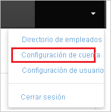
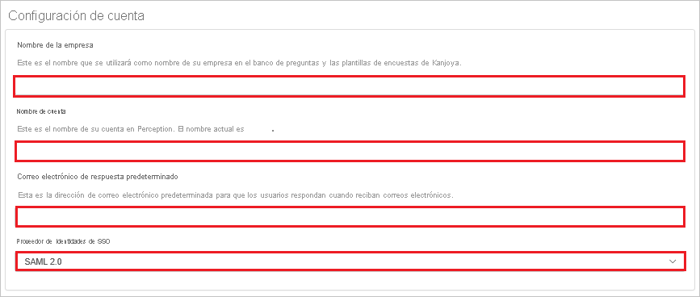

# Tutorial: Integración del inicio de sesión único de Azure AD con Perception United States (Non-UltiPro)

En este tutorial, aprenderá a integrar Perception United States (Non-UltiPro) con Azure Active Directory (Azure AD). La integración de Perception United States (Non-UltiPro) con Azure AD permite:

* Controlar en Azure AD quién tiene acceso a Perception United States (Non-UltiPro).
* Permitir que los usuarios inicien sesión automáticamente en Perception United States (Non-UltiPro) con sus cuentas de Azure AD.
* Administrar las cuentas desde una ubicación central (Azure Portal).

## Prerrequisitos

Para empezar, necesita los siguientes elementos:

* Una suscripción de Azure AD. Si no tiene una suscripción, puede crear una [cuenta gratuita](https://azure.microsoft.com/free/).
* Una suscripción habilitada para el inicio de sesión único en Perception United States (Non-UltiPro).

## Descripción del escenario

En este tutorial, puede configurar y probar el inicio de sesión único de Azure AD en un entorno de prueba.

* Perception United States (Non-UltiPro) admite el inicio de sesión único iniciado por **IDP**.

> [!NOTE]
> El identificador de esta aplicación es un valor de cadena fijo, por lo que solo se puede configurar una instancia en un inquilino.

## Incorporación de Perception United States (Non-UltiPro) desde la galería

Para configurar la integración de Perception Estados Unidos (no UltiPro) en Azure AD, deberá agregar Perception Estados Unidos (no UltiPro) desde la galería a la lista de aplicaciones SaaS administradas.

1. Inicie sesión en Azure Portal con una cuenta personal, profesional o educativa de Microsoft.
1. En el panel de navegación de la izquierda, seleccione el servicio **Azure Active Directory**.
1. Vaya a **Aplicaciones empresariales** y seleccione **Todas las aplicaciones**.
1. Para agregar una nueva aplicación, seleccione **Nueva aplicación**.
1. En la sección **Agregar desde la galería**, escriba **Perception United States (Non-UltiPro)** en el cuadro de búsqueda.
1. Seleccione **Perception United States (Non-UltiPro)** en el panel de resultados y agregue la aplicación. Espere unos segundos mientras la aplicación se agrega al inquilino.

## Configuración y prueba del inicio de sesión único de Azure AD para Perception United States (Non-UltiPro)

Configure y pruebe el inicio de sesión único de Azure AD con Perception United States (Non-UltiPro) mediante un usuario de prueba llamado **B.Simon**. Para que el inicio de sesión único funcione, es necesario establecer una relación de vinculación entre un usuario de Azure AD y el usuario correspondiente de Perception United States (Non-UltiPro).

Para configurar y probar el inicio de sesión único de Azure AD con Perception United States (Non-UltiPro), siga estos pasos:

1. **[Configuración del inicio de sesión único de Azure AD](#configure-azure-ad-sso)**, para permitir que los usuarios puedan utilizar esta característica.
    1. **[Creación de un usuario de prueba de Azure AD](#create-an-azure-ad-test-user)**, para probar el inicio de sesión único de Azure AD con B.Simon.
    1. **[Asignación del usuario de prueba de Azure AD](#assign-the-azure-ad-test-user)**, para habilitar a B.Simon para que use el inicio de sesión único de Azure AD.
1. **[Configuración del inicio de sesión único de Perception United States (Non-UltiPro)](#configure-perception-united-states-non-ultipro-sso)** , para configurar los valores de inicio de sesión único en la aplicación.
    1. **[Creación de un usuario de prueba de Perception United States (Non-UltiPro)](#create-perception-united-states-non-ultipro-test-user)** : para tener un homólogo de B.Simon en Perception United States (Non-UltiPro) que esté vinculado a la representación del usuario en Azure AD.
1. **[Prueba del inicio de sesión único](#test-sso)** : para comprobar si la configuración funciona.

## Configuración del inicio de sesión único de Azure AD

Siga estos pasos para habilitar el inicio de sesión único de Azure AD en Azure Portal.

1. En Azure Portal, en la página de integración de la aplicación **Perception United States (Non-UltiPro)** , busque la sección **Administrar** y seleccione **Inicio de sesión único**.
1. En la página **Seleccione un método de inicio de sesión único**, elija **SAML**.
1. En la página **Configuración del inicio de sesión único con SAML**, haga clic en el icono de lápiz de **Configuración básica de SAML** para editar la configuración.

   

4. En la página **Configuración básica de SAML**, siga estos pasos:

    a. En el cuadro de texto **Identificador**, escriba la dirección URL: `https://perception.kanjoya.com/sp`

    b. En el cuadro de texto **URL de respuesta**, escriba una dirección URL con el siguiente patrón: `https://perception.kanjoya.com/sso?idp=<entity_id>`

    c. La aplicación **Perception United States (no UltiPro)** requiere que el valor de **Identificador de Azure AD** como <entity_id>, que puede obtener de la sección **Configuración de Perception United States (Non-UltiPro)** , esté codificado en URI. Para obtener el valor codificado como URI, use el siguiente vínculo: **http://www.url-encode-decode.com/** .

    d. Después de obtener el valor codificado como URI, combínelo con la **Dirección URL de respuesta** según se indica a continuación:

    `https://perception.kanjoya.com/sso?idp=<URI encooded entity_id>`
    
    e. Pegue el valor anterior en el cuadro de texto **Dirección URL de respuesta**.

5. En la página **Configurar el inicio de sesión único con SAML**, en la sección **Certificado de firma de SAML**, haga clic en **Descargar** para descargar el **XML de metadatos de federación** de las opciones proporcionadas según sus requisitos y guárdelo en el equipo.

    

6. En la sección **Set up Perception Estados Unidos (no UltiPro)** (Configurar Perception Estados Unidos (no UltiPro)), copie las direcciones URL adecuadas según sus necesidades.

    

### Creación de un usuario de prueba de Azure AD 

En esta sección, va a crear un usuario de prueba llamado B.Simon en Azure Portal.

1. En el panel izquierdo de Azure Portal, seleccione **Azure Active Directory**, **Usuarios** y **Todos los usuarios**.
1. Seleccione **Nuevo usuario** en la parte superior de la pantalla.
1. En las propiedades del **usuario**, siga estos pasos:
   1. En el campo **Nombre**, escriba `B.Simon`.  
   1. En el campo **Nombre de usuario**, escriba username@companydomain.extension. Por ejemplo, `B.Simon@contoso.com`.
   1. Active la casilla **Show password** (Mostrar contraseña) y, después, anote el valor que se muestra en el cuadro **Contraseña**.
   1. Haga clic en **Crear**.

### Asignación del usuario de prueba de Azure AD

En esta sección, habilitará a B.Simon para que use el inicio de sesión único de Azure concediéndole acceso a Perception United States (Non-UltiPro).

1. En Azure Portal, seleccione sucesivamente **Aplicaciones empresariales** y **Todas las aplicaciones**.
1. En la lista de aplicaciones, seleccione **Perception Estados Unidos (no UltiPro)** .
1. En la página de información general de la aplicación, busque la sección **Administrar** y seleccione **Usuarios y grupos**.
1. Seleccione **Agregar usuario**. A continuación, en el cuadro de diálogo **Agregar asignación**, seleccione **Usuarios y grupos**.
1. En el cuadro de diálogo **Usuarios y grupos**, seleccione **B.Simon** de la lista de usuarios y haga clic en el botón **Seleccionar** de la parte inferior de la pantalla.
1. Si espera que se asigne un rol a los usuarios, puede seleccionarlo en la lista desplegable **Seleccionar un rol**. Si no se ha configurado ningún rol para esta aplicación, verá seleccionado el rol "Acceso predeterminado".
1. En el cuadro de diálogo **Agregar asignación**, haga clic en el botón **Asignar**.

## Configuración del inicio de sesión único en Perception United States (Non-UltiPro)

1. En otra ventana del explorador web, inicie sesión en su sitio de la compañía de Perception Estados Unidos (no UltiPro) como administrador.

2. En la barra de herramientas principal, haga clic en **Account Settings** (Configuración de la cuenta).

    

3. En la página **Account Settings** (Configuración de la cuenta), realice los pasos siguientes:

    

    a. En el cuadro de texto **Company Name** (Nombre de la empresa), escriba el nombre de la **empresa**.
    
    b. En el cuadro de texto **Account Name** (Nombre de la cuenta), escriba el nombre de la **cuenta**.

    c. En el cuadro de texto **Default Reply-To Email** (Correo electrónico de respuesta predeterminado), escriba un **correo electrónico** válido.

    d. Seleccione **SSO Identity Provider** (Proveedor de identidades de SSO) como **SAML 2.0**.

4. En la página **SSO Configuration** (Configuración de SSO), realice los siguientes pasos:

    

    a. Seleccione **SAML NameID Type** (Tipo de identificador de nombre de SAML) como **EMAIL** (correo electrónico).

    b. En el cuadro de texto **SSO Configuration Name** (nombre de configuración de SSO), escriba el nombre de su **configuración**.
    
    c. En el cuadro de texto **Nombre del proveedor de identidad**, pegue el valor de **Identificador de Azure AD** que ha copiado de Azure Portal. 

    d. En el cuadro de texto **SAML Domain** (dominio de SAML), escriba el dominio, por ejemplo @contoso.com.

    e. Haga clic en **Upload Again** (cargar de nuevo) para cargar el archivo **XML de metadatos**.

    f. Haga clic en **Update**(Actualizar).

### Creación de un usuario de prueba de Perception Estados Unidos (no UltiPro)

En esta sección, creará un usuario llamado Britta Simon en Perception Estados Unidos (no UltiPro). Trabaje con el [equipo de soporte técnico de Perception Estados Unidos (no UltiPro)](https://www.ultimatesoftware.com/Contact/ContactUs) para agregar los usuarios en la plataforma de Perception Estados Unidos (no UltiPro).

## Prueba de SSO

En esta sección, probará la configuración de inicio de sesión único de Azure AD con las siguientes opciones.

* Haga clic en Probar esta aplicación en Azure Portal y debería iniciar sesión automáticamente en la instancia de Perception United States (Non-UltiPro) para la que configuró el inicio de sesión único.

* Puede usar Mis aplicaciones de Microsoft. Al hacer clic en el icono de Perception United States (Non-UltiPro) que se encuentra en Aplicaciones, debería iniciar sesión automáticamente en la aplicación Perception United States (Non-UltiPro) para la que configuró el inicio de sesión único. Para más información acerca de Aplicaciones, consulte [Inicio de sesión e inicio de aplicaciones desde el portal Aplicaciones](../user-help/my-apps-portal-end-user-access.md).

## Pasos siguientes

Una vez configurado Perception United States (Non-UltiPro), puede aplicar controles de sesión, que protegen contra la filtración y la infiltración de la información confidencial de la organización en tiempo real. El control de sesión procede del acceso condicional. [Aprenda a aplicar el control de sesión con Microsoft Cloud App Security](/cloud-app-security/proxy-deployment-aad).