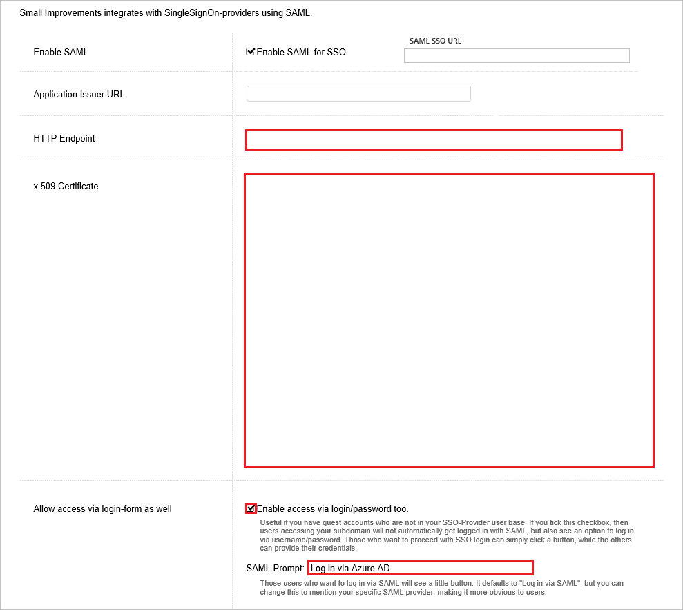
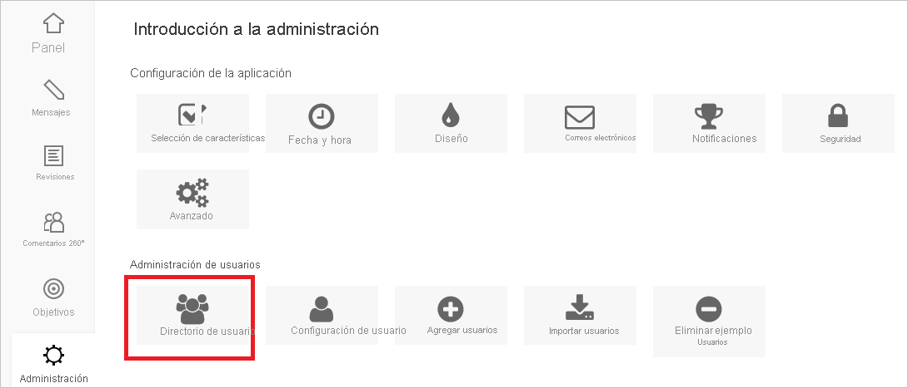
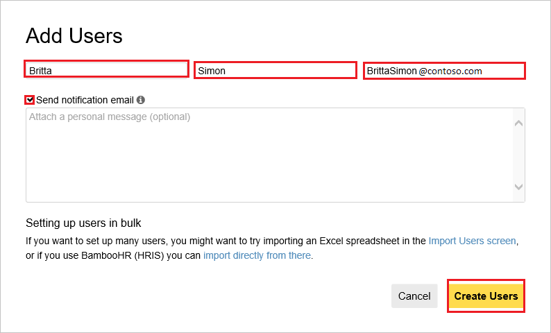

# Tutorial: Integración del inicio de sesión único de Azure AD con Small Improvements

En este tutorial, aprenderá a integrar Small Improvements con Azure Active Directory (Azure AD). Al integrar Small Improvements con Azure AD, puede hacer lo siguiente:

* Controlar en Azure AD quién tiene acceso a Small Improvements.
* Permitir que los usuarios inicien sesión automáticamente en Small Improvements con sus cuentas de Azure AD.
* Administrar las cuentas desde una ubicación central (Azure Portal).

## Requisitos previos

Para empezar, necesita los siguientes elementos:

* Una suscripción de Azure AD. Si no tiene una suscripción, puede crear una [cuenta gratuita](https://azure.microsoft.com/free/).
* Una suscripción habilitada para el inicio de sesión único (SSO) en Small Improvements.

## Descripción del escenario

En este tutorial, puede configurar y probar el inicio de sesión único de Azure AD en un entorno de prueba.

* Small Improvements admite el inicio de sesión único iniciado por **SP**.

## Adición de Small Improvements desde la galería

Para configurar la integración de Small Improvements en Azure AD, deberá agregar Small Improvements desde la galería a la lista de aplicaciones SaaS administradas.

1. Inicie sesión en Azure Portal con una cuenta personal, profesional o educativa de Microsoft.
1. En el panel de navegación de la izquierda, seleccione el servicio **Azure Active Directory**.
1. Vaya a **Aplicaciones empresariales** y seleccione **Todas las aplicaciones**.
1. Para agregar una nueva aplicación, seleccione **Nueva aplicación**.
1. En la sección **Agregar desde la galería**, escriba **Small Improvements** en el cuadro de búsqueda.
1. Seleccione **Small Improvements** en el panel de resultados y, a continuación, agregue la aplicación. Espere unos segundos mientras la aplicación se agrega al inquilino.

## Configuración y prueba del inicio de sesión único de Azure AD para Small Improvements

Configure y pruebe el inicio de sesión único de Azure AD con Small Improvements mediante un usuario de prueba llamado **B.Simon**. Para que el inicio de sesión único funcione, es preciso establecer una relación de vinculación entre un usuario de Azure AD y el usuario correspondiente de Small Improvements.

Para configurar y probar el inicio de sesión único de Azure AD con Small Improvements, realice los pasos siguientes:

1. **[Configuración del inicio de sesión único de Azure AD](#configure-azure-ad-sso)** , para permitir que los usuarios puedan utilizar esta característica.
    1. **[Creación de un usuario de prueba de Azure AD](#create-an-azure-ad-test-user)**, para probar el inicio de sesión único de Azure AD con B.Simon.
    1. **[Asignación del usuario de prueba de Azure AD](#assign-the-azure-ad-test-user)** , para habilitar a B.Simon para que use el inicio de sesión único de Azure AD.
1. **[Configuración del inicio de sesión único en Small Improvements](#configure-small-improvements-sso)** : para configurar los valores de inicio de sesión único en la aplicación.
    1. **[Creación de un usuario de prueba de Small Improvements](#create-small-improvements-test-user)** : para tener un homólogo de B.Simon en Small Improvements que esté vinculado a la representación del usuario en Azure AD.
1. **[Prueba del inicio de sesión único](#test-sso)** : para comprobar si la configuración funciona.

## Configuración del inicio de sesión único de Azure AD

Siga estos pasos para habilitar el inicio de sesión único de Azure AD en Azure Portal.

1. En Azure Portal, en la página de integración de la aplicación **Small Improvements**, busque la sección **Administrar** y seleccione **Inicio de sesión único**.
1. En la página **Seleccione un método de inicio de sesión único**, elija **SAML**.
1. En la página **Configuración del inicio de sesión único con SAML**, haga clic en el icono de lápiz de **Configuración básica de SAML** para editar la configuración.

   

4. En la sección **Configuración básica de SAML**, siga estos pasos:

    a. En el cuadro de texto **Identificador (id. de entidad)** , escriba una dirección URL con el siguiente patrón: `https://<subdomain>.small-improvements.com`

    b. En el cuadro de texto **URL de inicio de sesión**, escriba una dirección URL con el siguiente patrón: `https://<subdomain>.small-improvements.com`

    > [!NOTE]
    > Estos valores no son reales. Actualice estos valores con el identificador y la dirección URL de inicio de sesión reales. Póngase en contacto con el [equipo de soporte al cliente de Small Improvements](mailto:support@small-improvements.com) para obtener estos valores. También puede hacer referencia a los patrones que se muestran en la sección **Configuración básica de SAML** de Azure Portal.

5. En la página **Configurar el inicio de sesión único con SAML**, en la sección **Certificado de firma de SAML**, haga clic en **Descargar** para descargar el **certificado (Base64)** de las opciones proporcionadas según sus requisitos y guárdelo en el equipo.

    

6. En la sección **Set up Small Improvements** (Configurar Small Improvements), copie las direcciones URL adecuadas en función de sus necesidades.

    

### Creación de un usuario de prueba de Azure AD

En esta sección, va a crear un usuario de prueba llamado B.Simon en Azure Portal.

1. En el panel izquierdo de Azure Portal, seleccione **Azure Active Directory**, **Usuarios** y **Todos los usuarios**.
1. Seleccione **Nuevo usuario** en la parte superior de la pantalla.
1. En las propiedades del **usuario**, siga estos pasos:
   1. En el campo **Nombre**, escriba `B.Simon`.  
   1. En el campo **Nombre de usuario**, escriba username@companydomain.extension. Por ejemplo, `B.Simon@contoso.com`.
   1. Active la casilla **Show password** (Mostrar contraseña) y, después, anote el valor que se muestra en el cuadro **Contraseña**.
   1. Haga clic en **Crear**.

### Asignación del usuario de prueba de Azure AD

En esta sección, va a permitir que B.Simon acceda a Small Improvements mediante el inicio de sesión único de Azure.

1. En Azure Portal, seleccione sucesivamente **Aplicaciones empresariales** y **Todas las aplicaciones**.
1. En la lista de aplicaciones, seleccione **Small Improvements**.
1. En la página de información general de la aplicación, busque la sección **Administrar** y seleccione **Usuarios y grupos**.
1. Seleccione **Agregar usuario**. A continuación, en el cuadro de diálogo **Agregar asignación**, seleccione **Usuarios y grupos**.
1. En el cuadro de diálogo **Usuarios y grupos**, seleccione **B.Simon** de la lista de usuarios y haga clic en el botón **Seleccionar** de la parte inferior de la pantalla.
1. Si espera que se asigne un rol a los usuarios, puede seleccionarlo en la lista desplegable **Seleccionar un rol**. Si no se ha configurado ningún rol para esta aplicación, verá seleccionado el rol "Acceso predeterminado".
1. En el cuadro de diálogo **Agregar asignación**, haga clic en el botón **Asignar**.

## Configuración del inicio de sesión único de Small Improvements

1. En otra ventana del explorador, inicie sesión en su sitio de la empresa de Small Improvements como administrador.

1. En la página principal del panel, haga clic en el botón **Administration** (Administración) a la izquierda.

     

1. Haga clic en el botón **Inicio de sesión único de SAML** de la sección **Integraciones**.

     

1. En la página Configuración de SSO, realice los pasos siguientes:

      

    a. En el cuadro de texto **SAML Endpoint** (Punto de conexión SAML), pegue el valor de la **Login URL** (Dirección URL de inicio de sesión) que ha copiado de Azure Portal.

    b. Abra el certificado descargado en el Bloc de notas, copie el contenido y luego péguelo en el cuadro de texto **Certificado x509** . 

    c. Si quiere tener SSO y la opción de autenticación del formulario de inicio de sesión disponible para los usuarios, active la opción **Enable access via login/password too** (Habilitar también acceso a través de inicio de sesión y contraseña).  

    d. Escriba el valor adecuado para asignar un nombre al botón de inicio de sesión SSO en el cuadro de texto **Mensaje SAML** .  

    e. Haga clic en **Save**(Guardar).

### Creación de un usuario de prueba de Small Improvements

Para permitir que los usuarios de Azure AD inicien sesión en Small Improvements, tienen que aprovisionarse en Small Improvements. En el caso de Small Improvements, el aprovisionamiento es una tarea manual.

**Para aprovisionar una cuenta de usuario, realice estos pasos:**

1. Inicie sesión en su sitio de la empresa de Small Improvements como administrador.

1. En la página principal, vaya al menú de la izquierda y haga clic en **Administración**.

1. Haga clic en el botón **User Directory** (Directorio del usuario) en la sección Administración de usuarios.

     

1. Haga clic en **Agregar usuarios**.

     

1. En el cuadro de diálogo **Agregar usuarios**, realice los pasos siguientes: 

    

    a. Escriba el **nombre** de usuario, en este caso **Britta**.

    b. Escriba los **apellidos** del usuario, en este caso **Simon**.

    c. Escriba la dirección de **correo electrónico** del usuario como **brittasimon@contoso.com** .

    d. También puede escribir el mensaje personal en el cuadro **Enviar correo electrónico de notificación** . Si no desea enviar la notificación, desactive esta casilla.

    e. Haga clic en **Crear usuarios**.

## Prueba de SSO

En esta sección, probará la configuración de inicio de sesión único de Azure AD con las siguientes opciones. 

* Haga clic en **Probar esta aplicación** en Azure Portal. Esta acción le redirigirá a la dirección URL de inicio de sesión de Small Improvements, donde puede comenzar el flujo de inicio de sesión. 

* Acceda directamente a la dirección URL de inicio de sesión de Small Improvements y ponga en marcha el flujo de inicio de sesión desde allí.

* Puede usar Mis aplicaciones de Microsoft. Al hacer clic en el icono de Small Improvements en Aplicaciones, se le redirigirá a la dirección URL de inicio de sesión de Small Improvements. Para más información acerca de Aplicaciones, consulte [Inicio de sesión e inicio de aplicaciones desde el portal Aplicaciones](../user-help/my-apps-portal-end-user-access.md).

## Pasos siguientes

Una vez que se ha configurado Small Improvements, puede aplicar el control de sesión, que protege a la organización en tiempo real frente a la filtración e infiltración de información confidencial. El control de sesión procede del acceso condicional. [Aprenda a aplicar el control de sesión con Microsoft Defender para aplicaciones en la nube](/cloud-app-security/proxy-deployment-aad).
