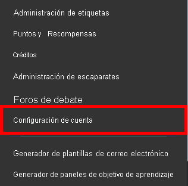
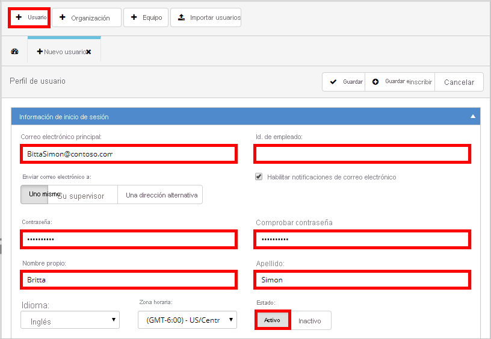

# Tutorial: Integración de Azure Active Directory con SmarterU

> [!NOTE]
> El proceso de integración de SmarterU con Azure Active Directory también está documentado y se mantiene en el [sistema de ayuda de SmarterU](https://help.smarteru.com/ID2053086).

En este tutorial aprenderá a integrar SmarterU con Azure Active Directory (Azure AD). Al integrar SmarterU con Azure AD, podrá hacer lo siguiente:

* Controlar en Azure AD quién tiene acceso a SmarterU.
* Permitir a los usuarios iniciar sesión automáticamente en SmarterU con sus cuentas de Azure AD.
* Administrar las cuentas desde una ubicación central (Azure Portal).

## Requisitos previos

Para empezar, necesita los siguientes elementos:

* Una suscripción de Azure AD. Si no tiene una suscripción, puede crear una [cuenta gratuita](https://azure.microsoft.com/free/).
* Suscripción habilitada para el inicio de sesión único en SmarterU.

## Descripción del escenario

En este tutorial, puede configurar y probar el inicio de sesión único de Azure AD en un entorno de prueba.

* SmarterU admite el inicio de sesión único iniciado por **IDP**.

> [!NOTE]
> El identificador de esta aplicación es un valor de cadena fijo, por lo que solo se puede configurar una instancia en un inquilino.

## Incorporación de SmarterU desde la galería

Para configurar la integración de SmarterU en Azure AD, es preciso agregar SmarterU desde la galería a la lista de aplicaciones SaaS administradas.

1. Inicie sesión en Azure Portal con una cuenta personal, profesional o educativa de Microsoft.
1. En el panel de navegación de la izquierda, seleccione el servicio **Azure Active Directory**.
1. Vaya a **Aplicaciones empresariales** y seleccione **Todas las aplicaciones**.
1. Para agregar una nueva aplicación, seleccione **Nueva aplicación**.
1. En la sección **Agregar desde la galería**, escriba **SmarterU** en el cuadro de búsqueda.
1. Seleccione **SmarterU** en el panel de resultados y agregue la aplicación. Espere unos segundos mientras la aplicación se agrega al inquilino.

## Configuración y prueba del inicio de sesión único de Azure AD para SmarterU

Configure y pruebe el inicio de sesión único de Azure AD con SmarterU mediante un usuario de prueba llamado **B.Simon**. Para que el inicio de sesión único funcione, es preciso establecer una relación de vínculo entre un usuario de Azure AD y el usuario correspondiente de SmarterU.

Para configurar y probar el inicio de sesión único de Azure AD con SmarterU, haga lo siguiente:

1. **[Configuración del inicio de sesión único de Azure AD](#configure-azure-ad-sso)** , para permitir que los usuarios puedan utilizar esta característica.
    1. **[Creación de un usuario de prueba de Azure AD](#create-an-azure-ad-test-user)** , para probar el inicio de sesión único de Azure AD con B.Simon.
    1. **[Asignación del usuario de prueba de Azure AD](#assign-the-azure-ad-test-user)** , para habilitar a B.Simon para que use el inicio de sesión único de Azure AD.
1. **[Configuración del inicio de sesión único en SmarterU](#configure-smarteru-sso)** : para definir los valores de inicio de sesión único en la aplicación.
    1. **[Creación de un usuario de prueba en SmarterU](#create-smarteru-test-user)** : para tener un homólogo de B.Simon en SmarterU vinculado a la representación del usuario en Azure AD.
1. **[Prueba del inicio de sesión único](#test-sso)** : para comprobar si la configuración funciona.

## Configuración del inicio de sesión único de Azure AD

Siga estos pasos para habilitar el inicio de sesión único de Azure AD en Azure Portal.

1. En Azure Portal, en la página de integración de la aplicación **SmarterU**, busque la sección **Administrar** y seleccione **Inicio de sesión único**.
1. En la página **Seleccione un método de inicio de sesión único**, elija **SAML**.
1. En la página **Configuración del inicio de sesión único con SAML**, haga clic en el icono de lápiz de **Configuración básica de SAML** para editar la configuración.

   

4. En la sección **Configuración básica de SAML**, siga estos pasos:

    En el cuadro de texto **Identificador**, escriba la dirección URL `https://www.smarteru.com/`

5. En la página **Configurar el inicio de sesión único con SAML**, en la sección **Certificado de firma de SAML**, haga clic en **Descargar** para descargar el **XML de metadatos de federación** de las opciones proporcionadas según sus requisitos y guárdelo en el equipo.

    

6. En la sección **Set up SmarterU** (Configurar SmarterU), copie las direcciones URL adecuadas según sus necesidades.

    

### Creación de un usuario de prueba de Azure AD

En esta sección, va a crear un usuario de prueba llamado B.Simon en Azure Portal.

1. En el panel izquierdo de Azure Portal, seleccione **Azure Active Directory**, **Usuarios** y **Todos los usuarios**.
1. Seleccione **Nuevo usuario** en la parte superior de la pantalla.
1. En las propiedades del **usuario**, siga estos pasos:
   1. En el campo **Nombre**, escriba `B.Simon`.  
   1. En el campo **Nombre de usuario**, escriba username@companydomain.extension. Por ejemplo, `B.Simon@contoso.com`.
   1. Active la casilla **Show password** (Mostrar contraseña) y, después, anote el valor que se muestra en el cuadro **Contraseña**.
   1. Haga clic en **Crear**.

### Asignación del usuario de prueba de Azure AD

En esta sección va a permitir que B.Simon acceda a SmarterU mediante el inicio de sesión único de Azure.

1. En Azure Portal, seleccione sucesivamente **Aplicaciones empresariales** y **Todas las aplicaciones**.
1. En la lista de aplicaciones, seleccione **SmarterU**.
1. En la página de información general de la aplicación, busque la sección **Administrar** y seleccione **Usuarios y grupos**.
1. Seleccione **Agregar usuario**. A continuación, en el cuadro de diálogo **Agregar asignación**, seleccione **Usuarios y grupos**.
1. En el cuadro de diálogo **Usuarios y grupos**, seleccione **B.Simon** de la lista de usuarios y haga clic en el botón **Seleccionar** de la parte inferior de la pantalla.
1. Si espera que se asigne un rol a los usuarios, puede seleccionarlo en la lista desplegable **Seleccionar un rol**. Si no se ha configurado ningún rol para esta aplicación, verá seleccionado el rol "Acceso predeterminado".
1. En el cuadro de diálogo **Agregar asignación**, haga clic en el botón **Asignar**.

## Configuración del inicio de sesión único en SmarterU

1. En otra ventana del explorador web, inicie sesión en su sitio de la compañía de SmarterU como administrador.

1. En la barra de herramientas de la parte superior, haga clic en **Configuración de cuenta**.

    

1. En la página de configuración de la cuenta, realice los siguientes pasos:

     

    a. Seleccione **Habilitar autorización externa**.
  
    b. En la sección **Control de inicio de sesión maestro**, seleccione la pestaña **SmarterU**.
  
    c. En la sección **Inicio de sesión predeterminado de usuario**, seleccione la pestaña **SmarterU**.
  
    d. Seleccione **Habilitar SAML**.
  
    e. Copie el contenido del archivo de metadatos descargado y luego péguelo en el cuadro de texto **Metadatos de IdP**.

    f. Seleccione una **notificación o atributo de identificador**.
  
    g. Haga clic en **Save**(Guardar).

### Creación de un usuario de prueba de SmarterU

Para permitir que los usuarios de Azure AD inicien sesión en SmarterU, tienen que aprovisionarse en SmarterU. En el caso de SmarterU, el aprovisionamiento es una tarea manual.

**Para aprovisionar una cuenta de usuario, realice estos pasos:**

1. Inicie sesión en su inquilino de **SmarterU**.

1. Vaya a **Usuarios**.

1. En la sección del usuario, lleve a cabo estos pasos:

      

    a. Haga clic en **+Usuario**.

    b. Escriba los valores de atributo relacionados de la cuenta de usuario de Azure AD en los siguientes cuadros de texto: **Primary Email** (Correo electrónico principal), **Employee ID** (Id. de empleado), **Password** (Contraseña), **Verify Password** (Comprobar contraseña), **Given Name** (Nombre propio) y **Surname** (Apellidos).

    c. Haga clic en **Activo**.

    d. Haga clic en **Save**(Guardar).

> [!NOTE]
> Puede usar cualquier otra API o herramienta de creación de cuentas de usuario de SmarterU ofrecida por SmarterU para aprovisionar cuentas de usuario de Azure AD.

## Prueba de SSO

En esta sección, probará la configuración de inicio de sesión único de Azure AD con las siguientes opciones.

* Haga clic en Probar esta aplicación en Azure Portal. Se debería iniciar sesión automáticamente en la instancia de SmarterU para la que configurara el inicio de sesión único.

* Puede usar Mis aplicaciones de Microsoft. Al hacer clic en el icono de SmarterU en Aplicaciones, debería iniciar sesión automáticamente en la instancia de SmarterU para la que configurara el inicio de sesión único. Para más información acerca de Aplicaciones, consulte [Inicio de sesión e inicio de aplicaciones desde el portal Aplicaciones](https://support.microsoft.com/account-billing/sign-in-and-start-apps-from-the-my-apps-portal-2f3b1bae-0e5a-4a86-a33e-876fbd2a4510).

## Pasos siguientes

Una vez que se ha configurado SmarterU, podrá aplicar el control de sesión, que protege la información confidencial de su organización de la filtración y la infiltración en tiempo real. El control de sesión procede del acceso condicional. [Aprenda a aplicar el control de sesión con Microsoft Cloud App Security](/cloud-app-security/proxy-deployment-aad).