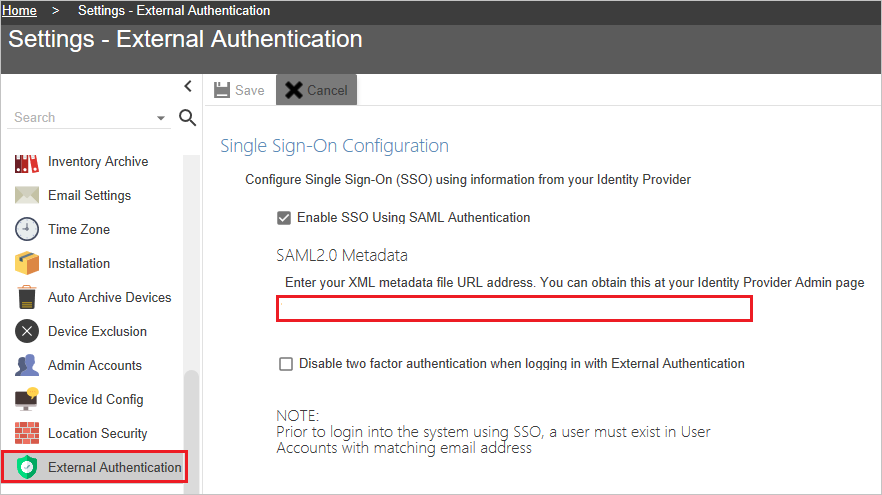
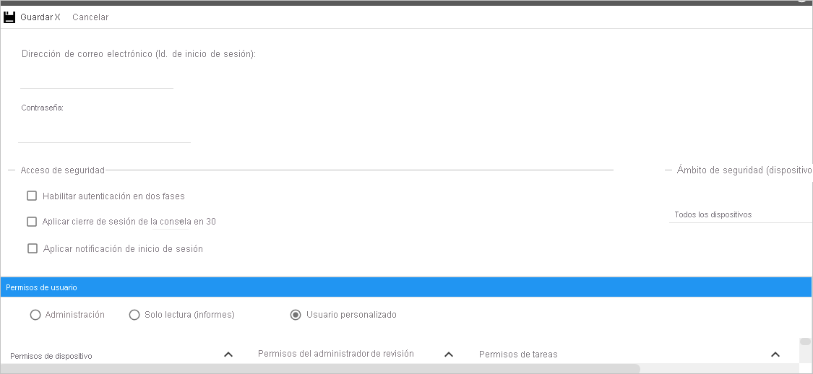

# Tutorial: Integración del inicio de sesión único (SSO) de Azure Active Directory con Syxsense

En este tutorial aprenderá a integrar Syxsense con Azure Active Directory (Azure AD). Al integrar Syxsense con Azure AD, puede hacer lo siguiente:

* Controlar en Azure AD quién tiene acceso a Syxsense.
* Permitir que los usuarios inicien sesión automáticamente en Syxsense con sus cuentas de Azure AD.
* Administrar las cuentas desde una ubicación central (Azure Portal).

## Requisitos previos

Para empezar, necesita los siguientes elementos:

* Una suscripción de Azure AD. Si no tiene una suscripción, puede crear una [cuenta gratuita](https://azure.microsoft.com/free/).
* Una suscripción habilitada para el inicio de sesión único (SSO) en Syxsense.

## Descripción del escenario

En este tutorial, va a configurar y probar el inicio de sesión único de Azure AD en un entorno de prueba.

* Syxsense admite el inicio de sesión único iniciado por **SP e IDP**.

## Incorporación de Syxsense desde la galería

Para configurar la integración de Syxsense en Azure AD, es preciso agregar Syxsense desde la galería a la lista de aplicaciones SaaS administradas.

1. Inicie sesión en Azure Portal con una cuenta personal, profesional o educativa de Microsoft.
1. En el panel de navegación de la izquierda, seleccione el servicio **Azure Active Directory**.
1. Vaya a **Aplicaciones empresariales** y seleccione **Todas las aplicaciones**.
1. Para agregar una nueva aplicación, seleccione **Nueva aplicación**.
1. En la sección **Agregar desde la galería**, escriba **Syxsense** en el cuadro de búsqueda.
1. Seleccione **Syxsense** en el panel de resultados y agregue la aplicación. Espere unos segundos mientras la aplicación se agrega al inquilino.

## Configuración y prueba del inicio de sesión único de Azure AD para Syxsense

Configure y pruebe el inicio de sesión único de Azure AD con Syxsense mediante un usuario de prueba llamado **B.Simon**. Para que el inicio de sesión único funcione, es preciso establecer una relación de vinculación entre un usuario de Azure AD y el usuario relacionado de Syxsense.

Para configurar y probar el inicio de sesión único de Azure AD con Syxsense, haga lo siguiente:

1. **[Configuración del inicio de sesión único de Azure AD](#configure-azure-ad-sso)** , para permitir que los usuarios puedan utilizar esta característica.
    1. **[Creación de un usuario de prueba de Azure AD](#create-an-azure-ad-test-user)** , para probar el inicio de sesión único de Azure AD con B.Simon.
    1. **[Asignación del usuario de prueba de Azure AD](#assign-the-azure-ad-test-user)** , para habilitar a B.Simon para que use el inicio de sesión único de Azure AD.
1. **[Configuración del inicio de sesión único en Syxsense](#configure-syxsense-sso)** , para configurar los valores del inicio de sesión único en la aplicación.
    1. **[Creación de un usuario de prueba de Syxsense](#create-syxsense-test-user)** , para tener un homólogo de B.Simon en Syxsense que esté vinculado a la representación del usuario en Azure AD.
1. **[Prueba del inicio de sesión único](#test-sso)** : para comprobar si la configuración funciona.

## Configuración del inicio de sesión único de Azure AD

Siga estos pasos para habilitar el inicio de sesión único de Azure AD en Azure Portal.

1. En Azure Portal, en la página de integración de la aplicación **Syxsense**, busque la sección **Administrar** y seleccione **Inicio de sesión único**.
1. En la página **Seleccione un método de inicio de sesión único**, elija **SAML**.
1. En la página **Configuración del inicio de sesión único con SAML**, haga clic en el icono de lápiz de **Configuración básica de SAML** para editar la configuración.

   

1. En la sección **Configuración básica de SAML**, si desea configurar la aplicación en modo iniciado por **IDP**, realice los siguientes pasos:

    a. En el cuadro de texto **Identificador**, escriba una dirección URL con el patrón siguiente: `https://<SUBDOMAIN>.cloudmanagementsuite.com/Saml2`

    b. En el cuadro de texto **URL de respuesta**, escriba una dirección URL con el siguiente patrón: `https://<SUBDOMAIN>.cloudmanagementsuite.com/Saml2/Acs`

    > [!NOTE]
    > Estos valores no son reales. Actualice estos valores con el identificador y la URL de respuesta reales. Póngase en contacto con el [equipo de soporte técnico del cliente de Syxsense](mailto:DevTeam@syxsense.com) para obtener estos valores. También puede hacer referencia a los patrones que se muestran en la sección **Configuración básica de SAML** de Azure Portal.

1. La aplicación Syxsense espera las aserciones de SAML en un formato específico, que requiere que se agreguen asignaciones de atributos personalizados a la configuración de los atributos del token de SAML. La siguiente captura de muestra la lista de atributos predeterminados.

    

1. Además de lo anterior, la aplicación Syxsense espera que se devuelvan algunos atributos más, que se muestran a continuación, en la respuesta de SAML. Estos atributos también se rellenan previamente, pero puede revisarlos según sus requisitos.

    | Nombre | Atributo de origen|
    | ------------ | --------- |
    | Email | user.email |

1. En la página **Configurar el inicio de sesión único con SAML**, en la sección **Certificado de firma de SAML**, haga clic en el botón de copia para copiar la **Dirección URL de metadatos de federación de aplicación** y guárdela en su equipo.

    

### Creación de un usuario de prueba de Azure AD

En esta sección, va a crear un usuario de prueba llamado B.Simon en Azure Portal.

1. En el panel izquierdo de Azure Portal, seleccione **Azure Active Directory**, **Usuarios** y **Todos los usuarios**.
1. Seleccione **Nuevo usuario** en la parte superior de la pantalla.
1. En las propiedades del **usuario**, siga estos pasos:
   1. En el campo **Nombre**, escriba `B.Simon`.  
   1. En el campo **Nombre de usuario**, escriba username@companydomain.extension. Por ejemplo, `B.Simon@contoso.com`.
   1. Active la casilla **Show password** (Mostrar contraseña) y, después, anote el valor que se muestra en el cuadro **Contraseña**.
   1. Haga clic en **Crear**.

### Asignación del usuario de prueba de Azure AD

En esta sección va a conceder a B.Simon acceso a Syxsense mediante el inicio de sesión único de Azure.

1. En Azure Portal, seleccione sucesivamente **Aplicaciones empresariales** y **Todas las aplicaciones**.
1. En la lista de aplicaciones, seleccione **Syxsense**.
1. En la página de información general de la aplicación, busque la sección **Administrar** y seleccione **Usuarios y grupos**.
1. Seleccione **Agregar usuario**. A continuación, en el cuadro de diálogo **Agregar asignación**, seleccione **Usuarios y grupos**.
1. En el cuadro de diálogo **Usuarios y grupos**, seleccione **B.Simon** de la lista de usuarios y haga clic en el botón **Seleccionar** de la parte inferior de la pantalla.
1. Si espera que haya un valor de rol en la aserción de SAML, en el cuadro de diálogo **Seleccionar rol**, seleccione en la lista el rol adecuado para el usuario y haga clic en el botón **Seleccionar** en la parte inferior de la pantalla.
1. En el cuadro de diálogo **Agregar asignación**, haga clic en el botón **Asignar**.

## Configuración del inicio de sesión único en Syxsense

1. En otra ventana del explorador web, inicie sesión en el sitio web de Syxsense como administrador.

1. Haga clic en el **icono Settings** (Configuración).

    

1. Haga clic en **External Authentication** (Autenticación externa), indique el valor de **Dirección URL de metadatos de federación de aplicación** en el cuadro de texto **SAML2.0 Metadata** (Metadatos de SAML2.0) y haga clic en **Save** (Guardar).

    

### Creación de un usuario de prueba de Syxsense

1. En otra ventana del explorador web, inicie sesión en el sitio web de Syxsense como administrador.

1. Haga clic en **User Accounts** (Cuentas de usuario) en el panel de navegación izquierdo.

    

1. Haga clic en **Agregar**.

    

1. Indique los detalles del usuario según los requisitos de su organización y haga clic en **Save** (Guardar).

    

## Prueba de SSO

En esta sección, probará la configuración de inicio de sesión único de Azure AD con las siguientes opciones. 

#### Iniciado por SP:

* Haga clic en **Probar esta aplicación** en Azure Portal. Esta acción le redirigirá a la URL de inicio de sesión de Syxsense, desde donde podrá poner en marcha el flujo de inicio de sesión.  

* Vaya directamente a la dirección URL de inicio de sesión de Syxsense e inicie el flujo de inicio de sesión desde allí.

#### Iniciado por IDP:

* Haga clic en **Probar esta aplicación** en Azure Portal. Debería iniciar sesión automáticamente en la instancia de Syxsense para la que configurara el inicio de sesión único. 

También puede usar Aplicaciones de Microsoft para probar la aplicación en cualquier modo. Al hacer clic en el icono de Syxsense de Aplicaciones, si se ha configurado en modo SP, se le redirigirá a la página de inicio de sesión de la aplicación para comenzar el flujo de inicio de sesión; y si se ha configurado en modo IDP, se debería iniciar sesión automáticamente en la instancia de Syxsense para la que configurara el inicio de sesión único. Para más información acerca de Aplicaciones, consulte [Inicio de sesión e inicio de aplicaciones desde el portal Aplicaciones](../user-help/my-apps-portal-end-user-access.md).

## Pasos siguientes

Una configurado Syxsense, podrá aplicar el control de sesión, que protege la información confidencial de su organización de la filtración y la infiltración en tiempo real. El control de sesión procede del acceso condicional. [Aprenda a aplicar el control de sesión con Microsoft Cloud App Security](/cloud-app-security/proxy-deployment-aad).