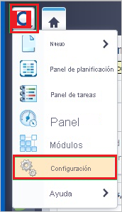
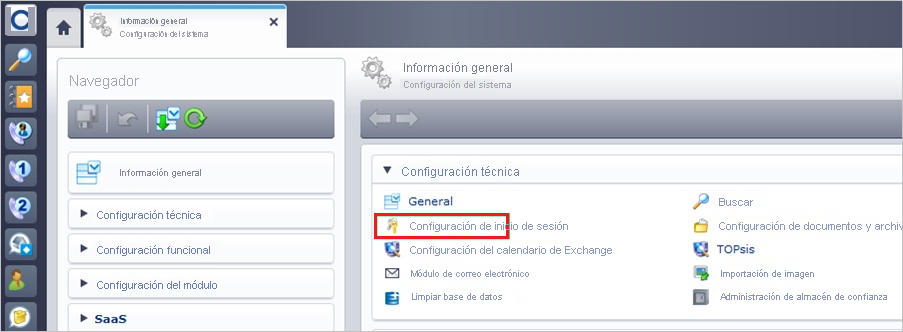
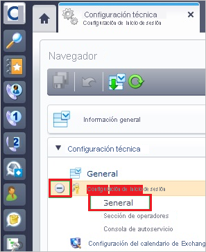
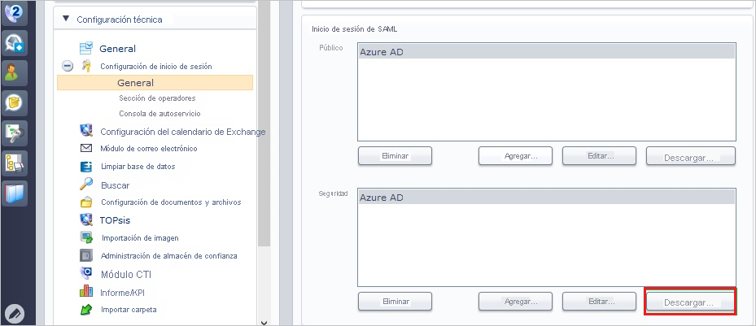
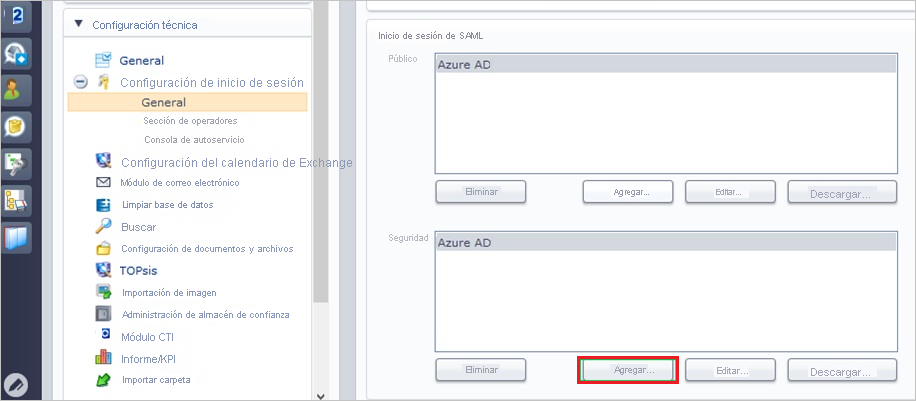
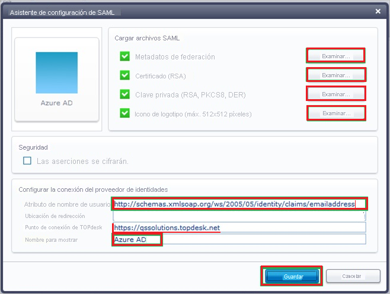
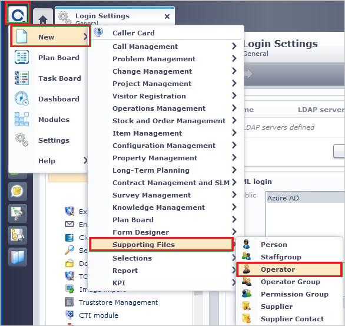

# Tutorial: Integración del inicio de sesión único de Azure AD con TOPdesk - Secure

En este tutorial, obtendrá información sobre cómo integrar TOPdesk - Secure con Azure Active Directory (Azure AD). Al integrar TOPdesk - Secure con Azure AD, podrá hacer lo siguiente:

* Controlar en Azure AD quién tiene acceso a TOPdesk - Secure.
* Permitir que los usuarios inicien sesión automáticamente en TOPdesk - Secure (inicio de sesión único) con sus cuentas de Azure AD.
* Administrar las cuentas desde una ubicación central (Azure Portal).

## Prerrequisitos

Para empezar, necesita los siguientes elementos:
 
 * Una suscripción de Azure AD. Si no tiene una suscripción, puede crear una [cuenta gratuita](https://azure.microsoft.com/free/).
* Una suscripción habilitada para el inicio de sesión único (SSO) en TOPdesk - Secure.

## Descripción del escenario

En este tutorial, puede configurar y probar el inicio de sesión único de Azure AD en un entorno de prueba.

* TOPdesk - Secure admite el inicio de sesión único iniciado por **SP**.

## Incorporación de TOPdesk - Secure desde la galería

Para configurar la integración de TOPdesk - Secure en Azure AD, deberá agregar TOPdesk - Secure desde la galería a la lista de aplicaciones SaaS administradas.

1. Inicie sesión en Azure Portal con una cuenta personal, profesional o educativa de Microsoft.
1. En el panel de navegación de la izquierda, seleccione el servicio **Azure Active Directory**.
1. Vaya a **Aplicaciones empresariales** y seleccione **Todas las aplicaciones**.
1. Para agregar una nueva aplicación, seleccione **Nueva aplicación**.
1. En la sección **Agregar desde la galería**, escriba **TOPdesk - Secure** en el cuadro de búsqueda.
1. En el panel de resultados, seleccione **TOPdesk - Secure** en el panel de resultados y agregue la aplicación. Espere unos segundos mientras la aplicación se agrega al inquilino.

## Configuración y prueba del inicio de sesión único de Azure AD SSO para TOPdesk - Secure

En esta sección, podrá configurar y probar el inicio de sesión único de Azure AD con TOPdesk - Secure con un usuario de prueba llamado **Britta Simon**.
Para que el inicio de sesión único funcione, es preciso establecer una relación de vínculo entre un usuario de Azure AD y el usuario relacionado de TOPdesk - Secure.

Para configurar y probar el inicio de sesión único de Azure AD con TOPdesk - Secure, es preciso completar los siguientes pasos:

1. **[Configuración del inicio de sesión único de Azure AD](#configure-azure-ad-sso)** , para permitir que los usuarios puedan utilizar esta característica.
    1. **[Creación de un usuario de prueba de Azure AD](#create-an-azure-ad-test-user)** , para probar el inicio de sesión único de Azure AD con Britta Simon.
    2. **[Asignación del usuario de prueba de Azure AD](#assign-the-azure-ad-test-user)** , para permitir que Britta Simon use el inicio de sesión único de Azure AD.
2. **[Configuración del inicio de sesión único de TOPdesk - Secure](#configure-topdesk---secure-sso)** , para configurar los valores de inicio de sesión único en la aplicación.
    1. **[Creación de un usuario de prueba de TOPdesk - Secure](#create-topdesk---secure-test-user)**: para tener un homólogo de Britta Simon en TOPdesk - Secure que esté vinculado a su representación en Azure AD.
1. **[Prueba del inicio de sesión único](#test-sso)** : para comprobar si la configuración funciona.

## Configuración del inicio de sesión único de Azure AD

En esta sección, habilitará el inicio de sesión único de Azure AD en Azure Portal.

Para configurar el inicio de sesión único de Azure AD con TOPdesk - Secure, realice los pasos siguientes:

1. En Azure Portal, en la página de integración la aplicación **TOPdesk - Secure**, seleccione **Inicio de sesión único**.

2. En el cuadro de diálogo **Seleccionar un método de inicio de sesión único**, seleccione el modo **SAML/WS-Fed** para habilitar el inicio de sesión único.

3. En la página **Configurar el inicio de sesión único con SAML**, haga clic en el icono del lapicero para abrir el cuadro de diálogo **Configuración básica de SAML**.

    

4. En la sección **Configuración básica de SAML**, siga estos pasos:

    a. En el cuadro **URL del identificador**, rellene la dirección URL de metadatos de TOPdesk que puede recuperar desde la configuración de esta aplicación. Debe usar el patrón siguiente: `https://<companyname>.topdesk.net/saml-metadata/<identifier>`

    b. En el cuadro de texto **URL de respuesta**, escriba una dirección URL con el siguiente patrón: `https://<companyname>.topdesk.net/tas/secure/login/verify`

    c. En el cuadro de texto **URL de inicio de sesión**, escriba una dirección URL con el siguiente patrón: `https://<companyname>.topdesk.net`

    > [!NOTE]
    > Estos valores no son reales. Actualice estos valores con los valores reales de Identificador, URL de respuesta y URL de inicio de sesión. Póngase en contacto con el [equipo de soporte técnico de TOPdesk - Secure](https://www.topdesk.com/en/services/support/) para obtener estos valores. También puede hacer referencia a los patrones que se muestran en la sección **Configuración básica de SAML** de Azure Portal.

5. En la página **Configurar el inicio de sesión único con SAML**, en la sección **Certificado de firma de SAML**, haga clic en **Descargar** para descargar el **XML de metadatos de federación** de las opciones proporcionadas según sus requisitos y guárdelo en el equipo.

    

6. En la sección **Set up TOPdesk - Secure** (Configurar TOPdesk - Secure), copie las direcciones URL que necesite.

    

### Creación de un usuario de prueba de Azure AD 

En esta sección, va a crear un usuario de prueba llamado B.Simon en Azure Portal.

1. En el panel izquierdo de Azure Portal, seleccione **Azure Active Directory**, **Usuarios** y **Todos los usuarios**.
1. Seleccione **Nuevo usuario** en la parte superior de la pantalla.
1. En las propiedades del **usuario**, siga estos pasos:
   1. En el campo **Nombre**, escriba `B.Simon`.  
   1. En el campo **Nombre de usuario**, escriba username@companydomain.extension. Por ejemplo, `B.Simon@contoso.com`.
   1. Active la casilla **Show password** (Mostrar contraseña) y, después, anote el valor que se muestra en el cuadro **Contraseña**.
   1. Haga clic en **Crear**.

### Asignación del usuario de prueba de Azure AD

En esta sección, va a permitir que B.Simon acceda a TOPdesk - Secure mediante el inicio de sesión único de Azure.

1. En Azure Portal, seleccione sucesivamente **Aplicaciones empresariales** y **Todas las aplicaciones**.
1. En la lista de aplicaciones, seleccione **TOPdesk - Secure**.
1. En la página de información general de la aplicación, busque la sección **Administrar** y seleccione **Usuarios y grupos**.
1. Seleccione **Agregar usuario**. A continuación, en el cuadro de diálogo **Agregar asignación**, seleccione **Usuarios y grupos**.
1. En el cuadro de diálogo **Usuarios y grupos**, seleccione **B.Simon** de la lista de usuarios y haga clic en el botón **Seleccionar** de la parte inferior de la pantalla.
1. Si espera que se asigne un rol a los usuarios, puede seleccionarlo en la lista desplegable **Seleccionar un rol**. Si no se ha configurado ningún rol para esta aplicación, verá seleccionado el rol "Acceso predeterminado".
1. En el cuadro de diálogo **Agregar asignación**, haga clic en el botón **Asignar**.

## Configuración del inicio de sesión único de TOPdesk - Seguro

1. Inicie sesión en el sitio **TOPdesk - Secure** de su empresa como administrador.

2. En el menú **TOPdesk**, haga clic en **Configuración**.

    

3. Haga clic en **Configuración de inicio de sesión**.

    

4. Expanda el menú **Configuración de inicio de sesión** menú y haga clic en **General**.

    

5. En la sección **Seguro** de la sección de configuración **Inicio de sesión SAML**, realice los pasos siguientes:

    

    a. Haga clic en **Descargar** para descargar el archivo de metadatos públicos y guárdelo en el equipo.

    b. Abra el archivo de metadatos y busque el nodo **AssertionConsumerService**.

    

    c. Copia el valor de **AssertionConsumerService**, péguelo en el cuadro de texto Dirección URL de respuesta de la sección **Dominio y direcciones URL de TOPdesk - Secure**.

6. Lleve a cabo los siguientes pasos para crear un archivo de certificado:

    

    a. Abra el archivo de metadatos descargado de Azure Portal.

    b. Expanda el nodo **RoleDescriptor** con **xsi:type** de **fed:ApplicationServiceType**.

    c. Copie el valor del nodo **X509Certificate**.

    d. Guarde en un archivo el valor **X509Certificate** copiado localmente en el equipo.

7. En la sección **Público**, haga clic en **Agregar**.

    

8. En la página del cuadro de diálogo **Asistente para la configuración SAML**, lleve a cabo los pasos siguientes:

    

    a. Para cargar el archivo de metadatos descargado de Azure Portal, en **Federation Metadata** (Metadatos de federación) haga clic en **Browse** (Examinar).

    b. Para cargar el archivo de certificado, en **Certificado (RSA)**, haga clic en **Examinar**.

    c. Para **Clave privada (RSA, PKCS8, DER)**, puede cargar su propia clave privada o puede ponerse en contacto con el [equipo de soporte técnico de TOPdesk](https://www.topdesk.com/en/services/support/) para obtener la clave privada.

    d. Para cargar el archivo de logotipo que obtuvo del equipo de soporte técnico de TOPdesk, en **Icono del logotipo**, haga clic en **Examinar**.

    e. En el cuadro de texto **User name attribute** (Atributo de nombre de usuario), escriba `http://schemas.xmlsoap.org/ws/2005/05/identity/claims/emailaddress`.

    f. En el cuadro de texto **Nombre para mostrar**, escriba un nombre para la configuración.

    g. Haga clic en **Save**(Guardar).

### Creación de un usuario de prueba de TOPdesk - Secure

Para permitir que los usuarios de Azure AD inicien sesión en TOPdesk - Secure, deben aprovisionarse en TOPdesk - Secure.  
En el caso de TOPdesk - Secure, el aprovisionamiento es una tarea manual.

### Siga estos pasos para configurar el aprovisionamiento de usuario:

1. Inicie sesión en su sitio de la compañía de **TOPdesk - Secure** como administrador.

2. En el menú de la parte superior, haga clic en **TOPdesk \> New \> Support Files \> Operator** (TOPdesk > Nuevo > Archivos de soporte > Operador).

    

3. En el cuadro de diálogo **Nuevo operador**, realice los pasos siguientes:

    ")

    a. Haga clic en la pestaña **General**.

    b. En el cuadro de texto **Apellidos**, escriba los apellidos del usuario, en este caso, **Simon**.

    c. Seleccione un **Sitio** para la cuenta en la sección **Ubicación**.

    d. En el cuadro de texto **Nombre de inicio de sesión** de la sección **Inicio de sesión de TOPdesk**, escriba un nombre de inicio de sesión para el usuario.

    e. Haga clic en **Save**(Guardar).

> [!NOTE]
> Puede usar cualquier otra API o herramienta de creación de cuentas de usuario de TOPdesk - Secure ofrecida por TOPdesk - Secure para aprovisionar cuentas de usuario de Azure AD.

## Prueba de SSO

En esta sección, probará la configuración de inicio de sesión único de Azure AD con las siguientes opciones. 

* Haga clic en **Probar esta aplicación** en Azure Portal. Esta acción le redirigirá a la dirección URL de inicio de sesión de TOPdesk - Secure, desde donde podrá iniciar el flujo de inicio de sesión. 

* Vaya directamente a la URL de inicio de sesión de TOPdesk - Secure y ponga en marcha el flujo de inicio de sesión desde allí.

* Puede usar Mis aplicaciones de Microsoft. Al hacer clic en el icono de TOPdesk - Secure en el panel de acceso y debería iniciar sesión automáticamente en la instancia de TOPdesk - Secure para la que configuró el inicio de sesión único. Para más información acerca de Aplicaciones, consulte [Inicio de sesión e inicio de aplicaciones desde el portal Aplicaciones](https://support.microsoft.com/account-billing/sign-in-and-start-apps-from-the-my-apps-portal-2f3b1bae-0e5a-4a86-a33e-876fbd2a4510).

## Pasos siguientes

Una vez que se ha configurado TOPdesk - Secure, puede aplicar el control de sesión, que protege su organización en tiempo real frente a la filtración e infiltración de información confidencial. El control de sesión procede del acceso condicional. [Aprenda a aplicar el control de sesión con Microsoft Cloud App Security](/cloud-app-security/proxy-deployment-any-app).
