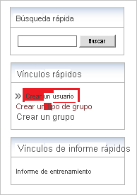
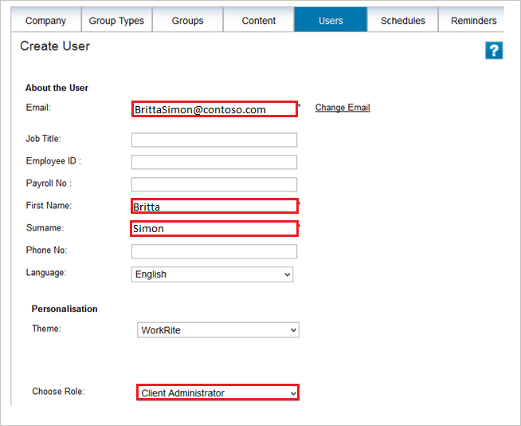

# Tutorial: Integración del inicio de sesión único de Azure AD con Workrite

En este tutorial, aprenderá a integrar Workrite con Azure Active Directory (Azure AD). Si integra Workrite con Azure AD, podrá realizar las siguientes acciones:

* Controlar en Azure AD quién tiene acceso a Workrite.
* Permitir que los usuarios puedan iniciar sesión automáticamente en Workrite con sus cuentas de Azure AD.
* Administrar las cuentas desde una ubicación central (Azure Portal).

## Requisitos previos

Para configurar la integración de Azure AD con Workrite, necesita los siguientes elementos:

* Una suscripción de Azure AD. Si no dispone de un entorno de Azure AD, puede obtener [una cuenta gratuita](https://azure.microsoft.com/free/).
* Suscripción de Workrite habilitada para el inicio de sesión único.

## Descripción del escenario

En este tutorial, puede configurar y probar el inicio de sesión único de Azure AD en un entorno de prueba.

* Workrite admite el inicio de sesión único iniciado por **SP**.

> [!NOTE]
> El identificador de esta aplicación es un valor de cadena fijo, por lo que solo se puede configurar una instancia en un inquilino.

## Adición de Workrite desde la galería

Para configurar la integración de Workrite en Azure AD, deberá agregar Workrite desde la galería a la lista de aplicaciones SaaS administradas.

1. Inicie sesión en Azure Portal con una cuenta personal, profesional o educativa de Microsoft.
1. En el panel de navegación de la izquierda, seleccione el servicio **Azure Active Directory**.
1. Vaya a **Aplicaciones empresariales** y seleccione **Todas las aplicaciones**.
1. Para agregar una nueva aplicación, seleccione **Nueva aplicación**.
1. En la sección **Agregar desde la galería**, escriba **Workrite** en el cuadro de búsqueda.
1. Seleccione **Workrite** en el panel de resultados y agregue la aplicación. Espere unos segundos mientras la aplicación se agrega al inquilino.

## Configuración y prueba del inicio de sesión único de Azure AD para Workrite

Configure y pruebe el inicio de sesión único de Azure AD con Workrite mediante un usuario de prueba llamado **B.Simon**. Para que el inicio de sesión único funcione, es necesario establecer una relación de vinculación entre un usuario de Azure AD y el usuario relacionado de Workrite.

Para configurar y probar el inicio de sesión único de Azure AD con Workrite, siga estos pasos:

1. **[Configuración del inicio de sesión único de Azure AD](#configure-azure-ad-sso)** , para permitir que los usuarios puedan utilizar esta característica.
    1. **[Creación de un usuario de prueba de Azure AD](#create-an-azure-ad-test-user)**, para probar el inicio de sesión único de Azure AD con B.Simon.
    1. **[Asignación del usuario de prueba de Azure AD](#assign-the-azure-ad-test-user)** , para habilitar a B.Simon para que use el inicio de sesión único de Azure AD.
1. **[Configuración del inicio de sesión único en Workrite](#configure-workrite-sso)** , para configurar los valores de Inicio de sesión único en la aplicación.
    1. **[Creación de un usuario de prueba de Workrite](#create-workrite-test-user)** : para tener un homólogo de B.Simon en Workrite que esté vinculado a la representación del usuario en Azure AD.
1. **[Prueba del inicio de sesión único](#test-sso)** : para comprobar si la configuración funciona.

## Configuración del inicio de sesión único de Azure AD

Siga estos pasos para habilitar el inicio de sesión único de Azure AD en Azure Portal.

1. En Azure Portal, en la página de integración de la aplicación **Workrite**, busque la sección **Administrar** y seleccione **Inicio de sesión único**.
1. En la página **Seleccione un método de inicio de sesión único**, elija **SAML**.
1. En la página **Configuración del inicio de sesión único con SAML**, haga clic en el icono de lápiz de **Configuración básica de SAML** para editar la configuración.

   

4. En la sección **Configuración básica de SAML**, siga estos pasos:

    En el cuadro de texto **URL de inicio de sesión**, escriba una dirección URL con el siguiente patrón: `https://app.workrite.co.uk/securelogin/samlgateway.aspx?id=<uniqueid>`

    > [!NOTE]
    > Este valor no es real. Actualícelo con la dirección URL de inicio de sesión real. Póngase en contacto con el [equipo de soporte al cliente de Workrite](mailto:support@workrite.co.uk) para obtener el valor. También puede hacer referencia a los patrones que se muestran en la sección **Configuración básica de SAML** de Azure Portal.

5. En la página **Configurar el inicio de sesión único con SAML**, en la sección **Certificado de firma de SAML**, haga clic en **Descargar** para descargar el **certificado (Base64)** de las opciones proporcionadas según sus requisitos y guárdelo en el equipo.

    

6. En la sección **Set up Workrite** (Configurar Workrite), copie las direcciones URL adecuadas según sus necesidades.

    

### Creación de un usuario de prueba de Azure AD 

En esta sección, va a crear un usuario de prueba llamado B.Simon en Azure Portal.

1. En el panel izquierdo de Azure Portal, seleccione **Azure Active Directory**, **Usuarios** y **Todos los usuarios**.
1. Seleccione **Nuevo usuario** en la parte superior de la pantalla.
1. En las propiedades del **usuario**, siga estos pasos:
   1. En el campo **Nombre**, escriba `B.Simon`.  
   1. En el campo **Nombre de usuario**, escriba username@companydomain.extension. Por ejemplo, `B.Simon@contoso.com`.
   1. Active la casilla **Show password** (Mostrar contraseña) y, después, anote el valor que se muestra en el cuadro **Contraseña**.
   1. Haga clic en **Crear**.

### Asignación del usuario de prueba de Azure AD

En esta sección, va a permitir que B.Simon acceda a Workrite mediante el inicio de sesión único de Azure.

1. En Azure Portal, seleccione sucesivamente **Aplicaciones empresariales** y **Todas las aplicaciones**.
1. En la lista de aplicaciones, seleccione **Workrite**.
1. En la página de información general de la aplicación, busque la sección **Administrar** y seleccione **Usuarios y grupos**.
1. Seleccione **Agregar usuario**. A continuación, en el cuadro de diálogo **Agregar asignación**, seleccione **Usuarios y grupos**.
1. En el cuadro de diálogo **Usuarios y grupos**, seleccione **B.Simon** de la lista de usuarios y haga clic en el botón **Seleccionar** de la parte inferior de la pantalla.
1. Si espera que se asigne un rol a los usuarios, puede seleccionarlo en la lista desplegable **Seleccionar un rol**. Si no se ha configurado ningún rol para esta aplicación, verá seleccionado el rol "Acceso predeterminado".
1. En el cuadro de diálogo **Agregar asignación**, haga clic en el botón **Asignar**.

## Configuración del inicio de sesión único de Workrite

Para configurar el inicio de sesión único en **Workrite**, es preciso enviar el **certificado (Base64)** descargado y las direcciones URL correspondientes copiadas de Azure Portal al [equipo de soporte técnico de Workrite](mailto:support@workrite.co.uk). Dicho equipo lo configura para establecer la conexión de SSO de SAML correctamente en ambos lados.

### Creación de un usuario de prueba de Workrite

El objetivo de esta sección es crear una usuaria de prueba llamada Britta Simon en Workrite.

**Para crear una usuaria llamada Britta Simon en Workrite, realice los pasos siguientes:**

1. Inicie sesión en su sitio de la compañía de Workrite como administrador.

2. En el panel de navegación, haga clic en **Administrador**.
   
    

3. Vaya a Vínculos rápidos y, a continuación, haga clic en **Crear un usuario**.
   
    

4. En el cuadro de diálogo **Crear usuario**, realice los pasos siguientes:
   
    
    
    a. En el cuadro de texto **Correo electrónico**, escriba la dirección de correo electrónico de un usuario, por ejemplo, Brittasimon@contoso.com.

    b. En el cuadro de texto **Nombre**, escriba el nombre del usuario, en este caso, Britta.

    c. En el cuadro de texto **Apellidos**, escriba los apellidos del usuario, en este caso, Simon.
    
    d. Seleccione **Administrador de cliente** como **Elegir rol**.
    
    e. Haga clic en **Save**(Guardar).

## Prueba de SSO 

En esta sección, probará la configuración de inicio de sesión único de Azure AD con las siguientes opciones. 

* Haga clic en **Probar esta aplicación** en Azure Portal. Esto le redirigirá a la dirección URL de inicio de sesión de Workrite, desde donde puede iniciar el flujo de inicio de sesión. 

* Vaya directamente a la dirección URL de inicio de sesión de Workrite e inicie el flujo de inicio de sesión desde allí.

* Puede usar Mis aplicaciones de Microsoft. Al hacer clic en el icono de Workrite que se encuentra en Aplicaciones, se le redirigirá a la URL de inicio de sesión de esa aplicación. Para más información acerca de Aplicaciones, consulte [Inicio de sesión e inicio de aplicaciones desde el portal Aplicaciones](../user-help/my-apps-portal-end-user-access.md).

## Pasos siguientes

Una vez que haya configurado Workrite, puede aplicar el control de sesión, que protege a la organización en tiempo real frente a la filtración e infiltración de información confidencial. El control de sesión procede del acceso condicional. [Aprenda a aplicar el control de sesión con Microsoft Defender para aplicaciones en la nube](/cloud-app-security/proxy-deployment-aad).
