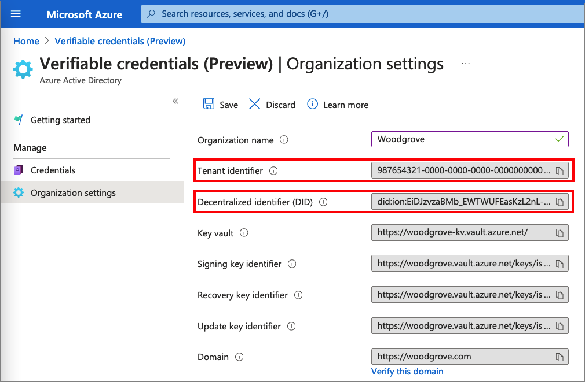
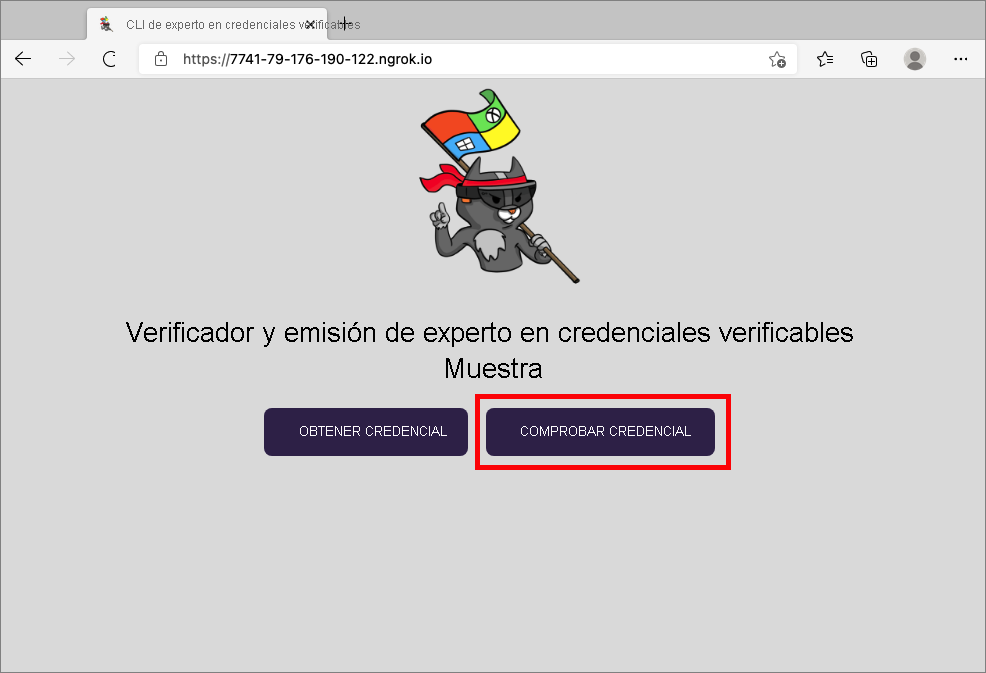
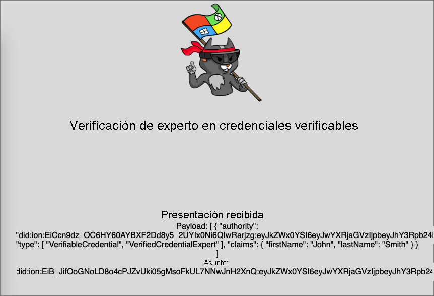

# <a name="configure-azure-ad-verifiable-credentials-verifier-preview"></a>Configuración del comprobador de credenciales verificables de Azure AD (versión preliminar)

En el [tutorial anterior](verifiable-credentials-configure-issuer.md), ha aprendido a emitir y comprobar las credenciales con el mismo inquilino de Azure Active Directory (Azure AD). En este tutorial, recorrerá los pasos necesarios para presentar y comprobar la primera credencial verificable: una tarjeta de experto en credenciales verificadas.

Como comprobador, desbloqueará privilegios para las personas que tengan tarjetas de expertos en credenciales verificadas. En este tutorial, ejecutará una aplicación de ejemplo desde la máquina local que le pedirá que presente una tarjeta de experto en credenciales verificadas y, a continuación, la comprobará.

En este artículo aprenderá a:

> [!div class="checklist"]
>
> - Descargar el código de la aplicación de ejemplo en la máquina local.
> - Configurar las credenciales verificables de Azure AD en el inquilino de Azure AD.
> - Recopilar las credenciales y los detalles del entorno para configurar y actualizar la aplicación de ejemplo con los detalles de la tarjeta de expertos en credenciales verificadas.
> - Ejecutar la aplicación de ejemplo e iniciar un proceso de emisión de credenciales verificables.

## <a name="prerequisites"></a>Prerrequisitos

- Antes de empezar, es importante [configurar un inquilino para las credenciales verificables de Azure AD](verifiable-credentials-configure-tenant.md).
- Necesita que [GIT](https://git-scm.com/downloads) esté instalado si desea clonar el repositorio que hospeda la aplicación de ejemplo.
- [Visual Studio Code](https://code.visualstudio.com/Download) u otro editor de código
- [.NET 5.0](https://dotnet.microsoft.com/download/dotnet/5.0)
- [NGROK](https://ngrok.com/) gratis.
- Un dispositivo móvil con Microsoft Authenticator
  - Android 6.2108.5654 o una versión posterior instalado
  - iOS 6.5.82 o una versión posterior instalado

## <a name="gather-tenant-details-to-set-up-your-sample-application"></a>Recopilación de detalles del inquilino para configurar la aplicación de ejemplo

Ahora que ha configurado su servicio de credenciales verificables de Azure AD, va a recopilar información sobre su entorno y las credenciales verificables que ha establecido. Estos fragmentos de información los utilizará al configurar la aplicación de ejemplo.

1. En las credenciales verificables, seleccione **Configuración de la organización**.
1. Copie el **identificador de inquilino** y anótelo para utilizarlo en otro momento.
1. Copie el **identificador descentralizado** y anótelo para usarlo en otro momento.

En la captura de pantalla siguiente se muestra cómo copiar los valores necesarios:



## <a name="download-the-sample-code"></a>Descarga del código de ejemplo

La aplicación de ejemplo está disponible en .NET y el código se mantiene en un repositorio de GitHub. Descargue nuestro código de ejemplo del [repositorio de GitHub](https://github.com/Azure-Samples/active-directory-verifiable-credentials-dotnet) o clone el repositorio en la máquina local:

```bash
git clone git@github.com:Azure-Samples/active-directory-verifiable-credentials-dotnet.git 
```

## <a name="configure-the-verifiable-credentials-app"></a>Configuración de la aplicación de credenciales verificables

Cree un secreto de cliente para la aplicación registrada que ha creado. La aplicación de ejemplo usa el secreto de cliente para demostrar su identidad al solicitar tokens.

1. Vaya a la página **Registros de aplicaciones** situada dentro de **Azure Active Directory**

1. Seleccione la aplicación *verifiable-credentials-app* creada anteriormente.

1. Seleccione el nombre para entrar en los **detalles de registros de aplicaciones**.

1. Copie el valor de **Id. de aplicación (cliente)** y guárdelo para usarlo más adelante. 

    

1. Mientras está en los detalles de registro de aplicaciones, en el menú principal, en **Administrar**, seleccione **Certificates & secrets** (Certificados y secretos).

1. Elija **Nuevo secreto de cliente**.

    1. En el cuadro **Descripción**, escriba una descripción para el secreto de cliente (por ejemplo, vc-sample-secret).

    1. En **Expira**, seleccione el tiempo durante el cual es válido el secreto (por ejemplo, 6 meses) y, luego, elija **Agregar**.

    1. Registre el **Valor** del secreto. Este valor se usará para la configuración en un paso posterior. El valor del secreto no se volverá a mostrar ni se podrá recuperar por ningún otro medio, de modo que anótelo en cuanto sea visible.

En este momento, debe tener toda la información necesaria para configurar la aplicación de ejemplo.

## <a name="update-the-sample-application"></a>Actualización de la aplicación de ejemplo

Ahora, realizará modificaciones en el código del emisor de la aplicación de ejemplo para actualizarlo con la dirección URL de la credencial verificable. Este paso le permite emitir credenciales verificables mediante su propio inquilino.

1. En el directorio *active-directory-verifiable-credentials-dotnet-main*, abra Visual Studio Code y seleccione el proyecto dentro del directorio *1. asp-net-core-api-idtokenhint*.

1. En la carpeta raíz del proyecto, abra el archivo appsettings.json. Este archivo contiene información sobre las credenciales verificables de Azure AD. Actualice las siguientes propiedades con la información que ha anotado durante los pasos anteriores.

    1. **Id. de inquilino:** su identificador de inquilino
    1. **Id. de cliente**: su identificador de cliente
    1. **Secreto de cliente**: su secreto de cliente
    1. **VerifierAuthority**: su identificador descentralizado
    1. **CredentialManifest**: su dirección URL de la credencial de emisión

1. Guarde el archivo *appSettings.json*.

El siguiente JSON muestra un archivo appsettings.json completo:

```json
{

 "AppSettings": {
   "Endpoint": "https://beta.did.msidentity.com/v1.0/{0}/verifiablecredentials/request",
   "VCServiceScope": "bbb94529-53a3-4be5-a069-7eaf2712b826/.default",
   "Instance": "https://login.microsoftonline.com/{0}",
   "TenantId": "987654321-0000-0000-0000-000000000000",
   "ClientId": "555555555-0000-0000-0000-000000000000",
   "ClientSecret": "123456789012345678901234567890",
   "VerifierAuthority": "did:ion:EiDJzvzaBMb_EWTWUFEasKzL2nL-BJPhQTzYWjA_rRz3hQ:eyJkZWx0YSI6eyJwYXRjaGVzIjpbeyJhY3Rpb24iOiJyZXBsYWNlIiwiZG9jdW1lbnQiOnsicHVibGljS2V5cyI6W3siaWQiOiJzaWdfMmNhMzY2YmUiLCJwdWJsaWNLZXlKd2siOnsiY3J2Ijoic2VjcDI1NmsxIiwia3R5IjoiRUMiLCJ4IjoiZDhqYmduRkRGRElzR1ZBTWx5aDR1b2RwOGV4Q2dpV3dWUGhqM0N...",
   "CredentialManifest": " https://beta.did.msidentity.com/v1.0/987654321-0000-0000-0000-000000000000/verifiableCredential/contracts/VerifiedCredentialExpert"
 }
}
```

## <a name="run-and-test-the-sample-app"></a>Ejecución y prueba de la aplicación de ejemplo

Ya está preparado para presentar y verificar su primera tarjeta de experto verificada mediante la ejecución de la aplicación de ejemplo.

1. En Visual Studio Code, ejecute el proyecto Verifiable_credentials_DotNet. O bien, desde el shell de comandos, ejecute los siguientes comandos:

    ```bash
    cd active-directory-verifiable-credentials-dotnet/1. asp-net-core-api-idtokenhint  dotnet build "asp-net-core-api-idtokenhint.csproj" -c Debug -o .\bin\Debug\netcoreapp3.1  
    dotnet run
    ```

1. En otro terminal, ejecute el comando siguiente. Este comando ejecuta [ngrok](https://ngrok.com/) para configurar una dirección URL en 3000 y hacer que esté disponible públicamente en Internet.

    ```bash
    ngrok http 3000 
    ```
    
    >[!NOTE]
    > En algunos equipos, podría tener que ejecutar el comando en este formato `./ngrok http 3000`.

1. Abra la dirección URL HTTPS generada por ngrok.

    

1. En el explorador web, seleccione **Verify Credential** (Verificar credencial).

    

1. Con la aplicación Authenticator, digitalice el código QR o hágalo directamente con la cámara del móvil.

1. En el mensaje de advertencia **Usar esta aplicación o este sitio web puede ser arriesgado**, seleccione **Avanzado**. Esta advertencia aparece porque el dominio no está verificado. Para comprobar el dominio, siga la guía del artículo Vinculación del dominio a su identificador descentralizado (DID). Para este tutorial, puede omitir el registro de dominio.  

    
    

1. En la advertencia de sitio web de riesgo, seleccione **Proceed anyways (unsafe)** (Continuar de todos modos [no seguro]).  
 
    

1. Para aprobar la solicitud, seleccione **Crear**.

    

1. Después de aprobar la solicitud, puede ver que esta se ha aprobado. También puede consultar el registro. Para ver el registro, seleccione la credencial verificable:

    

1. Después, seleccione **Actividad reciente**.  

    

1. La **actividad reciente** muestra las actividades recientes de la credencial verificable.

    

1. Vuelva a la aplicación de ejemplo. Muestra que la presentación de las credenciales verificables recibidas.

    

## <a name="next-steps"></a>Pasos siguientes

Más información sobre [cómo personalizar las credenciales verificables](credential-design.md)
