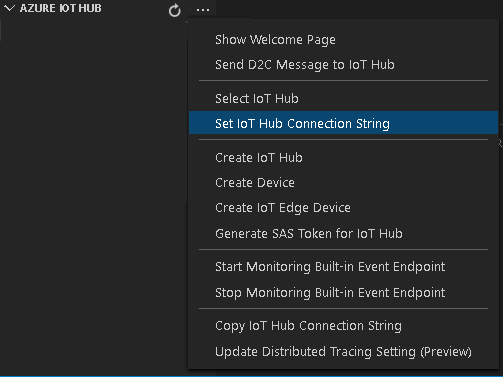

El manifiesto de implementación define los módulos que se implementan en un dispositivo perimetral. También define los valores de configuración de los módulos.

Siga estos pasos para generar el manifiesto a partir del archivo de plantilla y, después, impleméntelo en el dispositivo perimetral.

1. Abra Visual Studio Code.
1. Al lado del panel **AZURE IOT HUB**, seleccione el icono **Más acciones** para establecer la cadena de conexión de IoT Hub. Puede copiar la cadena del archivo _src/cloud-to-device-console-app/appsettings.json_.

    

    [!INCLUDE [provide-builtin-endpoint](../../common-includes/provide-builtin-endpoint.md)]
1. Haga clic con el botón derecho en **src/edge/deployment.template.json** y seleccione **Generate IoT Edge Deployment Manifest** (Generar manifiesto de implementación de IoT Edge).

   

   Esta acción debe crear un archivo de manifiesto llamado _deployment.amd64.json_ en la carpeta _src/edge/config llamado_.
1. Haga clic con el botón derecho en **src/edge/config/deployment.amd64.json**, seleccione **Create Deployment for Single Device** (Crear una implementación para un dispositivo individual) y seleccione el nombre del dispositivo perimetral.

   
1. Cuando se le pida que seleccione un dispositivo IoT Hub, elija **avasample-iot-edge-device** en el menú contextual.
1. Tras aproximadamente 30 segundos, en la esquina inferior izquierda de la ventana, actualice Azure IoT Hub. El dispositivo perimetral ahora muestra los siguientes módulos implementados:

    - Módulo perimetral de Video Analyzer (nombre del módulo `avaedge`)
    - Simulador del Protocolo de transmisión en tiempo real (RTSP) (nombre del módulo `rtspsim`)
