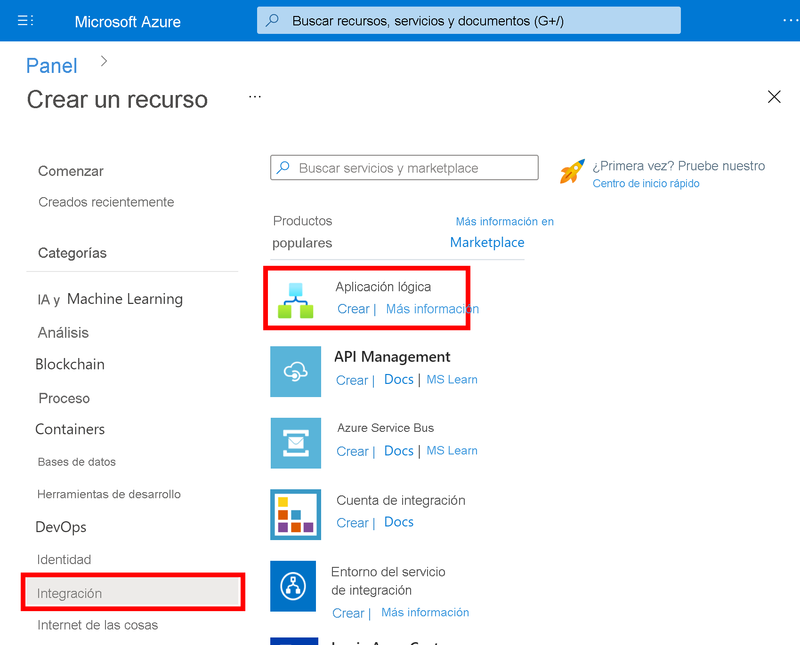
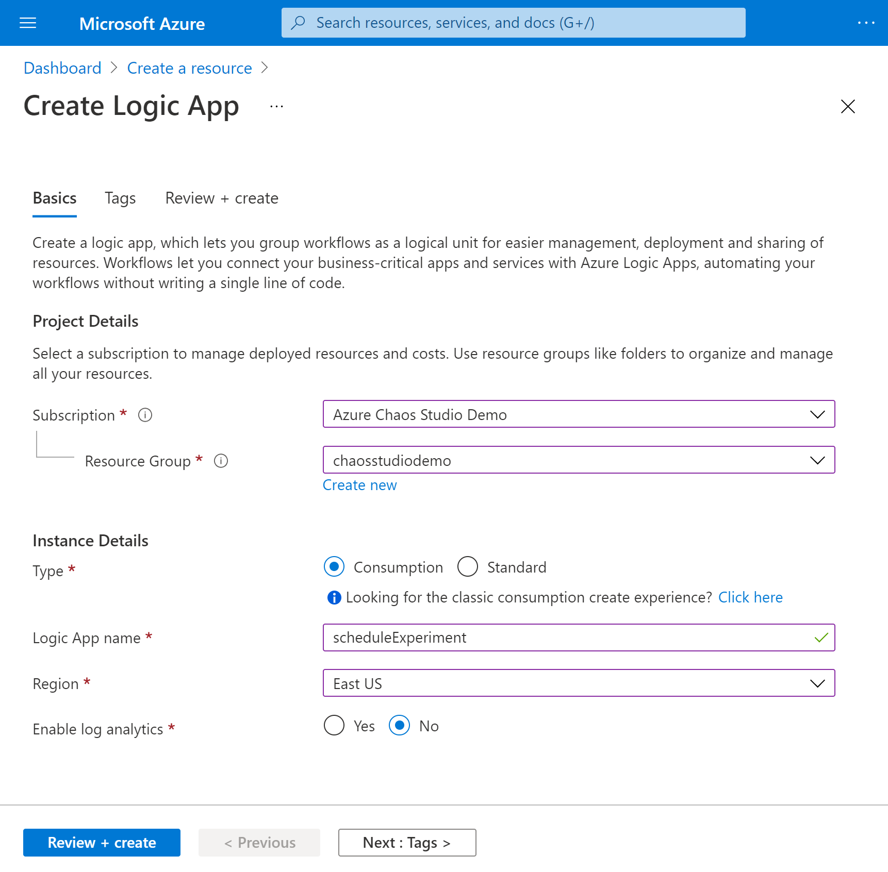
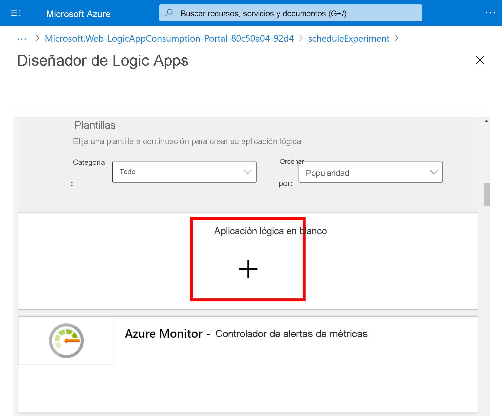
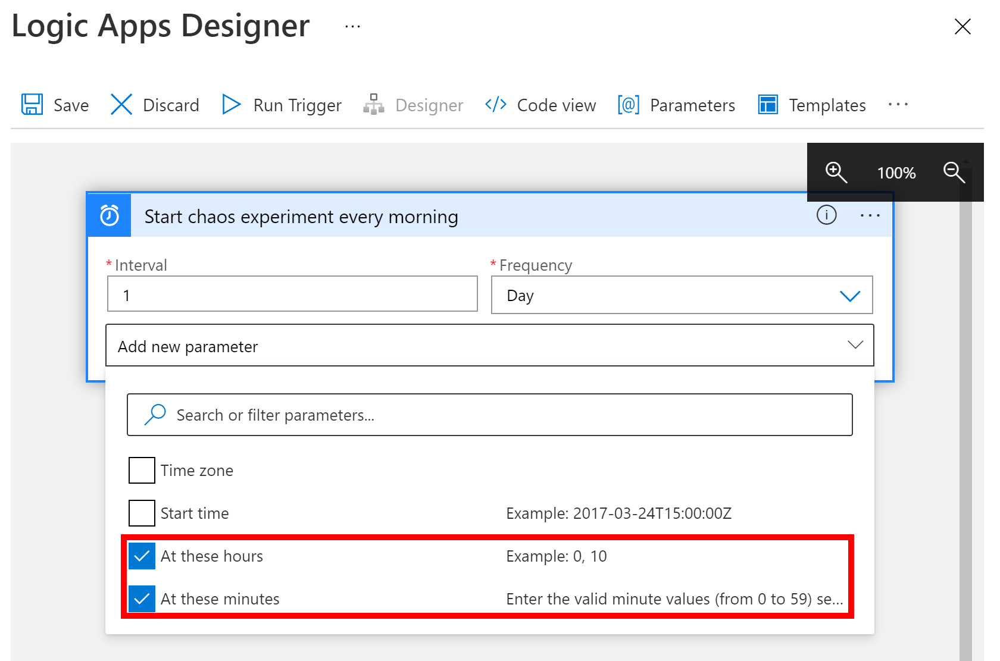
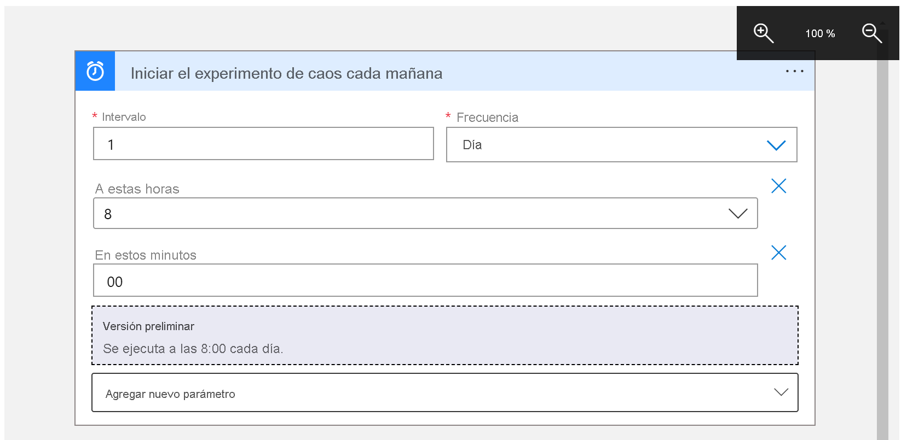
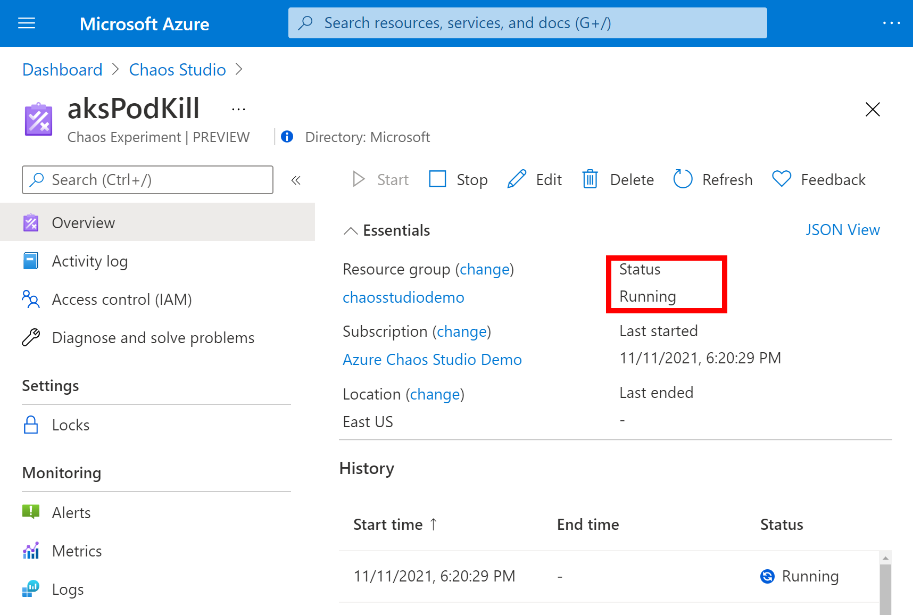

# Tutorial: Programación de un experimento periódico con Azure Chaos Studio

Azure Chaos Studio le permite ejecutar experimentos de caos que producirán un error intencionadamente en parte de la aplicación o el servicio para comprobar que es resistente a esos errores. Puede ser útil ejecutar estos experimentos de caos periódicamente para asegurarse de que la resistencia de la aplicación no ha sufrido una regresión o para satisfacer requisitos de cumplimiento. En este tutorial, usará una [aplicación lógica](../logic-apps/logic-apps-overview.md) para desencadenar un experimento para que se ejecute una vez al día.

En este tutorial aprenderá a:

> [!div class="checklist"]
> * Creación de una aplicación lógica 
> * Configurar la aplicación lógica para desencadenar un experimento de caos para iniciarse una vez al día
> * Probar que la aplicación lógica está configurada correctamente

## Requisitos previos

- Una cuenta de Azure con una suscripción activa. [Cree una cuenta gratuita](https://azure.microsoft.com/free/?WT.mc_id=A261C142F).
- Un experimento de caos. [Cree un experimento de caos mediante el inicio rápido](chaos-studio-quickstart-azure-portal.md).
- Todos los recursos de destino del experimento de caos deben [incorporarse a Chaos Studio](chaos-studio-targets-capabilities.md).

## Creación de una aplicación lógica
Una aplicación lógica es un flujo de trabajo automatizado que se puede ejecutar según una programación. La aplicación lógica usada en este tutorial inicia un experimento de caos mediante una programación de periodicidad.

1. Inicie sesión en [Azure Portal](https://portal.azure.com) con sus credenciales de su cuenta de Azure. En la página principal de Azure, seleccione **Crear un recurso**.

1. En el menú de Azure Marketplace, seleccione **Integración** > **Logic App**.

   

1. En el panel de **Logic App**, proporcione la información que se describe aquí sobre la aplicación lógica que desea crear.

   

   | Propiedad | Valor | Descripción |
   |----------|-------|-------------|
   | **Suscripción** | <*Azure-subscription-name*> | El nombre de la suscripción de Azure. En este ejemplo se usa `Azure Chaos Studio Demo`. |
   | **Grupos de recursos** | chaosstudiodemo | El nombre del [grupo de recursos de Azure](../azure-resource-manager/management/overview.md) que se utiliza para organizar recursos relacionados. En este ejemplo se crea un nuevo grupo de recursos llamado `chaosstudiodemo`. |
   | **Tipo** | Consumo | [Tipo de recurso de la aplicación lógica](../logic-apps/single-tenant-overview-compare.md). Establézcalo en **Consumo**. |
   | **Nombre** | scheduleExperiment | El nombre de la aplicación lógica, que solo puede contener letras, números, guiones (`-`), caracteres de subrayado (`_`), paréntesis (`(`, `)`) y puntos (`.`). En este ejemplo se usa `scheduleExperiment`. |
   | **Ubicación** | Este de EE. UU. | La región en la que desea almacenar la información de la aplicación lógica. En este ejemplo se usa `East US`. |
   | **Habilitación de análisis de registros** | No | Configure el registro de diagnóstico para la aplicación lógica. Establézcalo en **No**. |

1. Seleccione **Revisar y crear** cuando haya terminado. Una vez que Azure valide la información sobre la aplicación lógica, seleccione **Crear**.

1. Una vez que Azure implemente la aplicación, seleccione **Ir al recurso**.

   Azure abre el panel de selección de plantillas de aplicaciones lógicas, que muestra un vídeo de introducción, los desencadenadores usados frecuentemente y los patrones de plantillas de aplicaciones lógicas.

## Adición del desencadenador Periodicidad
A continuación, agregue el [desencadenador](../logic-apps/logic-apps-overview.md#logic-app-concepts) Periodicidad, que ejecuta el flujo de trabajo en función de una programación especificada. Cada aplicación lógica debe comenzar con un desencadenador, que se activa cuando sucede un evento específico o cuando hay nuevos datos que cumplen una condición determinada.

1. Desplácese hacia abajo más allá del vídeo y de los desencadenadores frecuentes hasta la sección **Plantillas** y seleccione **Aplicación lógica en blanco**.

   

1. En el cuadro de búsqueda del diseñador de Logic Apps, escriba `recurrence` y seleccione el desencadenador denominado **Periodicidad**.

   

1. En la forma **Periodicidad**, seleccione el botón de **puntos suspensivos** ( **...** ) y luego **Cambiar de nombre**. Cambie el nombre del desencadenador por esta descripción:`Start chaos experiment every morning`

   

1. En el desencadenador, cambie estas propiedades como se muestra a continuación.

   

   | Propiedad | Obligatorio | Value | Descripción |
   |----------|----------|-------|-------------|
   | **Intervalo** | Sí | 1 | Número de intervalos que se espera entre comprobaciones. |
   | **Frecuencia** | Sí | Día | Unidad de tiempo que se usa para la periodicidad. |

1. En **Intervalo** y **Frecuencia**, abra la lista **Agregar nuevo parámetro** y seleccione estas propiedades para agregarlas al desencadenador.

   * **A estas horas**
   * **En estos minutos**

   

1. Ahora, establezca los valores de las propiedades como se muestra y se describe aquí.

   

   | Propiedad | Valor | Descripción |
   |----------|-------|-------------|
   | **A estas horas** | 8 | Este valor solo está disponible cuando se establece la **Frecuencia** en **Semana** o **Día**. Para esta periodicidad, seleccione las horas del día. En este ejemplo, la ejecución se realiza a la marca de hora `8`. |
   | **En estos minutos** | 00 | Este valor solo está disponible cuando se establece la **Frecuencia** en **Semana** o **Día**. Para esta periodicidad, seleccione los minutos del día. En este ejemplo, la ejecución se realiza una vez a la marca de hora cero. |

   Este desencadenador se activa todos los días entre semana a las 8:00 a. m. El cuadro **Vista previa** muestra la programación de periodicidad. Para más información, consulte [Programación de tareas y flujos de trabajo](../connectors/connectors-native-recurrence.md) y [Acciones y desencadenadores de flujos de trabajo](../logic-apps/logic-apps-workflow-actions-triggers.md#recurrence-trigger).

1. Guarde la aplicación lógica. En la barra de herramientas del diseñador, seleccione **Save** (Guardar).

## Adición de una acción de ejecución del experimento de caos
Ahora que tiene un desencadenador, agregue una [acción](../logic-apps/logic-apps-overview.md#logic-app-concepts) que inicie el experimento. En este tutorial se usa la acción de **invocación de operación de recursos** para iniciar el experimento.

1. En el diseñador de Logic Apps, seleccione **New step** (Nuevo paso).

1. En **Elija una operación**, escriba `Invoke resource operation` y seleccione la opción en **Acciones** llamada **Invoke resource operation** (Invocar operación de recursos).

    

1. Establezca el **inquilino** correcto donde se almacena el experimento y haga clic en **Iniciar sesión**.

1. Inicie sesión en su cuenta de Azure para ese inquilino.

1. Ahora, establezca los valores de las propiedades de la acción, como se muestra y se describe aquí.

   

   | Propiedad | Valor | Descripción |
   |----------|-------|-------------|
   | **Suscripción** | <*Azure-subscription-name*> | Nombre de la suscripción de Azure donde se implementa el experimento de caos. En este ejemplo se usa `Azure Chaos Studio Demo`. |
   | **Grupo de recursos** | <*Resource-group-name*> | Nombre del grupo de recursos donde se implementa el experimento de caos. En este ejemplo se usa `chaosstudiodemo`. |
   | **Proveedor de recursos** | `Microsoft.Chaos` | Proveedor de recursos de Chaos Studio. |
   | **Identificador de recurso corto** | `experiments/`<*Resource-group-name*> | Nombre del experimento de caos precedido por `experiments/`. |
   | **Versión de API del cliente** | `2021-09-15-preview` | La versión de la API REST de Chaos Studio. |
   | **Nombre de acción** | `start` | Nombre de la acción del experimento de Chaos Studio. Siempre es `start`. |

1. Guarde la aplicación lógica. En la barra de herramientas del diseñador, seleccione **Save** (Guardar).

## Probar la aplicación lógica
Ahora, pruebe la aplicación lógica para asegurarse de que inicia correctamente el experimento.

1. Cierre el diseñador de aplicaciones lógicas.

1. En la información general de la aplicación lógica, seleccione **Ejecutar desencadenador** y, a continuación, **Ejecutar**.

    

1. Vaya al experimento de caos en Azure Portal y compruebe que **Estado** está establecido en **Ejecutando**.

    

## Limpieza de recursos

Si no va a seguir usando esta aplicación, elimine la aplicación lógica mediante los siguientes pasos:

1. En la información general de la aplicación lógica, haga clic en **Eliminar**.
1. Escriba el nombre de la aplicación lógica y haga clic en **Eliminar**.

## Pasos siguientes

Ahora que ha establecido una programación para el experimento, puede...
> [!div class="nextstepaction"]
> [Ejecutar y administrar el experimento](chaos-studio-run-experiment.md)
