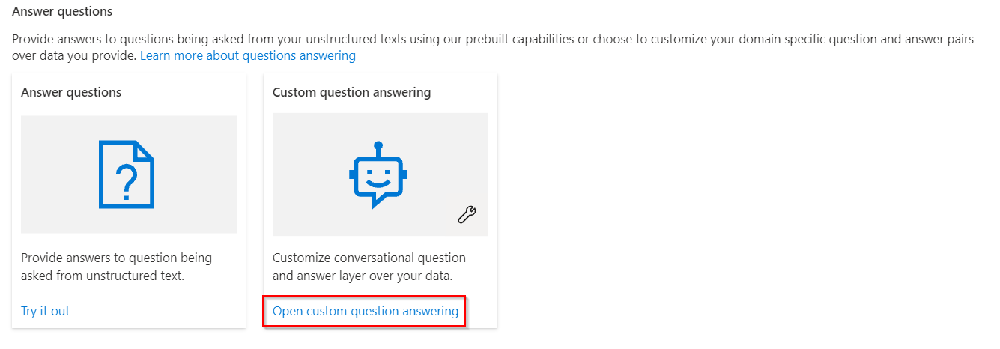
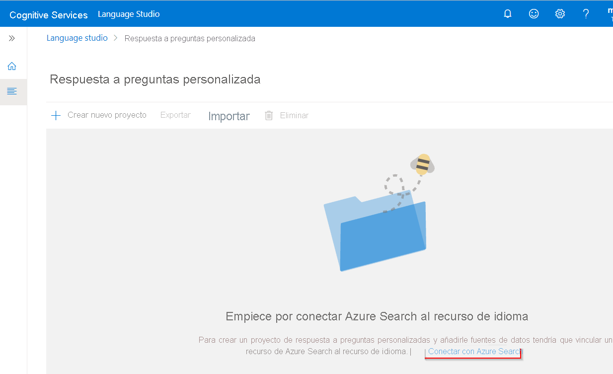
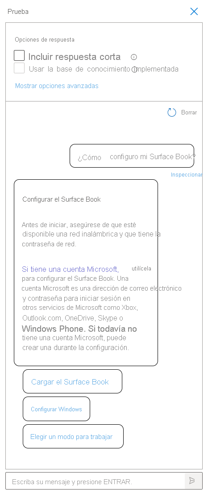

# Creación, prueba e implementación de un proyecto de respuesta a preguntas personalizado

Puede crear un proyecto de respuesta de preguntas a partir de su propio contenido, como preguntas frecuentes o manuales de productos. En este artículo se incluye un ejemplo de creación de un proyecto de respuesta a preguntas a partir de un manual de producto para responder preguntas.

## Prerrequisitos

> [!div class="checklist"]
> * Si no tiene una suscripción a Azure, cree una [cuenta gratuita](https://azure.microsoft.com/free/cognitive-services/) antes de empezar.
> * Un [recurso de lenguaje](https://aka.ms/create-language-resource) con la característica de respuesta a preguntas personalizada habilitada.

## Creación del primer proyecto de respuesta a preguntas

1. Inicie sesión en [Language Studio](https://language.azure.com/) con las credenciales de Azure.

2. Desplácese hacia abajo hasta la sección **Answer questions** (Responder a las preguntas) y seleccione **Open custom question answering** (Abrir respuesta a preguntas personalizadas).

    > [!div class="mx-imgBorder"]
    > 

3. Si el recurso aún no está conectado a Azure Search, seleccione **Connect to Azure Search** (Conexión con Azure Search). Se abrirá una nueva pestaña del explorador que conducirá al panel **Características** del recurso en Azure Portal.

    > [!div class="mx-imgBorder"]
    > 

4. Seleccione **Enable custom question answering** (Habilitar respuesta a preguntas personalizada), elija el recurso de Azure Search al que desea vincular y, a continuación, seleccione **Apply** (Aplicar).

    > [!div class="mx-imgBorder"]
    > 

5. Vuelva a la pestaña de Language Studio. Es posible que tenga que actualizar la página para que se registre el cambio realizado en el recurso. Seleccione **Create new project** (Crear proyecto).

6. Elija la opción **I want to set the language for all projects created in this resource** (Quiero establecer el idioma de todos los proyectos creados en este recurso) > **English** (Inglés) y seleccione **Siguiente**.

7. Escriba el nombre de proyecto **Sample-project**, la descripción **Mi primer proyecto de respuesta de preguntas** y deje la respuesta predeterminada con un valor de **No answer found** (No se encuentra respuesta).

8. Revise las opciones elegidas y seleccione **Create project** (Crear proyecto).

9. En la página **Manage sources** (Administrar orígenes), seleccione **Add source** > **URLS** (Agregar origen > Direcciones URL).

10. Seleccione **Add url** (Agregar URL), escriba los siguientes valores y seleccione **Add all** (Agregar todo):

    |Nombre de dirección URL|Valor de dirección URL|
    |--------|---------|
    |Guía de usuario de Surface Book |https://download.microsoft.com/download/7/B/1/7B10C82E-F520-4080-8516-5CF0D803EEE0/surface-book-user-guide-EN.pdf |

    El proceso de extracción tarda unos minutos en leer el documento e identificar las preguntas y respuestas. Las preguntas y respuestas determinarán si el contenido subyacente está estructurado o no.

    Después de agregar correctamente el origen, puede editar el contenido del mismo para agregar más conjuntos de respuestas a preguntas personalizadas.

## Prueba del proyecto

1. Seleccione el vínculo al origen y se abrirá la página de edición de knowledge base.

2. Seleccione **Test** (Probar) en la barra de menús y escriba la pregunta **How do I setup my surface book?** (¿Cómo se configura un Surface Book?) Se generará una respuesta en función de los pares de respuestas a preguntas que se identificaron y extrajeron automáticamente de la dirección URL de origen:

    > [!div class="mx-imgBorder"]
    > 

    Si marca la casilla para **incluir respuesta a pregunta corta**, también verá una respuesta precisa, si está disponible, junto con el fragmento de respuesta en el panel de prueba al hacer una pregunta.

3. Seleccione  **Inspect**  (Inspeccionar) para examinar la respuesta con mayor detalle. La ventana de prueba se usa para probar los cambios realizados en el proyecto antes de implementar el proyecto.

    > [!div class="mx-imgBorder"]
    > 

    En la interfaz de **Inspect** (Inspeccionar), puede ver el nivel de confianza de esta respuesta a la pregunta y editará directamente un par de pregunta y respuesta determinado.

## Implementación del proyecto

1. Seleccione el icono Implementar knowledge base para entrar en el menú de implementación de knowledge base.

    > [!div class="mx-imgBorder"]
    > 

    Al implementar un proyecto, su contenido se mueve del índice `test` a un índice `prod` de Azure Search.

2. Seleccione **Deploy** (Implementar) y, después, cuando se le solicite vuelva a seleccionar **Deploy** (Implementar).

    > [!div class="mx-imgBorder"]
    > 

    El proyecto se ha implementado correctamente. Puede usar el punto de conexión para responder preguntas tanto en su propia aplicación personalizada para responder como en un bot.

## Limpieza de recursos

Si no va a seguir con las pruebas de la respuesta a preguntas personalizada, puede eliminar el recurso asociado.

## Pasos siguientes

> [!div class="nextstepaction"]
> [Adición de preguntas con metadatos](../../../qnamaker/quickstarts/add-question-metadata-portal.md)
