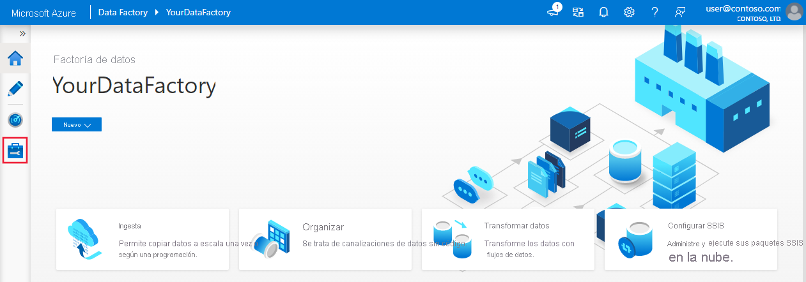
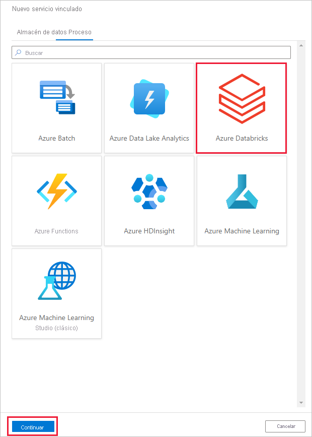
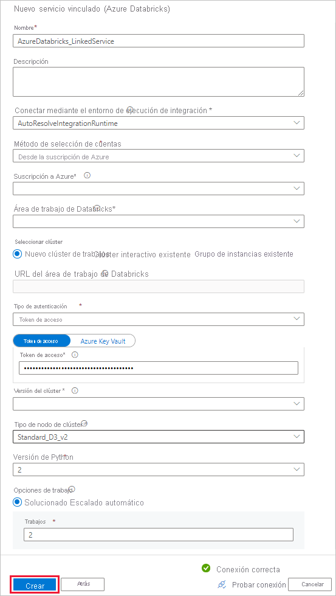
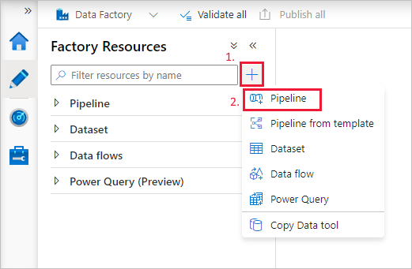
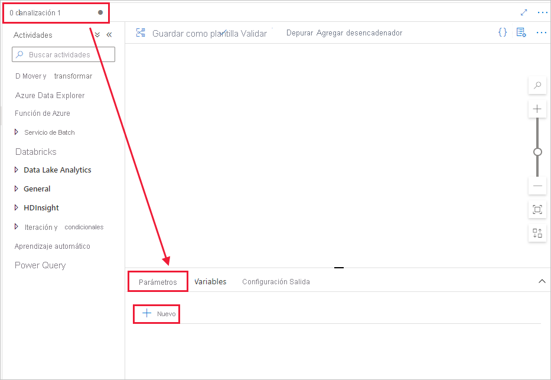
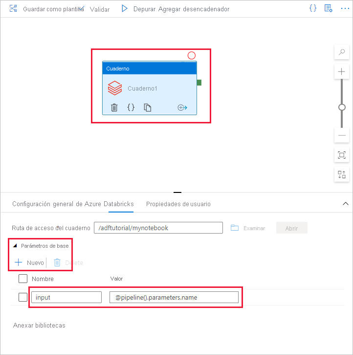
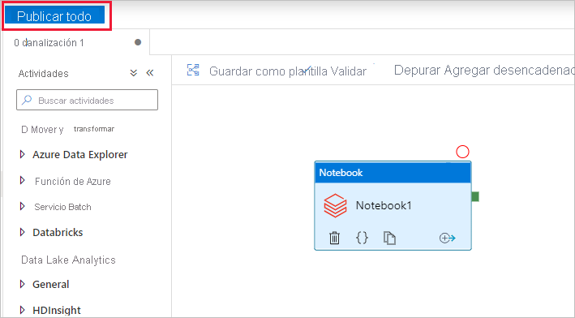
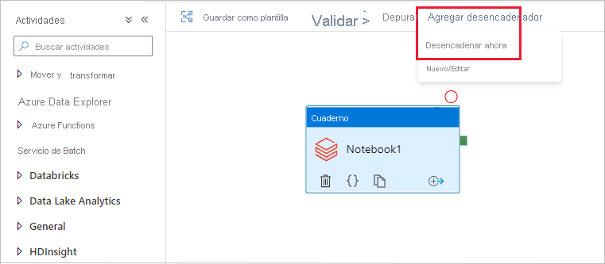

# <a name="run-a-databricks-notebook-with-the-databricks-notebook-activity-in-azure-data-factory"></a>Ejecución de un cuaderno de Databricks con la actividad Notebook de Databricks en Azure Data Factory

[!INCLUDE[appliesto-adf-xxx-md](includes/appliesto-adf-xxx-md.md)]

En este tutorial, va a utilizar Azure Portal para crear una canalización de Azure Data Factory que ejecuta un cuaderno de Databricks en el clúster de trabajos de Databricks. También pasa parámetros de Azure Data Factory al cuaderno de Databricks durante la ejecución.

En este tutorial, realizará los siguientes pasos:

  - Creación de una factoría de datos.

  - Cree una canalización que utiliza la actividad Notebook de Databricks.

  - Desencadenamiento de una ejecución de la canalización

  - Supervisión de la ejecución de la canalización

Si no tiene una suscripción a Azure, cree una [cuenta gratuita](https://azure.microsoft.com/free/) antes de empezar.

Si desea una introducción y demostración de once minutos de esta característica, vea el siguiente vídeo:

> [!VIDEO https://channel9.msdn.com/Shows/Azure-Friday/ingest-prepare-and-transform-using-azure-databricks-and-data-factory/player]

## <a name="prerequisites"></a>Prerrequisitos

  - **Área de trabajo de Azure Databricks**. [Cree un área de trabajo de Databricks](/azure/databricks/scenarios/quickstart-create-databricks-workspace-portal) o use una existente. Va a crear un cuaderno de Python en el área de trabajo de Azure Databricks. Después, va a ejecutar el cuaderno y le pasará parámetros mediante Azure Data Factory.

## <a name="create-a-data-factory"></a>Crear una factoría de datos

1. Inicie el explorador web **Microsoft Edge** o **Google Chrome**. Actualmente, la interfaz de usuario de Data Factory solo se admite en los exploradores web Microsoft Edge y Google Chrome.

1. Seleccione **Crear un recurso** en el menú de Azure Portal, después, **Integración** y **Data Factory**.

    :::image type="content" source="./media/doc-common-process/new-azure-data-factory-menu.png" alt-text="Captura de pantalla que muestra la selección de Data Factory en el panel Nuevo.":::

1. En la página **Create Data Factory** (Crear factoría de datos), en la pestaña **Aspectos básicos**, seleccione su **suscripción** de Azure en la que desea crear la factoría de datos.

1. Para **Grupo de recursos**, realice uno de los siguientes pasos:
    
    1. Seleccione un grupo de recursos existente de la lista desplegable.
    
    1. Seleccione **Crear nuevo** y escriba el nombre de un nuevo grupo de recursos.

    Para obtener más información sobre los grupos de recursos, consulte [Uso de grupos de recursos para administrar los recursos de Azure](../azure-resource-manager/management/overview.md).

1. En **Región**, seleccione la ubicación de la factoría de datos.

    En la lista solo se muestran las ubicaciones que admite Data Factory y dónde se almacenarán los metadatos de Azure Data Factory. Los almacenes de datos asociados (como Azure Storage y Azure SQL Database) y los procesos (como Azure HDInsight) que usa Data Factory se pueden ejecutar en otras regiones.

1. En **Nombre**, escriba **ADFTutorialDataFactory**.
    
    El nombre de la instancia de Azure Data Factory debe ser *único de forma global*. Si ve el siguiente error, cambie el nombre de la factoría de datos (por ejemplo, use **&lt;suNombre&gt;ADFTutorialDataFactory**). Para conocer las reglas de nomenclatura de los artefactos de Data Factory, consulte el artículo [Azure Data Factory: reglas de nomenclatura](./naming-rules.md).

    :::image type="content" source="./media/doc-common-process/name-not-available-error.png" alt-text="Captura de pantalla que muestra un error cuando un nombre no está disponible.":::

1. En **Versión**, seleccione **V2**.

1. Seleccione **Siguiente: Configuración de Git** y, después, seleccione la casilla **Configurar Git más adelante**.

1. Seleccione **Revisar y crear** y elija **Crear** una vez superada la validación. 

1. Una vez que finalice la creación, seleccione **Ir al recurso** para ir a la página de **Data Factory**. Seleccione el icono **Open Azure Data Factory Studio** (Abrir Azure Data Factory Studio) para iniciar la aplicación de interfaz de usuario (IU) de Azure Data Factory en una pestaña independiente del explorador.

    :::image type="content" source="./media/doc-common-process/data-factory-home-page.png" alt-text="Captura de pantalla que muestra la página principal de Azure Data Factory con el icono Open Azure Data Factory Studio (Abrir Azure Data Factory Studio).":::

## <a name="create-linked-services"></a>Crear servicios vinculados

En esta sección, va a crear un servicio vinculado de Databricks. Este servicio vinculado contiene la información de conexión al clúster de Databricks:

### <a name="create-an-azure-databricks-linked-service"></a>Creación de un servicio vinculado de Azure Databricks

1.  En la página principal, cambie a la pestaña **Administrar** del panel de la izquierda.

    

1.  Seleccione **Servicios vinculados** en **Conexiones** y, después, **+ Nuevo**.
    
    

1.  En la ventana **New Linked Service** (Nuevo servicio vinculado), seleccione **Compute** (Proceso) &gt; **Azure Databricks** y, luego, **Continue** (Continuar).
    
    

1.  En la ventana **New Linked Service** (Nuevo servicio vinculado), realice los pasos siguientes:
    
    1.  En **Name** (Nombre) escriba **_AzureDatabricks\_LinkedService_**.
    
    1.  Seleccione el **área de trabajo de Databricks** adecuado en el que ejecutará el cuaderno.

    1.  En **Select cluster** (Seleccionar clúster), seleccione **New job cluster** (Nuevo clúster de trabajo).
    
    1.  La información de **Databrick Workspace URL** (Dirección URL del área de trabajo de Databricks) se debe rellenar automáticamente.

    1.  En **Access Token** (Token de acceso), genérelo en el área de trabajo de Azure Databricks. Puede encontrar los pasos [aquí](https://docs.databricks.com/api/latest/authentication.html#generate-token).

    1.  En **Cluster version** (Versión del clúster), seleccione **4.2** (con Apache Spark 2.3.1 y Scala 2.11).

    1.  En **Cluster node type** (Tipo de nodo de clúster), seleccione **Standard\_D3\_v2** en la categoría **General Purpose (HDD)** (Uso general [HDD]) para los fines de este tutorial. 
    
    1.  En **Workers** (Trabajadores), escriba **2**.
    
    1.  Seleccione **Crear**.

        

## <a name="create-a-pipeline"></a>Crear una canalización

1.  Seleccione el botón **+** (Más) y seleccione **Pipeline** (Canalización) en el menú.

    

1.  Cree un **parámetro** para su uso en la **canalización**. Más adelante va a pasar este parámetro a la actividad Notebook de Databricks. En la canalización vacía, haga seleccione la pestaña **Parameters** (Parámetros) y **New** (Nuevo), y asígnele el nombre de "**name**".

    

    

1.  En el cuadro de herramientas **Activities** (Actividades), expanda **Databricks**. Arrastre la actividad **Notebook** del cuadro de herramientas **Activities** (Actividades) a la superficie del diseñador de canalizaciones.

    

1.  En las propiedades de la ventana de actividad **Notebook** de **Databricks** de la parte inferior, realice los pasos siguientes:

    1. Cambie a la pestaña **Azure Databricks**.

    1. Seleccione **AzureDatabricks\_LinkedService** (que creó en el procedimiento anterior).

    1. Cambie a la pestaña **Configuración** .

    1. Seleccione una **ruta de acceso de cuaderno** para Databricks. Vamos a crear un cuaderno y especifique aquí la ruta de acceso. Para obtener la ruta de acceso del cuaderno, siga los pasos siguientes.

       1. Inicie el área de trabajo de Azure Databricks.

       1. Cree una **carpeta** en el área de trabajo y llámela **adftutorial**.

          

       1. [Captura de pantalla que muestra cómo crear un cuaderno.](https://docs.databricks.com/user-guide/notebooks/index.html#creating-a-notebook) (Python). Vamos a llamarle **mynotebook**, en la carpeta **adftutorial**. Haga clic en **Crear**.

          

          

       1. En el cuaderno "mynotebook&quot; recién creado, agregue el código siguiente:

           ```
           # Creating widgets for leveraging parameters, and printing the parameters

           dbutils.widgets.text(&quot;input&quot;, &quot;&quot;,&quot;")
           y = dbutils.widgets.get("input")
           print ("Param -\'input':")
           print (y)
           ```

           

       1. La **ruta de acceso del cuaderno** en este caso es **/adftutorial/mynotebook**.

1.  Vuelva a la **herramienta de creación de interfaz de usuario de Data Factory**. Vaya a la pestaña **Configuración** en la actividad **Notebook1**.

    a.  Agregue un **parámetro** a la actividad Notebook. Utilice el mismo parámetro que se ha agregado antes a la **canalización**.

       

    b.  Denomine **input** al parámetro y proporcione el valor como expresión **\@pipeline().parameters.name**.

1.  Para comprobar la canalización, seleccione el botón **Validate** (Comprobar) en la barra de herramientas. Para cerrar la ventana de validación, seleccione el botón **Cerrar**.

    

1.  Seleccione **Publicar todo**. La interfaz de usuario de Data Factory permite publicar entidades (servicios vinculados y canalizaciones) en el servicio Azure Data Factory.

    

## <a name="trigger-a-pipeline-run"></a>Desencadenamiento de una ejecución de la canalización

Seleccione **Agregar desencadenador** en la barra de herramientas y, después, **Trigger Now** (Desencadenar ahora).



En el cuadro de diálogo **Ejecución de canalización** se solicita el parámetro **name**. Utilice **/path/filename** como parámetro aquí. Seleccione **Aceptar**.


## <a name="monitor-the-pipeline-run"></a>Supervisión de la ejecución de la canalización

1.  Vaya a la pestaña **Monitor** (Supervisar). Confirme que ve una ejecución de canalización. Se tarda aproximadamente entre 5 y 8 minutos crear un clúster de trabajo de Databricks, donde se ejecuta el cuaderno.

    

1.  Seleccione **Actualizar** periódicamente para comprobar el estado de la ejecución de canalización.

1.  Para ver las ejecuciones de actividad asociadas con la ejecución de esta canalización, seleccione **View Activity Runs** (Ver ejecuciones de actividad) de la columna **Actions** (Acciones).

    

Puede volver a la vista de ejecuciones de canalización. Para ello seleccione el vínculo **Pipelines** (Canalizaciones) en la parte superior.

## <a name="verify-the-output"></a>Comprobación del resultado

Puede iniciar sesión en el **área de trabajo de Azure Databricks**, ir a **Clusters** (Clústeres) y ver el estado del **trabajo** como *ejecución pendiente, en ejecución o finalizado*.


Puede hacer clic en el **nombre del trabajo** y desplazarse para ver más detalles. Si la ejecución se realiza correctamente, puede validar los parámetros pasados y la salida del cuaderno de Python.


## <a name="next-steps"></a>Pasos siguientes

La canalización de este ejemplo desencadena una actividad Notebook de Databricks y le pasa un parámetro. Ha aprendido a:

  - Creación de una factoría de datos.

  - Creación de una canalización que utiliza la actividad Notebook de Databricks.

  - Desencadenamiento de una ejecución de la canalización

  - Supervisión de la ejecución de la canalización