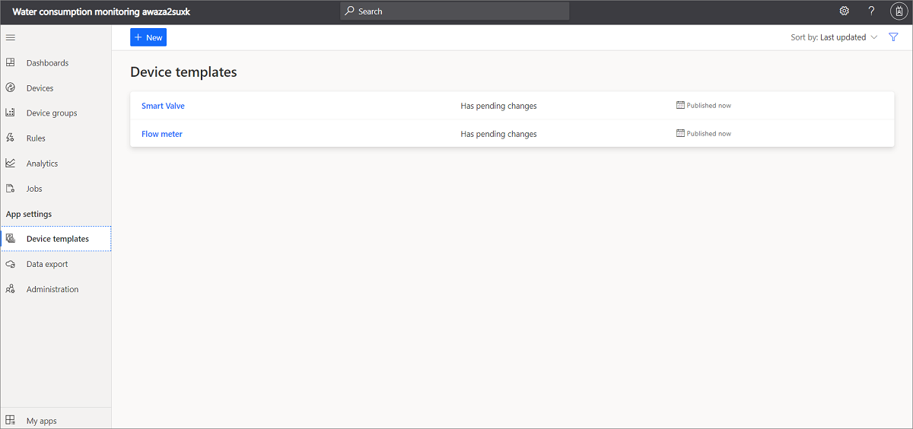
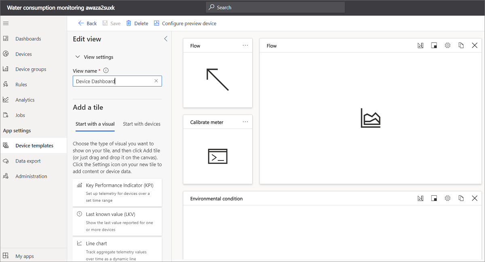
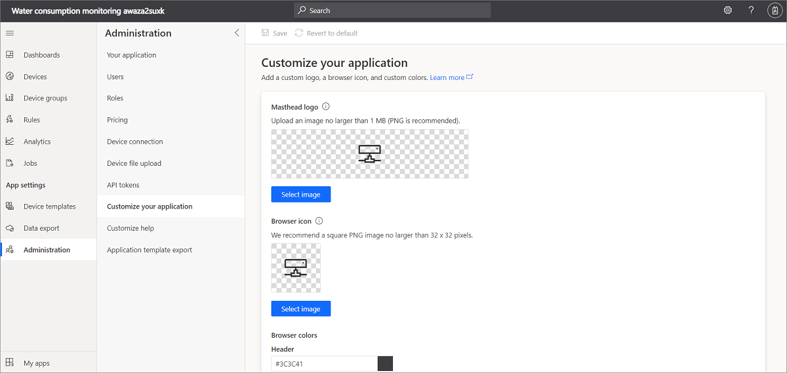

# Tutorial: Implementación y recorrido por la aplicación de supervisión de consumo del agua

Use la plantilla de aplicación de *supervisión de consumo del agua* de IoT Central y las instrucciones de este artículo para desarrollar una solución de supervisión de consumo del agua integral.

### Dispositivos y conectividad

Las soluciones de administración de agua usan dispositivos de agua inteligentes, como medidores de flujo, monitores de calidad del agua, válvulas inteligentes y detectores de fugas.

Los dispositivos que se usan en las soluciones inteligentes para el agua normalmente se conectan mediante redes de área extensa de bajo consumo (LPWAN) mediante un operador de red de terceros. Para estos tipos de dispositivos, use el [Puente de dispositivos de Azure IoT Central](../core/howto-build-iotc-device-bridge.md) para enviar los datos del dispositivo a la aplicación de IoT en Azure IoT Central. También puede tener puertas de enlace de dispositivo que sean compatibles con IP y que puedan conectarse directamente a IoT Central.

### IoT Central

Azure IoT Central es una plataforma de aplicaciones de IoT que le ayuda a compilar e implementar rápidamente una solución de IoT. Puede utilizar su marca, personalizar e integrar la solución con servicios de terceros.

Al conectar los dispositivos de agua inteligentes a IoT Central, la aplicación proporciona el control, la supervisión y las alertas de los dispositivos, la interfaz de usuario con RBAC integrado, paneles de información configurables y opciones de extensibilidad.

### Extensibilidad e integraciones

Puede ampliar su aplicación de IoT en IoT Central y, si lo desea:

* Transformar e integrar los datos de IoT para el análisis avanzado, como el entrenamiento de modelos de aprendizaje automático, mediante la exportación continua de datos de la aplicación de IoT Central.
* Automatizar flujos de trabajo en otros sistemas al desencadenar acciones mediante Power Automate o webhooks desde la aplicación de IoT Central.
* Acceder mediante programación a la aplicación IoT de IoT Central mediante las API de IoT Central.

### Aplicaciones empresariales

Puede usar datos de IoT para crear varias aplicaciones empresariales dentro de una utilidad de agua. En la [aplicación de supervisión de consumo de agua de IoT Central](tutorial-water-consumption-monitoring.md), puede configurar reglas y acciones, y establecer que creen alertas en [Connected Field Service](/dynamics365/field-service/connected-field-service). Configure Power Automate en reglas de IoT Central para automatizar los flujos de trabajo entre aplicaciones y servicios. Además, en función de las actividades de los servicios de Connected Field Service, la información se puede devolver a Azure IoT Central.

En este tutorial, aprenderá a:

> [!div class="checklist"]

> * Usar la plantilla de supervisión del consumo de agua de Azure IoT Central para crear la aplicación de supervisión del consumo de agua.
> * Explorar y personalizar el panel.
> * Explorar las plantillas de dispositivo.
> * Explorar los dispositivos simulados
> * Explorar y configurar reglas
> * Configurar trabajos
> * Realizar la personalización de marca de la aplicación mediante etiquetado.

## Requisitos previos

* No se necesitan requisitos previos específicos para implementar esta aplicación.
* Puede usar el plan gratuito o una suscripción de Azure.

## Creación de una aplicación de supervisión del consumo de agua

Cree la aplicación mediante los pasos siguientes:

1. Navegue al sitio de [Compilación Azure IoT Central](https://aka.ms/iotcentral). Después, inicie sesión con una cuenta Microsoft personal, profesional o educativa. Seleccione **Compilar** en la barra de navegación de la izquierda y la pestaña **Gobierno**: :::image type="content" source="media/tutorial-waterconsumptionmonitoring/iot-central-government-tab-overview1.png" alt-text="Plantilla de aplicación":::.

1. Seleccione **Crear aplicación** en **Supervisión del consumo del agua**.

Para más información, consulte [Creación de una aplicación de Azure IoT Central](../core/howto-create-iot-central-application.md).

## Recorrido por la aplicación.

Las secciones siguientes le guiarán por las características clave de la aplicación:

### Panel

Después de crear la aplicación, se abre el panel de ejemplo **Wide World water consumption dashboard**.
  
:::image type="content" source="media/tutorial-waterconsumptionmonitoring/water-consumption-monitoring-dashboard-full.png" alt-text="Panel de supervisión del consumo de agua.":::

Puede crear y personalizar las vistas del panel para los operadores.

> [!NOTE]
> Todos los datos que se muestran en el panel se basan en los datos del dispositivo simulado, que explorará en la sección siguiente.
  
El panel consta de diferentes tipos de iconos:

* **Icono de imagen de Wide World Water Utility**: el primer icono del panel es un icono de imagen de un servicio de agua ficticio, "Wide World Water". Puede personalizar el icono y colocar su propia imagen o quitarlo.
* **Icono Average water flow KPI** (KPI de caudal de agua promedio): el icono de KPI está configurado para mostrar como ejemplo *el caudal medio en los últimos 30 minutos*. Puede personalizar el icono de KPI y establecerlo en un tipo y un intervalo de tiempo diferentes.
* **Iconos de comando de dispositivo**: estos iconos incluyen los iconos **Close valve** (Cerrar válvula), **Open valve** (Abrir válvula) y **Set valve position** (Establecer posición de la válvula). Al seleccionar los comandos, irá a la página de comandos del dispositivo simulado. In Azure IoT Central, un *comando* es un tipo de *funcionalidad del dispositivo*. Explorará este concepto más adelante en la sección [Plantilla de dispositivo](../government/tutorial-water-consumption-monitoring.md#explore-the-device-template) de este tutorial.

* **Mapa de área de distribución de agua**: el mapa usa Azure Maps, que puede configurar directamente en Azure IoT Central. El icono del mapa muestra la [ubicación](../core/howto-use-location-data.md) del dispositivo. Mantenga el puntero sobre el mapa y pruebe los controles del mapa, como *acercar*, *alejar* o *ampliar*.

    :::image type="content" source="media/tutorial-waterconsumptionmonitoring/water-consumption-monitoring-dashboard-map.png" alt-text="Mapa del panel de supervisión del consumo de agua":::

* **Gráfico de líneas de flujo de agua promedio** y **Gráfico de líneas de condiciones ambientales**: puede visualizar los datos de telemetría de uno o varios dispositivos representados como un gráfico de líneas durante el intervalo de tiempo deseado.
* **Gráfico de mapa térmico de presión de válvula promedio**: puede elegir el tipo de visualización del mapa térmico de los datos de telemetría del dispositivo que desea ver distribuidos en un intervalo de tiempo con un índice de colores.
* **Icono de contenido Restablecer umbrales de alertas**: puede incluir iconos de contenido de llamada a acciones e insertar un vínculo a una página de acciones. En este caso, Restablecer umbrales de alertas le lleva a los **Trabajos** de la aplicación, donde puede ejecutar las actualizaciones de las propiedades del dispositivo. Explorará esta opción más adelante en la sección [Configurar trabajos](../government/tutorial-water-consumption-monitoring.md#configure-jobs) de este tutorial.
* **Iconos de propiedades**: el panel muestra los iconos **Valve operational info** (Información operativa de válvulas), **Flow alert thresholds** (Umbrales de alerta de caudal) y **Maintenance info** (Información de mantenimiento).

### Personalización del panel

Puede personalizar las vistas del panel para los operadores.

1. Seleccione **Edit** (Editar) para personalizar el panel **Wide World water consumption**. Para personalizar el panel, seleccione el menú **Edit** (Editar). Una vez que el panel esté en modo de **edición**, puede agregar nuevos iconos o configurarlo.

    :::image type="content" source="media/tutorial-waterconsumptionmonitoring/water-consumption-monitoring-edit-dashboard.png" alt-text="Editar panel":::

Para más información, consulte [Creación y personalización de paneles](../core/howto-manage-dashboards.md).

## Exploración de la plantilla de dispositivo

 En Azure IoT Central, una plantilla de dispositivo define las funcionalidades de un dispositivo. Las funcionalidades del dispositivo incluyen los datos de telemetría enviados por los sensores del dispositivo, las propiedades del dispositivo y los comandos que el dispositivo puede ejecutar. Puede definir una o varias plantillas de dispositivo en Azure IoT Central que representen la funcionalidad de los dispositivos que se van a conectar.

La aplicación de supervisión del consumo de agua incluye dos plantillas de dispositivo de referencia que representan un *medidor de caudal* y una *válvula inteligente*.

Para ver la plantilla de dispositivo, siga estos pasos:

1. Seleccione **Plantillas de dispositivo** en el panel izquierdo de la aplicación en Azure IoT Central. En la lista **Plantillas de dispositivo**, verá dos plantillas de dispositivo, **Smart Valve** (Válvula inteligente) y **Flow meter** (Medidor de caudal).

   

1. Seleccione la plantilla de dispositivo **Flow meter** (Medidor de caudal) y familiarícese con las funcionalidades del dispositivo.

     

### Personalización de la plantilla de dispositivo

Para personalizar la plantilla de dispositivo:

1. Vaya a **Personalizar** en el menú **Plantillas de dispositivo**.
1. Busque el tipo de telemetría `Temperature`.
1. Actualice el valor de **Nombre para mostrar** de `Temperature` a `Reported temperature`.
1. Actualice la unidad de medida o establezca los campos **Valor mínimo** y **Valor máximo**.
1. Para guardar los cambios, seleccione **Guardar**.

    

### Adición de una propiedad de la nube

1. Vaya a **Propiedades en la nube** en el menú **Plantillas de dispositivo**.
1. Agregue una nueva propiedad en la nube; para ello, seleccione **+ Agregar propiedad en la nube**.
    En Azure IoT Central, puede agregar una propiedad que sea pertinente para el dispositivo. Por ejemplo, una propiedad en la nube podría ser un umbral de alerta específico de un área de la instalación, información de recursos u otra información de mantenimiento.
1. Para guardar los cambios, seleccione **Guardar**.

Para más información, consulte [Propiedades de la nube](../core/concepts-device-templates.md#cloud-properties).

### Vistas

La plantilla de dispositivo de supervisión del consumo de agua incluye vistas predefinidas. Las vistas definen cómo verán los operadores los datos del dispositivo y establecen los valores de las propiedades de la nube.

  

Para más información, consulte [Vistas](../core/concepts-device-templates.md#views).

### Publicación de la plantilla de dispositivo

Vaya a la página de plantillas de dispositivo y seleccione **Publicar** para guardar los cambios realizados en la plantilla de dispositivo.

Para más información, consulte [Publicación de plantillas](../core/howto-set-up-template.md#publish-a-device-template).

### Creación de una nueva plantilla de dispositivo

Seleccione **+ New** (+ Nueva) para crear una plantilla de dispositivo y siga el proceso de creación.
Puede crear una plantilla de dispositivo personalizada desde el principio o elegir una del catálogo de dispositivos de Azure.

Para más información, consulte [Adición de plantillas de dispositivo](../core/howto-set-up-template.md).

## Explorar los dispositivos simulados

En Azure IoT Central, puede crear dispositivos simulados para probar la aplicación y la plantilla de dispositivo. La aplicación de supervisión del consumo de agua tiene dos dispositivos simulados asignados a las plantillas de dispositivo **Flow meter** (Medidor de caudal) y **Smart Valve** (Válvula inteligente).

### Visualización de los dispositivos

1. Seleccione **Dispositivos** > **Todos los dispositivos** en el panel izquierdo.

    :::image type="content" source="media/tutorial-waterconsumptionmonitoring/water-consumption-monitoring-devices.png" alt-text="Panel Todos los dispositivos":::

1. Seleccione **Smart Valve 1** (Válvula inteligente 1).

    :::image type="content" source="media/tutorial-waterconsumptionmonitoring/water-consumption-monitor-device-1.png" alt-text="Válvula inteligente 1":::

1. En la pestaña **Comandos**, puede ver los tres comandos de dispositivo, **Close Valve** (Cerrar válvula), **Open Valve** (Abrir válvula) y **Set Valve position** (Establecer posición de la válvula), que son funcionalidades definidas en la plantilla de dispositivo **Smart Valve** (Válvula inteligente).

1. Explore las pestañas **Device Properties** (Propiedades del dispositivo) **Device Dashboard** (Panel del dispositivo).

> [!NOTE]
> Las vistas que se ven en esta página se configuran en la página **Plantilla de dispositivo > Vistas**. 

### Adición de nuevos dispositivos

Para agregar nuevos dispositivos, seleccione **(+ Nuevo)** en la pestaña **Dispositivos**.

Para obtener más información, vea [Administración de dispositivos](../core/howto-manage-devices-individually.md).

## Exploración de reglas

En Azure IoT Central puede crear reglas para supervisar automáticamente los datos de telemetría de los dispositivos y desencadenar acciones cuando se cumplan una o varias condiciones. Las acciones pueden incluir el envío de notificaciones por correo electrónico, el desencadenamiento de una acción de Microsoft Power Automate o una acción de webhook para enviar datos a otros servicios.

La aplicación de supervisión del consumo de agua que ha creado tiene tres reglas preconfiguradas.

### Visualización de reglas

1. En el panel izquierdo, seleccione **Reglas**.

    :::image type="content" source="media/tutorial-waterconsumptionmonitoring/water-consumption-monitoring-rules.png" alt-text="Panel Reglas":::

1. Seleccione **High water flow alert** (Alerta de flujo de agua elevado), que es una de las reglas preconfiguradas en la aplicación.

    :::image type="content" source="media/tutorial-waterconsumptionmonitoring/water-consumption-monitoring-high-flow-alert.png" alt-text="Alerta de pH alto":::

    La regla `High water flow alert` está configurada para compararse con la condición `Flow` es `greater than``Max flow threshold`. Flow threshold es una propiedad en la nube definida en la plantilla de dispositivo **Smart Valve** (Válvula inteligente). El valor de `Max flow threshold` se establece por instancia de dispositivo.

A continuación, puede crear una acción de correo electrónico.

Para agregar una acción a la regla:

1. Seleccione **+ Email** (+ Correo electrónico).
1. Escriba **High flow alert** (Alerta de flujo elevado) como valor descriptivo de **Display name** (Nombre para mostrar) de la acción.
1. Escriba la dirección de correo electrónico asociada a la cuenta de Azure IoT Central en **To** (Para).
1. Tiene la opción de escribir una nota e incluirla en el texto del correo electrónico.
1. Seleccione **Done** (Listo) para completar la acción.
1. Seleccione **Guardar** para guardar la regla nueva.
1. Habilite la regla.

A los pocos minutos de que se cumpla la condición configurada, recibirá un correo electrónico.

> [!NOTE]
> La aplicación envía un correo electrónico cada vez que se cumple una condición. Seleccione **Deshabilitar** para deshabilitar la regla para dejar de recibir correo electrónico de la regla automatizada.
  
Para crear una regla, siga estos pasos:

Para crear una nueva regla, seleccione **+ Nuevo** en la pestaña **Reglas** del panel izquierdo.

## Trabajos de configuración

En Azure IoT Central, los trabajos permiten desencadenar actualizaciones de propiedades en la nube o del dispositivo en varios dispositivos. Además de las propiedades, los trabajos se pueden usar también para desencadenar comandos de dispositivo en varios dispositivos. Azure IoT Central automatiza el flujo de trabajo.

1. Seleccione **Trabajos** en el panel izquierdo.
1. Seleccione **+ Nuevo** y configure uno o varios trabajos.

Para más información, consulte [Ejecución de un trabajo](../core/howto-manage-devices-in-bulk.md).

## Personalización de la aplicación

Como administrador, puede cambiar varias opciones de configuración para personalizar la experiencia del usuario en la aplicación.

1. Seleccione **Administration** > **Customize your application** (Administración > Personalizar la aplicación).
1. Seleccione el botón **Change** (Cambiar) para elegir una imagen para cargar en el campo **Application logo** (Logotipo de la aplicación).
1. Seleccione el botón **Change** (Cambiar) para elegir una imagen para **Browser icon** (Icono del explorador) que aparecerá en las pestañas del explorador.
1. También puede reemplazar los valores predeterminados de **Browser colors** (Colores del explorador) mediante la adición de códigos de color HTML hexadecimales. Para más información acerca de la notación de colores **Valor HEXADECIMAL**, consulte [Colores HTML](https://www.w3schools.com/html/html_colors.asp).

   

1. También puede cambiar las imágenes de la aplicación; para ello, seleccione **Administration** > **Application settings** (Administración > Configuración de la aplicación). Seleccione el botón **Select image** (Seleccionar imagen) para elegir una imagen para cargar como la imagen de la aplicación.

## Limpieza de recursos

Si no va a seguir usando esta aplicación, elimínela.

1. Seleccione **Administration** (Administración) en el panel izquierdo de la aplicación de Azure IoT Central.
1. Seleccione **Application settings** (Configuración de la aplicación) y, a continuación, seleccione **Delete** (Eliminar) en la parte inferior de la página.

## Pasos siguientes
 
El siguiente paso sugerido consiste en familiarizarse con la [supervisión de la calidad de agua](./tutorial-water-quality-monitoring.md).