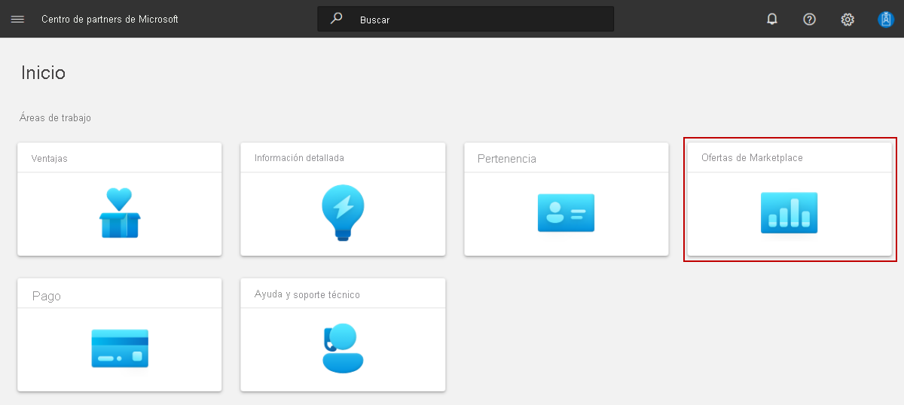

# Cree una oferta de máquina virtual de Azure en Azure Marketplace.

En este artículo se explica cómo crear una oferta de máquina virtual de Azure para [Azure Marketplace](https://azuremarketplace.microsoft.com/). Se dirige a máquinas virtuales basadas en Windows y en Linux que contienen un sistema operativo, un disco duro virtual (VHD) y hasta 16 discos de datos.

Antes de comenzar, [cree una cuenta de marketplace comercial en el Centro de partners](create-account.md). Asegúrese de que la cuenta esté inscrita en el programa Marketplace comercial.

## Antes de empezar

Si todavía no lo ha hecho, revise [Planeación de una oferta de máquina virtual](marketplace-virtual-machines.md). Ahí se explican los requisitos técnicos de la máquina virtual y se enumera la información y los recursos que necesitará al crear la oferta.

## Crear una nueva oferta

[!INCLUDE [Workspaces view note](./includes/preview-interface.md)]

#### [Vista de áreas de trabajo](#tab/workspaces-view)

1. Inicie sesión en el [Centro de partners](https://go.microsoft.com/fwlink/?linkid=2166002).

1. En la página principal, seleccione el icono **Ofertas de Marketplace**.

    

1. En la página Ofertas de Marketplace, seleccione **+ Nueva oferta** > **Máquina virtual de Azure**.

    

> [!NOTE]
> Una vez publicada la oferta, las modificaciones que realice en el Centro de partners aparecerán en Azure Marketplace solo después de volver a publicarla. Tras realizar cambios en la oferta, asegúrese siempre de volver a publicarla.

Escriba un **Identificador de oferta**. Se trata de un identificador único para cada oferta de su cuenta.

- Este identificador se muestra a los clientes en la dirección web de la oferta de Azure Marketplace y en Azure PowerShell y la CLI de Azure, si procede.
- Use solo letras minúsculas y números. El identificador puede incluir guiones y caracteres de subrayado, pero no espacios, y está limitado a 50 caracteres. Por ejemplo, si escribe **test-offer-1**, la dirección web de la oferta será `https://azuremarketplace.microsoft.com/marketplace/../test-offer-1`.
- El identificador de oferta no se puede cambiar después de seleccionar **Crear**.

Escriba un **Alias de la oferta**. El alias de la oferta es el nombre que se usa para la oferta en el Centro de partners.

- Este nombre no se utiliza en Azure Marketplace. Es diferente del nombre de la oferta y de otros valores que se muestran a los clientes.

Seleccione **Crear** para generar la oferta y continuar. En el Centro de partners, abra la página **Configuración de la oferta**.

#### [Vista actual](#tab/current-view)

1. Inicie sesión en el [Centro de partners](https://partner.microsoft.com/dashboard/home).
2. En el panel izquierdo, seleccione **Marketplace comercial** > **Información general**.
3. En la página **Información general**, seleccione **Nueva oferta** > **Máquina virtual de Azure**.

    

> [!NOTE]
> Una vez publicada la oferta, las modificaciones que realice en el Centro de partners aparecerán en Azure Marketplace solo después de volver a publicarla. Tras realizar cambios en la oferta, asegúrese siempre de volver a publicarla.

Escriba un **Identificador de oferta**. Se trata de un identificador único para cada oferta de su cuenta.

- Este identificador se muestra a los clientes en la dirección web de la oferta de Azure Marketplace y en Azure PowerShell y la CLI de Azure, si procede.
- Use solo letras minúsculas y números. El identificador puede incluir guiones y caracteres de subrayado, pero no espacios, y está limitado a 50 caracteres. Por ejemplo, si escribe **test-offer-1**, la dirección web de la oferta será `https://azuremarketplace.microsoft.com/marketplace/../test-offer-1`.
- El identificador de oferta no se puede cambiar después de seleccionar **Crear**.

Escriba un **Alias de la oferta**. El alias de la oferta es el nombre que se usa para la oferta en el Centro de partners.

- Este nombre no se utiliza en Azure Marketplace. Es diferente del nombre de la oferta y de otros valores que se muestran a los clientes.

Seleccione **Crear** para generar la oferta y continuar. En el Centro de partners, abra la página **Configuración de la oferta**.

---

## Versión de prueba (opcional)

[!INCLUDE [Test drives section](includes/test-drives.md)]

En el caso de las ofertas de máquina virtual, la implementación de Azure Resource Manager (ARM) es la única opción de versión de prueba disponible. La plantilla de implementación debe contener todos los recursos de Azure que componen la solución.

Para habilitar una versión de prueba, active la casilla **Habilitar una versión de prueba**, lo que habilitará una pestaña Versión de prueba en el menú de desplazamiento izquierdo. Más adelante, en [Configuración de una versión de prueba de máquina virtual](azure-vm-test-drive.md), configurará y creará la lista de la versión de prueba con esa pestaña.

Con la versión de prueba, es necesario configurar un CRM para los clientes potenciales (vea la sección siguiente). Para eliminar la versión de prueba de la oferta, desactive esta casilla.

## Clientes potenciales

[!INCLUDE [Customer leads](includes/customer-leads.md)]

Seleccione **Guardar borrador** antes de pasar a la siguiente pestaña del menú de navegación izquierdo, **Propiedades**.

## Pasos siguientes

- [Configuración de las propiedades de la oferta de máquinas virtuales](azure-vm-properties.md)
- [Procedimientos recomendados para la publicación de ofertas](gtm-offer-listing-best-practices.md)
