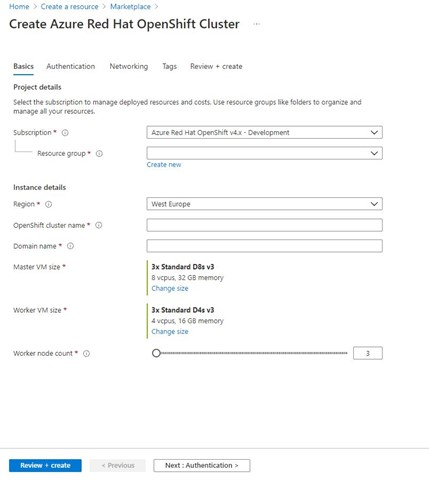

# Inicio rápido: Implementación de un clúster de Red Hat OpenShift en Azure (ARO) mediante Azure Portal

Red Hat OpenShift en Azure (ARO) es un servicio de OpenShift administrado que le permite implementar y administrar clústeres rápidamente. En este inicio rápido, implementaremos un clúster de ARO mediante Azure Portal.

## Requisitos previos
Inicie sesión en [Azure Portal](https://portal.azure.com).

## Creación de un clúster de ARO
1.  En el menú de Azure Portal o en la **página principal**, seleccione **Crear un recurso**.
2.  Seleccione **Contenedores** > **Red Hat OpenShift en Azure**.
3.  En la página **Datos básicos**, configure las siguientes opciones:
    * **Detalles del proyecto**:
        *   Seleccione una **suscripción de Azure**.
        *   Seleccione o cree un **grupo de recursos de Azure**, como *myResourceGroup*.
    * **Detalles del clúster**:
        * Seleccione una **Región** para el clúster de ARO.
        *   Escriba un **nombre de clúster** de OpenShift, como *myAROCluster*.
        *   Escriba el **Nombre de dominio**.
        *   Seleccione **Master VM Size** (Tamaño de máquina virtual maestra) y **Worker VM Size** (Tamaño de máquina virtual de trabajo).

4.  En la página **Autenticación**, configure las siguientes opciones:
    1) Elija **Seleccionar existente** en el selector Tipo de entidad de servicio (si ya está seleccionado previamente, no se requiere ninguna acción y puede continuar con los pasos siguientes).
    2) Busque el proveedor de recursos Red Hat OpenShift en Azure y selecciónelo. 

>[!NOTE]
>Ignore el botón "Crear nuevo" y otros campos opcionales.

5.  En la pestaña **Redes**, asegúrese de configurar lo siguiente:
    * Virtual network
    * Subred maestra
    * Subred de trabajo
    * Visibilidad del servidor de API
    * Visibilidad de la entrada

6.  En la sección **Etiquetas**, agregue etiquetas para organizar los recursos.

 
7.  Haga clic en **Revisar y crear** y, luego, en **Crear** cuando finalice la validación.

 
8.  La creación del clúster de ARO tarda aproximadamente entre 35 y 45 minutos. Una vez finalizada la implementación, vaya al recurso; puede hacerlo de dos maneras:
    *   Haga clic en **Ir al recurso**.
    *   Vaya al grupo de recursos del clúster de ARO y seleccione el recurso de ARO.
        *   Por ejemplo, en el panel de clúster siguiente, busque *myResourceGroup* y seleccione el recurso *myAROCluster*.
