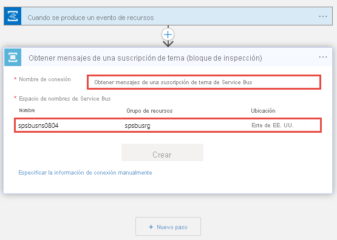
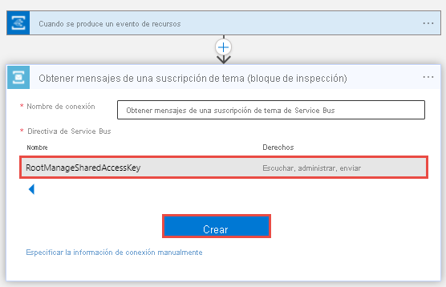

# <a name="tutorial-respond-to-azure-service-bus-events-received-via-azure-event-grid-by-using-azure-logic-apps"></a>Tutorial: Respuesta a eventos de Azure Service Bus recibidos mediante Azure Event Grid utilizando Azure Logic Apps
En este tutorial, aprenderá a responder a eventos de Azure Service Bus recibidos mediante Azure Event Grid utilizando Azure Logic Apps. 

[!INCLUDE [service-bus-event-grid-prerequisites](./includes/service-bus-event-grid-prerequisites.md)]

## <a name="receive-messages-by-using-logic-apps"></a>Recepción de mensajes mediante Logic Apps
En este paso, va a crear una aplicación lógica de Azure que recibe eventos de Service Bus mediante Azure Event Grid. 

1. En Azure Portal, cree una aplicación lógica.
    1. Seleccione **+Crear un recurso**, **Integración** y, luego, **Aplicación lógica**. 
    2. Selección la **suscripción** de Azure. 
    3. En **Grupo de recursos**, seleccione **Usar existente** y seleccione el grupo de recursos que usó para otros recursos (por ejemplo, función de Azure, espacio de nombres de Service Bus) que creó anteriormente. 
    1. En **Tipo**, seleccione **Consumo**. 
    1. Escriba un **nombre** para la aplicación lógica.
    1. Seleccione la **Región** de la aplicación lógica. 
    1. Seleccione **Revisar + crear**. 
    1. En la página **Revisar y crear**, seleccione **Crear** para crear la aplicación lógica. 
    1. En la página **Implementación finalizada**, seleccione **Ir al recurso**. 
1. En la página **Diseñador de aplicaciones lógicas**, seleccione **Aplicación lógica en blanco** en **Plantillas**. 

### <a name="add-a-step-receive-messages-from-service-bus-via-event-grid"></a>Agregue un paso para recibir mensajes de Service Bus a través de Event Grid
1. En el diseñador, realice los pasos siguientes:
    1. Busque **Event Grid**. 
    2. Seleccione **When a resource event occurs: Azure Event Grid** (Cuando se produzca un evento de recursos: Azure Event Grid). 

        
4. Seleccione **Sign in** (Iniciar sesión), escriba sus credenciales de Azure y seleccione **Allow Access** (Permitir acceso). 
5. En la página **When a resource event occurs** (Cuando se produce un evento de recurso), realice los siguientes pasos:
    1. Seleccione su suscripción a Azure. 
    2. En **Resource Type** (Tipo de recurso), seleccione **Microsoft.ServiceBus.Namespaces**. 
    3. En **Resource Name** (Nombre del recurso), seleccione el espacio de nombres de Service Bus. 
    4. Seleccione **Add new parameter** (Agregar nuevo parámetro), seleccione **Filtro de sufijo** (Filtro de sufijo) y, a continuación, mueva el foco fuera de la lista desplegable.
    
        :::image type="content" source="./media/service-bus-to-event-grid-integration-example/add-new-parameter-suffix-filter.png" alt-text="Imagen que muestra la adición de un filtro de sufijo.":::
    1. En **Suffix Filter** (Filtro de sufijo), escriba el nombre de la suscripción al tema de Service Bus. 
        
1. En el diseñador, seleccione **+New Step** (+Nuevo paso) y siga los siguientes pasos:
    1. Busque **Service Bus**.
    2. Seleccione **Service Bus** en la lista. 
    3. Seleccione **Get messages** (Obtener mensajes) en la lista **Actions** (Acciones). 
    4. Seleccione **Get messages from a topic subscription (peek-lock)** (Obtener mensajes de una suscripción de tema [bloque de inspección]). 

        
    5. Escriba un **nombre para la conexión**. Por ejemplo: **Obtenga mensajes de la suscripción al tema** y seleccione el espacio de nombres de Service Bus. 

         
    6. Seleccione **RootManageSharedAccessKey** y, luego, **Crear**.

         
    8. Seleccione su **tema** y **suscripción**. 
    
        

### <a name="add-a-step-to-process-and-complete-received-messages"></a>Agregar un paso para procesar y completar los mensajes recibidos
En este paso, agregará pasos para enviar el mensaje recibido en un correo electrónico y, a continuación, completará el mensaje. En un escenario real, procesará un mensaje en la aplicación lógica antes de completar el mensaje.

#### <a name="add-a-foreach-loop"></a>Agregar un bucle loop
1. Seleccione **+ New step**(+ Nuevo paso).
1. Busque y seleccione **Control**.  

    :::image type="content" source="./media/service-bus-to-event-grid-integration-example/select-control.png" alt-text="Imagen que muestra la selección de la categoría Control":::
1. En la lista **Acciones**, seleccione **Para cada**.

    :::image type="content" source="./media/service-bus-to-event-grid-integration-example/select-for-each.png" alt-text="Imagen que muestra la selección del control Para cada":::    
1. En **Seleccionar una salida de los pasos anteriores** (haga clic dentro del cuadro de texto si es necesario), seleccione **Cuerpo** en **Obtener mensajes de una suscripción de tema (peek-lock)** . 

    :::image type="content" source="./media/service-bus-to-event-grid-integration-example/select-input-for-each.png" alt-text="Imagen que muestra la selección de entrada en Para cada":::    

#### <a name="add-a-step-inside-the-foreach-loop-to-send-an-email-with-the-message-body"></a>Agregue un paso dentro del bucle Para cada para enviar un correo electrónico con el cuerpo del mensaje.

1. En el bucle **Para cada**, seleccione **Agregar una acción**. 

    :::image type="content" source="./media/service-bus-to-event-grid-integration-example/select-add-action.png" alt-text="Imagen que muestra la selección de agregar un botón de acción dentro del bucle Para cada":::        
1. En el cuadro de texto **Buscar conectores y acciones**, escriba **Office 365**. 
1. Busque **Office 365 Outlook** en el cuadro de texto y selecciónelo. 
1. En la lista de acciones, seleccione **Enviar un correo electrónico (V2)** . 
1. En la ventana **Enviar correo electrónico (V2)** , siga estos pasos: 
1. Seleccione dentro del cuadro de texto de **Cuerpo** y siga estos pasos:
    1. En **Para**, escriba una dirección de correo electrónico. 
    1. En **Asunto**, escriba **Mensaje recibido de suscripción del tema de Service Bus**.  
    1. Cambie a **Expresión**.
    1. Escriba la siguiente expresión:
    
        ```
        base64ToString(items('For_each')?['ContentData'])
        ``` 
    1. Seleccione **Aceptar**. 
    
        :::image type="content" source="./media/service-bus-to-event-grid-integration-example/specify-expression-email.png" alt-text="Imagen que muestra la expresión del cuerpo de la actividad Enviar correo electrónico.":::

#### <a name="add-another-action-in-the-foreach-loop-to-complete-the-message"></a>Agregue otra acción en el bucle Para cada para completar el mensaje.         
1. En el bucle **Para cada**, seleccione **Agregar una acción**. 
    1. Seleccione **Service Bus** en la lista **Recientes**.
    2. Seleccione **Complete the message in a topic subscription** (Completar el mensaje en una suscripción de tema) en la lista de acciones. 
    3. Seleccione el **tema** de Service Bus.
    4. Seleccione una **suscripción** al tema.
    5. En **Lock token of the message** (	Token de bloqueo del mensaje), seleccione **Lock Token** (Token de bloqueo) en **Dynamic content** (Contenido dinámico). 

        
8. Seleccione **Save** (Guardar) en la barra de herramientas del diseñador de aplicaciones lógicas para guardar la aplicación lógica. 

    :::image type="content" source="./media/service-bus-to-event-grid-integration-example/save-logic-app.png" alt-text="Guardar una aplicación lógica":::

## <a name="test-the-app"></a>Pruebas de la aplicación
1. Si aún no ha enviado mensajes de prueba al tema, siga las instrucciones de la sección [Envío de mensajes al tema de Service Bus](#send-messages-to-the-service-bus-topic) para hacerlo. 
1. Cambie a la página **Información general** de la aplicación lógica y, a continuación, cambie a la pestaña **Historial de ejecuciones** en el panel inferior. Verá los mensajes de las ejecuciones de la aplicación lógica que se enviaron al tema. Podrían pasar unos minutos antes de que se ejecute la aplicación lógica. Seleccione **Actualizar** en la barra de herramientas para actualizar la página. 

    
1. Seleccione una ejecución de la aplicación lógica para ver los detalles. Observe que se han procesado cinco mensajes en el bucle for. 
    
    :::image type="content" source="./media/service-bus-to-event-grid-integration-example/logic-app-run-details.png" alt-text="Detalles de la ejecución de una aplicación lógica"::: 
2. Debe recibir un correo electrónico para cada mensaje recibido por la aplicación lógica.    

## <a name="troubleshoot"></a>Solución de problemas
Si no ve ninguna invocación después de esperar un tiempo y de actualizar, siga estos pasos: 

1. Asegúrese de que los mensajes han llegado al tema de Service Bus. Consulte el contador de **mensajes entrantes** en la página **Tema de Service Bus**. En este caso, la aplicación **MessageSender** se ejecutó dos veces, por lo que aparecerán 10 mensajes (5 mensajes por cada ejecución).

    :::image type="content" source="./media/service-bus-to-event-grid-integration-example/topic-incoming-messages.png" alt-text="Página Tema de Service Bus: mensajes entrantes":::    
1. Confirme que **no hay mensajes activos** en la suscripción de Service Bus. 
    Si no ve ningún evento en esta página, compruebe si el valor de **Recuento de mensajes activos** es cero en la página **Service Bus Subscription** (Suscripción de Service Bus). Si es mayor que cero, por alguna razón, los mensajes de la suscripción no se están reenviando a la función del controlador (el controlador de la suscripción de eventos). Compruebe que la suscripción de eventos esté configurada correctamente. 

    :::image type="content" source="./media/service-bus-to-event-grid-integration-example/subscription-active-message-count.png" alt-text="Recuento de mensajes activos en la suscripción de Service Bus":::    
1. También puede ver los **eventos entregados** en la página **Eventos** del espacio de nombres de Service Bus. 

    :::image type="content" source="./media/service-bus-to-event-grid-integration-example/event-subscription-page.png" alt-text="Página Eventos: eventos entregados" lightbox="./media/service-bus-to-event-grid-integration-example/invocation-details.png":::
1. También puede consultar si los eventos se han entregado en la página **Suscripción de eventos**. Para acceder a esta página, seleccione la suscripción de eventos en la página **Eventos**. 
    
    :::image type="content" source="./media/service-bus-to-event-grid-integration-example/event-subscription-delivered-events.png" alt-text="Página Suscripción de eventos: eventos entregados":::
## <a name="next-steps"></a>Pasos siguientes

* Más información sobre [Azure Event Grid](../event-grid/index.yml).
* Más información acerca de [Azure Functions](../azure-functions/index.yml).
* Más información acerca de la [característica Logic Apps de Azure App Service](../logic-apps/index.yml).
* Aprenda más sobre [Azure Service Bus](/azure/service-bus/).


[2]: ./media/service-bus-to-event-grid-integration-example/sbtoeventgrid2.png
[3]: ./media/service-bus-to-event-grid-integration-example/sbtoeventgrid3.png
[7]: ./media/service-bus-to-event-grid-integration-example/sbtoeventgrid7.png
[8]: ./media/service-bus-to-event-grid-integration-example/sbtoeventgrid8.png
[9]: ./media/service-bus-to-event-grid-integration-example/sbtoeventgrid9.png
[10]: ./media/service-bus-to-event-grid-integration-example/sbtoeventgrid10.png
[11]: ./media/service-bus-to-event-grid-integration-example/sbtoeventgrid11.png
[12]: ./media/service-bus-to-event-grid-integration-example/sbtoeventgrid12.png
[12-1]: ./media/service-bus-to-event-grid-integration-example/sbtoeventgrid12-1.png
[12-2]: ./media/service-bus-to-event-grid-integration-example/sbtoeventgrid12-2.png
[13]: ./media/service-bus-to-event-grid-integration-example/sbtoeventgrid13.png
[14]: ./media/service-bus-to-event-grid-integration-example/sbtoeventgrid14.png
[15]: ./media/service-bus-to-event-grid-integration-example/sbtoeventgrid15.png
[16]: ./media/service-bus-to-event-grid-integration-example/sbtoeventgrid16.png
[17]: ./media/service-bus-to-event-grid-integration-example/sbtoeventgrid17.png
[18]: ./media/service-bus-to-event-grid-integration-example/sbtoeventgrid18.png
[20]: ./media/service-bus-to-event-grid-integration-example/sbtoeventgridportal.png
[21]: ./media/service-bus-to-event-grid-integration-example/sbtoeventgridportal2.png