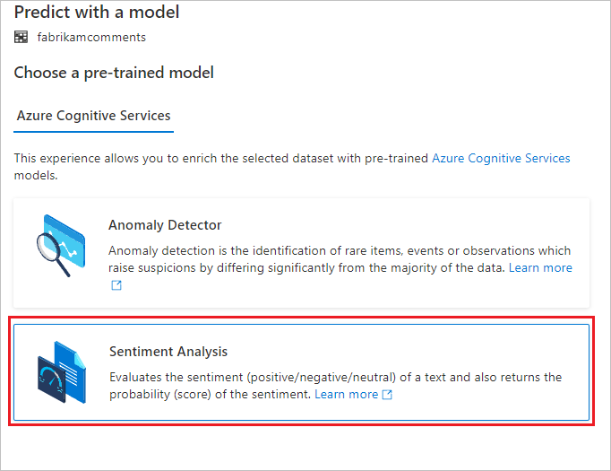
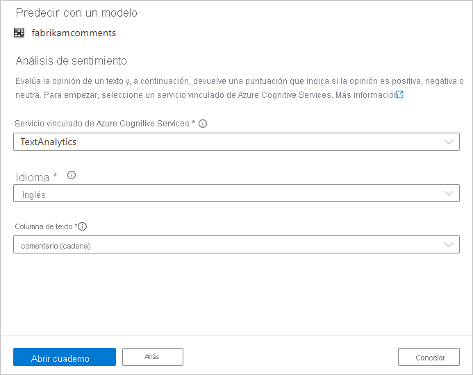

# <a name="tutorial-sentiment-analysis-with-cognitive-services"></a>Tutorial: Análisis de sentimiento con Cognitive Services

En este tutorial, aprenderá a enriquecer fácilmente los datos de Azure Synapse Analytics con [Azure Cognitive Services](../../cognitive-services/index.yml). Además, utilizará las funcionalidades de [Text Analytics](../../cognitive-services/text-analytics/index.yml) para realizar análisis de sentimientos. 

Los usuarios de Azure Synapse solo tienen que seleccionar una tabla que contenga una columna de texto para enriquecerla con sentimientos. Estos sentimientos pueden ser positivos, negativos, mixtos o neutros. También se devolverá una probabilidad.

Esta tutorial abarca lo siguiente:

> [!div class="checklist"]
> - Pasos para obtener un conjunto de datos de una tabla de Spark que contiene una columna de texto y realizar el análisis de sentimiento.
> - Uso de un asistente de Azure Synapse para enriquecer los datos con el servicio Text Analytics de Cognitive Services.

Si no tiene una suscripción a Azure, [cree una cuenta gratuita antes de empezar](https://azure.microsoft.com/free/).

## <a name="prerequisites"></a>Requisitos previos

- Necesitará un [área de trabajo de Azure Synapse Analytics](../get-started-create-workspace.md) con una cuenta de almacenamiento de Azure Data Lake Storage Gen2 que esté configurada como almacenamiento predeterminado. Asegúrese de que es el *colaborador de datos de Storage Blob* en el sistema de archivos de Data Lake Storage Gen2 con el que trabaja.
- Grupo de Spark en el área de trabajo de Azure Synapse Analytics. Para más información, consulte el artículo sobre [creación de un grupo de Spark en Azure Synapse](../quickstart-create-sql-pool-studio.md).
- Haber completado los pasos de configuración previos que se detallan en este tutorial sobre la [configuración de Cognitive Services en Azure Synapse](tutorial-configure-cognitive-services-synapse.md).

## <a name="sign-in-to-the-azure-portal"></a>Inicio de sesión en Azure Portal

Inicie sesión en [Azure Portal](https://portal.azure.com/).

## <a name="create-a-spark-table"></a>Creación de una tabla de Spark

En este tutorial, es necesario tener una tabla de Spark.

1. Descargue el archivo [FabrikamComments.csv](https://github.com/Kaiqb/KaiqbRepo0731190208/blob/master/CognitiveServices/TextAnalytics/FabrikamComments.csv), que contiene un conjunto de datos para analizar el texto. 

1. Cargue el archivo en la cuenta de almacenamiento de Azure Synapse que se encuentra en Data Lake Storage Gen2.
  
   

1. Cree una tabla de Spark a partir del archivo .csv; para ello, haga clic con el botón derecho en el archivo y seleccione **New Notebook** (Nuevo cuaderno) > **Create Spark table** (Crear tabla de Spark).

   

1. Asigne un nombre a la tabla en la celda de código y ejecute el cuaderno en un grupo de Spark. Recuerde que debe establecer `header=True`.

   

   ```python
   %%pyspark
   df = spark.read.load('abfss://default@azuresynapsesa.dfs.core.windows.net/data/FabrikamComments.csv', format='csv'
   ## If a header exists, uncomment the line below
   , header=True
   )
   df.write.mode("overwrite").saveAsTable("default.YourTableName")
   ```

## <a name="open-the-cognitive-services-wizard"></a>Inicio del asistente de Cognitive Services

1. Haga clic con el botón derecho en la tabla de Spark que creó en el procedimiento anterior. Seleccione **Machine Learning** > **Predict with a model** (Predecir con un modelo) para abrir el asistente.

   

2. Aparecerá un panel de configuración y se le pedirá que seleccione un modelo de Cognitive Services. Seleccione **Análisis de sentimiento**.

   

## <a name="configure-sentiment-analysis"></a>Configuración del análisis de sentimiento

A continuación, configure el análisis de sentimiento. Seleccione lo siguiente:
- **Servicio vinculado de Azure Cognitive Services**:como parte de los pasos de requisitos previos, ha creado un servicio vinculado a su instancia de [Cognitive Services](tutorial-configure-cognitive-services-synapse.md). Selecciónelo aquí.
- **Idioma**: seleccione **Inglés** como idioma del texto en el que desea realizar el análisis de sentimiento.
- **Columna de texto**: Seleccione **comment (string)** [comentario (string)] como la columna de texto del conjunto de datos que desea analizar para determinar el sentimiento.

Cuando haya terminado, seleccione **Open notebook** (Abrir cuaderno). Esto generará un cuaderno con el código de PySpark que realiza el análisis de sentimiento con Azure Cognitive Services.



## <a name="run-the-notebook"></a>Ejecución del cuaderno

El cuaderno que acaba de abrir utiliza la [biblioteca MMLSpark](https://github.com/microsoft/SynapseML) para conectarse a Cognitive Services. El servicio vinculado de Azure Cognitive Services que proporcionó le permite hacer referencia de forma segura a su servicio cognitivo desde esta experiencia sin revelar secretos.

 Ahora puede ejecutar todas las celdas para enriquecer los datos con sentimientos. Seleccione **Run all** (Ejecutar todas). 

Los sentimientos que se devuelven pueden ser **positivos**, **negativos**, **neutros** o **mixtos**. También se indicará la probabilidad de cada sentimiento. [Descubra más información sobre el análisis de sentimiento en Cognitive Services](../../cognitive-services/text-analytics/how-tos/text-analytics-how-to-sentiment-analysis.md).


## <a name="next-steps"></a>Pasos siguientes
- [Tutorial: Detección de anomalías con Azure Cognitive Services](tutorial-cognitive-services-anomaly.md)
- [Tutorial: Asistente para puntuación de modelos de Machine Learning en grupos de SQL dedicados de Azure Synapse](tutorial-sql-pool-model-scoring-wizard.md)
- [Funcionalidades de aprendizaje automático en Azure Synapse Analytics](what-is-machine-learning.md)
