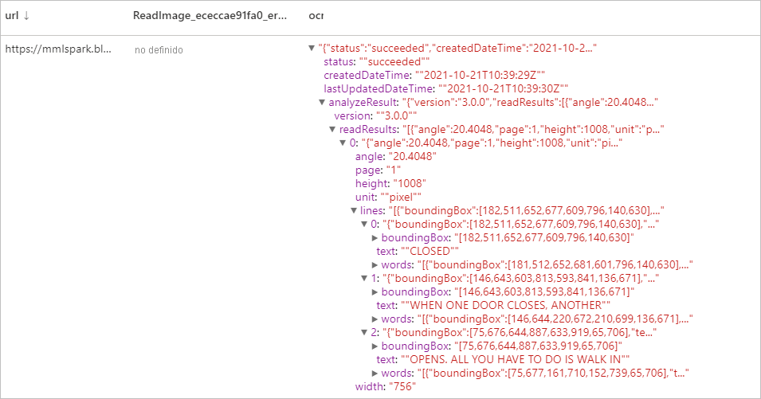

# <a name="tutorial-computer-vision-with-cognitive-service"></a>Tutorial: Computer Vision con Cognitive Service

[Computer Vision](../../cognitive-services/computer-vision/index.yml) es una instancia de [Azure Cognitive Service](../../cognitive-services/index.yml) que permite procesar imágenes y devolver información basada en las características visuales. En este tutorial, aprenderá a usar [Computer Vision](../../cognitive-services/computer-vision/index.yml) para analizar imágenes en Azure Synapse Analytics.

En este tutorial se muestra cómo usar el análisis de textos con [SynapseML](https://github.com/microsoft/SynapseML) para:

> [!div class="checklist"]
> - Extraer características visuales del contenido de la imagen
> - Reconocer caracteres de imágenes (OCR)
> - Analizar el contenido de imagen y generar miniaturas
> - Detectar e identificar contenido específico del dominio en una imagen
> - Generar etiquetas relacionadas con una imagen
> - Generar una descripción de una imagen completa en lenguaje natural


## <a name="analyze-image"></a>Analyze Image
Extrae un conjunto completo de características visuales basadas en el contenido de la imagen, como objetos, caras, contenido para adultos y descripciones de texto generado automáticamente. 
### <a name="example-input"></a>Entrada de ejemplo


```python
# Create a dataframe with the image URLs
df = spark.createDataFrame([
        ("<replace with your file path>/dog.jpg", )
    ], ["image", ])

# Run the Computer Vision service. Analyze Image extracts infortmation from/about the images.
analysis = (AnalyzeImage()
    .setLinkedService(cognitive_service_name)
    .setVisualFeatures(["Categories","Color","Description","Faces","Objects","Tags"])
    .setOutputCol("analysis_results")
    .setImageUrlCol("image")
    .setErrorCol("error"))

# Show the results of what you wanted to pull out of the images.
display(analysis.transform(df).select("image", "analysis_results.description.tags"))

```
### <a name="expected-results"></a>Resultados esperados

```json
["dog","outdoor","fence","wooden","small","brown","building","sitting","front","bench","standing","table","walking","board","beach","holding","bridge"]
```

## <a name="optical-character-recognition-ocr"></a>Reconocimiento óptico de caracteres (OCR)
Extraiga texto impreso, texto manuscrito, dígitos y símbolos de moneda de imágenes, como fotos de señales de tráfico y productos, así como de documentos tales como facturas, informes financieros, artículos, etc. Esta tecnología está optimizada para extraer texto de imágenes con mucho texto y de documentos PDF con varias páginas y una mezcla de idiomas. Es compatible con la detección de texto impreso y manuscrito en un mismo documento o una misma imagen.

### <a name="example-input"></a>Entrada de ejemplo


```python
df = spark.createDataFrame([
        ("<replace with your file path>/ocr.jpg", )
    ], ["url", ])

ri = (ReadImage()
    .setLinkedService(cognitive_service_name)
    .setImageUrlCol("url")
    .setOutputCol("ocr"))

display(ri.transform(df))
```
### <a name="expected-results"></a>Resultados esperados


## <a name="generate-thumbnails"></a>Generación de miniaturas
Analice el contenido de una imagen para generar una miniatura adecuada de la misma. En primer lugar, Computer Vision genera una miniatura de alta calidad y, después, analiza los objetos de la imagen para determinar el área de interés. Luego, Computer Vision recorta la imagen para ajustarla a los requisitos del área de interés. La miniatura generada se puede presentar con una relación de aspecto diferente de la de la imagen original en función de sus necesidades.

### <a name="example-input"></a>Entrada de ejemplo


```python
df = spark.createDataFrame([
        ("<replace with your file path>/satya.jpeg", )
    ], ["url", ])

gt =  (GenerateThumbnails()
    .setLinkedService(cognitive_service_name)
    .setHeight(50)
    .setWidth(50)
    .setSmartCropping(True)
    .setImageUrlCol("url")
    .setOutputCol("thumbnails"))

thumbnails = gt.transform(df).select("thumbnails").toJSON().first()

import json
img = json.loads(thumbnails)["thumbnails"]

displayHTML("")

```

### <a name="expected-results"></a>Resultados esperados


## <a name="tag-image"></a>Etiquetado de imagen
Genera una lista de palabras o etiquetas que son pertinentes para el contenido de la imagen proporcionada. Las etiquetas se devuelven en función de miles de objetos, seres vivos, paisajes o acciones reconocibles que se encuentran en las imágenes. Las etiquetas pueden contener sugerencias para evitar la ambigüedad o proporcionar un contexto; por ejemplo, la etiqueta "ascomiceto" puede venir acompañada de la sugerencia "hongo".

Sigamos usando la imagen de Satya como ejemplo.

```python
df = spark.createDataFrame([
        ("<replace with your file path>/satya.jpeg", )
    ], ["url", ])

ti = (TagImage()
    .setLinkedService(cognitive_service_name)
    .setImageUrlCol("url")
    .setOutputCol("tags"))

display(ti.transform(df))
```

### <a name="expected-result"></a>Resultado esperado


## <a name="describe-image"></a>Describe Image
Genere una descripción de toda una imagen en lenguaje natural, con frases completas. Los algoritmos de Computer Vision generan varias descripciones en función de los objetos identificados en la imagen. Cada una de estas descripciones se evalúa y se genera una puntuación de confianza. Después, se devuelve una lista de puntuaciones de confianza ordenadas de más alta a más baja.

Sigamos usando la imagen de Satya como ejemplo.

```python
df = spark.createDataFrame([
        ("<replace with your file path>/satya.jpeg", )
    ], ["url", ])

di = (DescribeImage()
    .setLinkedService(cognitive_service_name)
    .setMaxCandidates(3)
    .setImageUrlCol("url")
    .setOutputCol("descriptions"))

display(di.transform(df))
```
### <a name="expected-result"></a>Resultado esperado


## <a name="recognize-domain-specific-content"></a>Reconocer contenido específico del dominio
Use los modelos de dominio para detectar e identificar el contenido específico del dominio en una imagen, como celebridades y monumentos. Por ejemplo, si una imagen contiene personas, Computer Vision puede usar un modelo de dominio para celebridades para determinar si las personas que se han detectado en la imagen son famosos conocidos.

Sigamos usando la imagen de Satya como ejemplo.

```python

df = spark.createDataFrame([
        ("<replace with your file path>/satya.jpeg", )
    ], ["url", ])

celeb =  (RecognizeDomainSpecificContent()
    .setLinkedService(cognitive_service_name)
    .setModel("celebrities")
    .setImageUrlCol("url")
    .setOutputCol("celebs"))

display(celeb.transform(df))
```

### <a name="expected-result"></a>Resultado esperado


## <a name="clean-up-resources"></a>Limpieza de recursos
Para asegurarse de que se cierra la instancia de Spark, finalice todas las sesiones (cuadernos) conectadas. El grupo se cierra cuando se alcanza el **tiempo de inactividad** especificado en el grupo de Apache Spark. También puede decidir **finalizar la sesión** en la barra de estado en la parte superior derecha del cuaderno.


## <a name="next-steps"></a>Pasos siguientes

* [Consulte los cuadernos de ejemplo de Synapse](https://github.com/Azure-Samples/Synapse/tree/main/MachineLearning) 
* [Repositorio de GitHub de SynapseML](https://github.com/Azure/mmlspark)
