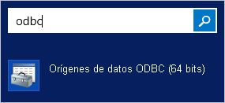
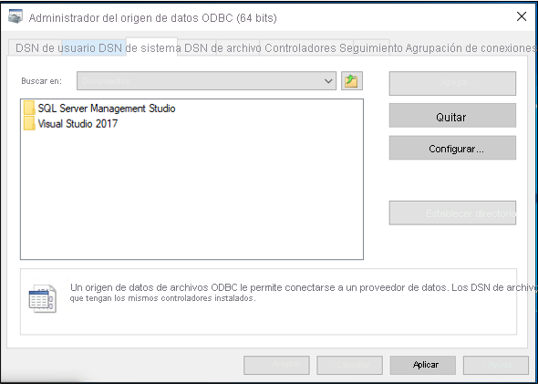
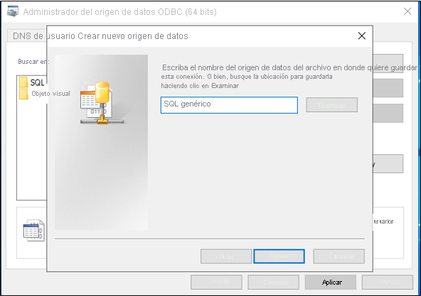
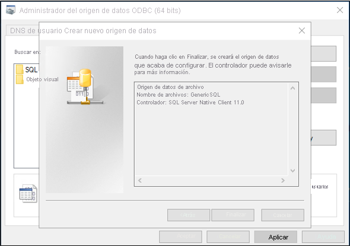
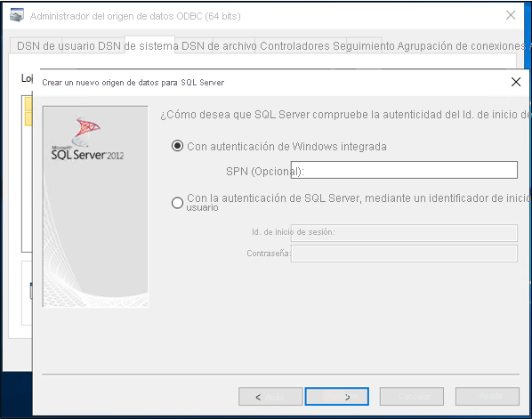
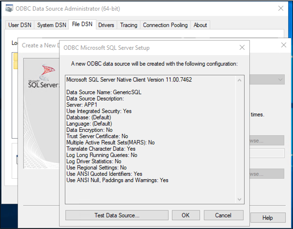
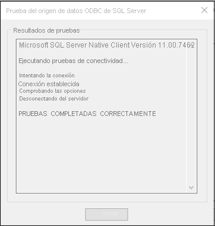

En este documento se describen los pasos que hay que realizar para aprovisionar y desaprovisionar automáticamente usuarios de Azure Active Directory (Azure AD) en una base de datos SQL.  
 
Para obtener información importante acerca de lo que hace este servicio, cómo funciona y ver preguntas frecuentes al respecto, consulte [Automatización del aprovisionamiento y desaprovisionamiento de usuarios para aplicaciones SaaS con Azure Active Directory](../articles/active-directory/app-provisioning/user-provisioning.md).

## <a name="prerequisites-for-provisioning-to-a-sql-database"></a>Requisitos previos para el aprovisionamiento de una instancia de SQL Database

>[!IMPORTANT]
> La versión preliminar de aprovisionamiento local se encuentra actualmente en una versión preliminar solo por invitación. Para solicitar acceso a la capacidad, use el [formulario de solicitud de acceso](https://aka.ms/onpremprovisioningpublicpreviewaccess). La versión preliminar estará a disposición de más clientes y conectores durante los próximos meses, cuando se prepare la disponibilidad general.


### <a name="on-premises-prerequisites"></a>Requisitos previos locales

 - Un sistema de destino, como una base de datos SQL, en el que se puedan crear, actualizar y eliminar usuarios.
 - Un equipo con Windows Server 2016 o posterior con una dirección TCP/IP accesible desde Internet, conectividad con el sistema de destino, y conectividad saliente a login.microsoftonline.com. Un ejemplo es una máquina virtual de Windows Server 2016 hospedada en IaaS de Azure o detrás de un proxy. El servidor debe tener al menos 3 GB de RAM.
 - Un equipo con .NET Framework 4.7.1.

En función de las opciones que seleccione, es posible que algunas de las pantallas del asistente no estén disponibles y que la información sea ligeramente diferente. Para los fines de esta configuración, se usa el tipo de objeto de usuario. Use la siguiente información como orientación para la configuración. 

#### <a name="supported-systems"></a>Sistemas compatibles
* Microsoft SQL Server y Azure SQL
* IBM DB2 10.x
* IBM DB2 9.x
* Oracle 10 y 11g
* Oracle 12c y 18c
* MySQL 5.x

Nota: El conector SQL genérico requiere que los nombres de columna no distingan entre mayúsculas y minúsculas. MySQL distingue mayúsculas de minúsculas en Linux y Postgres lo hace en todas las plataformas. Como resultado, no se admiten actualmente. 

### <a name="cloud-requirements"></a>Requisitos de la nube

 - Un inquilino de Azure AD con Azure AD Premium P1 o Premium P2 (o EMS E3 o E5). 
 
    [!INCLUDE [active-directory-p1-license.md](active-directory-p1-license.md)]
 - El rol Administrador híbrido para configurar el agente de aprovisionamiento y los roles administrador de aplicaciones o administrador de la nube para configurar el aprovisionamiento en Azure Portal.

## <a name="prepare-the-sample-database"></a>Preparación de la base de datos de ejemplo
En un servidor con SQL Server, ejecute el script SQL que se encuentra en el [Apéndice A](#appendix-a). Este script crea una base de datos de ejemplo con el nombre CONTOSO. Esta es la base de datos en la que se van a aprovisionar usuarios.


## <a name="create-the-dsn-connection-file"></a>Creación del archivo de conexión DNS
El conector SQL genérico es un archivo DSN para conectarse al servidor SQL. Primero hay que crear un archivo con la información de conexión ODBC.

 1. Inicie la utilidad de administración ODBC en el servidor.
     </br>
 2. Seleccione la pestaña **Archivo DNS** y luego **Agregar**. 
     </br>
 3. Seleccione **SQL Server Native Client 11.0** y luego **Siguiente**. 
     </br>
 4. Asigne un nombre al archivo, como **GenericSQL**, y seleccione **Siguiente**. 
     </br>
 5. Seleccione **Finalizar**. 
     </br>
 6. Ahora configure la conexión. Escriba **APP1** como nombre del servidor y seleccione **Siguiente**.
     </br>
 7. Mantenga la autenticación de Windows y seleccione **Siguiente**.
     </br>
 8. Escriba el nombre de la base de datos de ejemplo, que es **CONTOSO**.
     
 9. Mantenga los valores predeterminados de esta pantalla y seleccione **Finalizar**.
     </br>
 10. Para comprobar que todo funciona según lo previsto, seleccione **Probar origen de datos**. 
     </br>
 11. Asegúrese de que la prueba se ha realizado correctamente.
     </br>
 12. Seleccione **Aceptar** dos veces. Cierre el Administrador de orígenes de datos ODBC.


## <a name="download-install-and-configure-the-azure-ad-connect-provisioning-agent-package"></a>Descarga, instale y configure el paquete del agente de aprovisionamiento de Azure AD Connect

 1. Inicie sesión en Azure Portal.
 2. Vaya a **Aplicaciones empresariales** > **Agregar una nueva aplicación**.
 3. Busque la aplicación **ECMA local** y agréguela a la imagen del inquilino.
 4. Seleccione la **aplicación ECMA local** que agregó.
 5. En **Introducción**, en **3. Aprovisionar cuentas de usuario**, seleccione **Comenzar**.
 6. En la parte superior, seleccione **Editar aprovisionamiento**.
 7. En **Conectividad local**, descargue el agente de aprovisionamiento.     
     >[!NOTE]
     >Use diferentes agentes de aprovisionamiento para el aprovisionamiento de aplicaciones locales y el aprovisionamiento de Azure AD Connect Cloud Sync o el aprovisionamiento controlado por RR.HH. No se deben administrar los tres escenarios en el mismo agente. 
 8. Ejecute el instalador de aprovisionamiento de Azure AD Connect, **AADConnectProvisioningAgentSetup.msi**.
 9. En la pantalla **Paquete del agente de aprovisionamiento de Microsoft Azure AD Connect**, acepte los términos de la licencia y seleccione **Instalar**.
     </br>
 10. Una vez finalizada esta operación, se inicia el Asistente para configuración. Seleccione **Siguiente**.
     </br>
 11. En la pantalla **Seleccionar extensión**, seleccione **Aprovisionamiento de aplicaciones locales (de Azure AD a la aplicación)** . Seleccione **Siguiente**.
     </br>
 12. Use la cuenta de administrador global para iniciar sesión en Azure AD.
     </br>
 13. En la pantalla **Configuración del agente**, seleccione **Confirmar**.
     </br>
 14. Una vez completada la instalación, debería ver un mensaje en la parte inferior del asistente. Seleccione **Salir**.
     </br>
 15. Vuelva a la página Azure Portal en la **aplicación ECMA local** y vuelva a **Editar aprovisionamiento**.
 16. En la página **Aprovisionamiento**, cambie el modo a **Automático**.
     </br>
 17. En la sección **Conectividad local**, seleccione el agente que acaba de implementar y luego **Asignar agentes**.
     </br>
     >[!NOTE]
     >Después de agregar el agente, espere 10 minutos a que se complete el registro. La prueba de conectividad no funciona hasta que se completa el registro.
     >
     >Como alternativa, puede reiniciar el agente de aprovisionamiento en el servidor para forzar que el registro del agente se complete. Vaya al servidor, busque **servicios** en la barra de búsqueda de Windows, identifique el **servicio del agente de aprovisionamiento de Azure AD Connect**, haga clic con el botón derecho en el servicio y reinicie.

  
 ## <a name="configure-the-azure-ad-ecma-connector-host-certificate"></a>Configuración del certificado de host del conector ECMA de Azure AD
 1. En el escritorio, seleccione el acceso directo ECMA.
 2. Una vez que se inicie la configuración del host del conector ECMA, deje el puerto predeterminado **8585** y seleccione **Generar** para generar un certificado. El certificado autogenerado se firma automáticamente como parte de la raíz de confianza. SAN coincide con el nombre de host.
     
 3. Seleccione **Guardar**.

## <a name="create-a-generic-sql-connector"></a>Creación de un conector SQL genérico
 1. Seleccione el acceso directo Host del conector ECMA en el escritorio.
 2. Seleccione **Nuevo conector**.
     </br>
 3. En la página **Propiedades**, rellene los cuadros con los valores especificados en la tabla que sigue a la imagen y seleccione **Siguiente**.
     

     |Propiedad|Value|
     |-----|-----|
     |Nombre|SQL|
     |Temporizador de sincronización automática (minutos)|120|
     |Token secreto|Escriba aquí su propia clave. Debe tener un mínimo de 12 caracteres.|
     |DLL de extensión|Para un conector SQL genérico, seleccione **Microsoft.IAM.Connector.GenericSql.dll**.|
4. En la página **Conectividad**, rellene los cuadros con los valores especificados en la tabla que sigue a la imagen y seleccione **Siguiente**.
     </br>
     
     |Propiedad|Descripción|
     |-----|-----|
     |Archivo DSN|El nombre del archivo de origen de datos que se usa para conectarse a la instancia de SQL Server.|
     |Nombre de usuario|El nombre de usuario de una persona con derechos para la instancia de SQL Server. Debe tener el formato hostname\sqladminaccount para servidores independientes o domain\sqladminaccount para servidores miembros del dominio.|
     |Contraseña|Contraseña del nombre de usuario que acaba de proporcionar.|
     |DN es el Delimitador|A menos que sepa que el entorno requiere esta configuración, no active las casillas **DN es el Delimitador** y **Export Type:Object Replace**.|
 5. En la página **Esquema 1**, rellene los cuadros con los valores especificados en la tabla que sigue a la imagen y seleccione **Siguiente**.
     </br>

     |Propiedad|Value|
     |-----|-----|
     |Método de detección de tipo de objeto|Fixed Value|
     |Lista de valores fijos/Tabla/Vista/SP|Usuario|
 6. En la página **Esquema 2**, rellene los cuadros con los valores especificados en la tabla que sigue a la imagen y seleccione **Siguiente**.
     </br>
 
     |Propiedad|Value|
     |-----|-----|
     |User:Attribute Detection|Tabla|
     |User:Table/View/SP|Employees|
 7. En la página **Esquema 3**, rellene los cuadros con los valores especificados en la tabla que sigue a la imagen y seleccione **Siguiente**.
     

     |Propiedad|Descripción|
     |-----|-----|
     |Seleccionar un delimitador para User|User:ContosoLogin|
     |Seleccionar atributo DN para User|AzureID|
8. En la página **Esquema 4**, deje los valores predeterminados y seleccione **Siguiente**.
     </br>
 9. En la página **Global**, rellene los cuadros y seleccione **Siguiente**. Use la tabla que sigue a la imagen como guía sobre los cuadros individuales.
     </br>
     
     |Propiedad|Descripción|
     |-----|-----|
     |Formato de fecha y hora del origen de datos|aaaa/MM/dd HH:mm:ss|
 10. En la página **Particiones**, seleccione **Siguiente**.
     </br>
 11. En la página **Perfiles de ejecución**, mantenga activada la casilla **Exportar**. Active la casilla **Importación completa** y seleccione **Siguiente**.
     </br>
     
     |Propiedad|Descripción|
     |-----|-----|
     |Exportación|Perfil de ejecución que exportará datos a SQL. Este perfil de ejecución es obligatorio.|
     |Importación completa|Perfil de ejecución que importará todos los datos de orígenes SQL especificados anteriormente.|
     |Importación diferencial|Perfil de ejecución que importará solo los cambios de SQL desde la última importación completa o diferencial.|
 12. En la página **Exportar**, rellene los cuadros y seleccione **Siguiente**. Use la tabla que sigue a la imagen como guía sobre los cuadros individuales. 
     </br>
     
     |Propiedad|Descripción|
     |-----|-----|
     |Método de operación|Tabla|
     |Tabla/Vista/SP|Employees|
 13. En la página **Importación completa**, rellene los cuadros y seleccione **Siguiente**. Use la tabla que sigue a la imagen como guía sobre los cuadros individuales. 
     </br>
     
     |Propiedad|Descripción|
     |-----|-----|
     |Método de operación|Tabla|
     |Tabla/Vista/SP|Employees|
 14. En la página **Tipos de objeto**, rellene los cuadros y seleccione **Siguiente**. Use la tabla que sigue a la imagen como guía sobre los cuadros individuales.   
      - **Delimitador**: este atributo debe ser único en el sistema de destino. El servicio de aprovisionamiento de Azure AD consulta al host ECMA mediante este atributo después del ciclo inicial. Este valor de delimitador debe ser igual que el valor de delimitador del esquema 3.
      - **Atributo de consulta**: lo usa el host ECMA para consultar la caché en memoria. Este atributo debe ser único.
      - **DN**: la opción **Generado automáticamente** debe seleccionarse en la mayoría de los casos. Si no está seleccionada, asegúrese de que el atributo DN esté asignado a un atributo de Azure AD que almacene el DN en este formato: CN = anchorValue, Object = objectType.  Para obtener información adicional sobre los delimitadores y el DN, consulte [Acerca de los atributos de anclaje y los nombres distintivos](../articles/active-directory/app-provisioning/on-premises-application-provisioning-architecture.md#about-anchor-attributes-and-distinguished-names).
     </br>
     
     |Propiedad|Descripción|
     |-----|-----|
     |Objeto de destino|Usuario|
     |Delimitador|ContosoLogin|
     |Atributo de consulta|AzureID|
     |DN|AzureID|
     |Generado automáticamente|Activada|      
 15. El host ECMA detecta los atributos que admite el sistema de destino. Puede elegir cuál de esos atributos desea exponer a Azure AD. A continuación, estos atributos se pueden configurar en Azure Portal para el aprovisionamiento. En la página **Seleccionar atributos**, agregue todos los atributos en la lista desplegable y seleccione **Siguiente**. 
     </br>
      La lista desplegable **Atributo** muestra cualquier atributo que se haya detectado en el sistema de destino y que *no* se haya elegido en la página **Seleccionar atributos** anterior. 
 
 16. En la página **Desaprovisionando**, en **Deshabilitar flujo**, seleccione **Eliminar**. Tenga en cuenta que los atributos seleccionados en la página anterior no estarán disponibles para seleccionar en la página Desaprovisionando. Seleccione **Finalizar**.
     </br>


## <a name="ensure-the-ecma2host-service-is-running"></a>Comprobación de que el servicio ECMA2Host se está ejecutando
 1. En el servidor en el que se ejecuta el host del conector ECMA de Azure AD, seleccione **Iniciar**.
 2. Escriba **run** y luego **services.msc** en el cuadro.
 3. En la lista **Servicios**, asegúrese de que **Microsoft ECMA2Host** esté presente y en ejecución. Si no es así, seleccione **Iniciar**.
     


## <a name="test-the-application-connection"></a>Prueba de la conexión con la aplicación
 1. Inicie sesión en Azure Portal.
 2. Vaya a **Aplicaciones empresariales** y seleccione la **aplicación ECMA local**.
 3. Vaya a **Editar aprovisionamiento**.
 4. Pasados 10 minutos, en la sección **Credenciales de administración**, escriba la siguiente dirección URL. Reemplace la parte `{connectorName}` por el nombre del conector en el host ECMA. También puede reemplazar `localhost` por el nombre de host.

 |Propiedad|Valor|
 |-----|-----|
 |URL de inquilino|https://localhost:8585/ecma2host_{connectorName}/scim|
 
 5. Escriba el valor de **Token secreto** que ha definido al crear el conector.
 6. Seleccione **Probar conexión** y espere un minuto.
     
 7. Una vez que se supere la prueba de conexión, seleccione **Guardar**.</br>
     
## <a name="assign-users-to-an-application"></a>Asignación de usuarios a una aplicación
Ahora que el host del conector ECMA de Azure AD ya se comunica con Azure AD, puede pasar a configurar quién está dentro del ámbito de aprovisionamiento. 

 1. En Azure Portal, seleccione **Aplicaciones empresariales**.
 2. Seleccione la aplicación **Aprovisionamiento local**.
 3. A la izquierda, en **Administrar**, seleccione **Usuarios y grupos**.
 4. Seleccione **Agregar usuario o grupo**.
     
5. En **Usuarios**, seleccione **Ninguno seleccionado**.
     
 6. Seleccione usuarios de la derecha y luego el botón **Seleccionar**.</br>
     
 7. Ahora seleccione **Asignar**.
     

## <a name="configure-attribute-mappings"></a>configuración de las asignaciones de atributos
Ahora debe asignar atributos entre la aplicación local y el servidor SQL.

#### <a name="configure-attribute-mapping"></a>Configuración de la asignación de atributos
 1. En el portal de Azure AD, en **Aplicaciones empresariales**, seleccione la página **Aprovisionamiento**.
 2. Seleccione **Comenzar**.
 3. Expanda **Asignaciones** y seleccione **Aprovisionar usuarios de Azure Active Directory**.
     </br>
4. Seleccione **Agregar nueva asignación**.
     </br>
 5. Especifique los atributos de origen y destino y agregue todas las asignaciones de la tabla siguiente.
     </br>
     
     |Tipo de asignación|Atributo de origen|Atributo de destino|
     |-----|-----|-----|
     |Directo|userPrincipalName|urn:ietf:params:scim:schemas:extension:ECMA2Host:2.0:User:ContosoLogin|
     |Directo|objectID|urn:ietf:params:scim:schemas:extension:ECMA2Host:2.0:User:AzureID|
     |Directo|mail|urn:ietf:params:scim:schemas:extension:ECMA2Host:2.0:User:Email|
     |Directo|givenName|urn:ietf:params:scim:schemas:extension:ECMA2Host:2.0:User:FirstName|
     |Directo|surName|urn:ietf:params:scim:schemas:extension:ECMA2Host:2.0:User:LastName|
     |Directo|mailNickname|urn:ietf:params:scim:schemas:extension:ECMA2Host:2.0:User:textID|
 
 6. Seleccione **Guardar**.
     
## <a name="test-provisioning"></a>Prueba del aprovisionamiento
Ahora que los atributos están asignados, puede probar el aprovisionamiento a petición con uno de los usuarios.
 
 1. En Azure Portal, seleccione **Aplicaciones empresariales**.
 2. Seleccione la aplicación **Aprovisionamiento local**.
 3. A la izquierda, seleccione **Aprovisionamiento**.
 4. Seleccione **Aprovisionamiento a petición**.
 5. Busque alguno de los usuarios de prueba y seleccione **Aprovisionar**.
     

## <a name="start-provisioning-users"></a>Inicio del aprovisionamiento de usuarios
 1. Una vez que el aprovisionamiento a petición se realice correctamente, vuelva a la página de configuración del aprovisionamiento. Asegúrese de que el ámbito esté establecido solo en los usuarios y grupos asignados, **active el aprovisionamiento** y seleccione **Guardar**.
 
    
2. Espere varios minutos para que se inicie el aprovisionamiento. Puede tardar hasta 40 minutos. Una vez completado el trabajo de aprovisionamiento, como se explica en la sección siguiente, puede **desactivar el estado de aprovisionamiento** y seleccionar **Guardar**. Esta acción evita que el servicio de aprovisionamiento se ejecute en el futuro.

## <a name="check-that-users-were-successfully-provisioned"></a>Comprobación de aprovisionamiento correcto de los usuarios
Después de esperar, compruebe la base de datos SQL para asegurarse de que los usuarios se están aprovisionando.

 

## <a name="appendix-a"></a>Apéndice A
Use el siguiente script SQL para crear la base de datos de ejemplo.

```SQL
---Creating the Database---------
Create Database CONTOSO
Go
-------Using the Database-----------
Use [CONTOSO]
Go
-------------------------------------

/****** Object:  Table [dbo].[Employees]    Script Date: 1/6/2020 7:18:19 PM ******/
SET ANSI_NULLS ON
GO

SET QUOTED_IDENTIFIER ON
GO

CREATE TABLE [dbo].[Employees](
    [ContosoLogin] [nvarchar](128) NULL,
    [FirstName] [nvarchar](50) NOT NULL,
    [LastName] [nvarchar](50) NOT NULL,
    [Email] [nvarchar](128) NULL,
    [InternalGUID] [uniqueidentifier] NULL,
    [AzureID] [uniqueidentifier] NULL,
    [textID] [nvarchar](128) NULL
) ON [PRIMARY]
GO

ALTER TABLE [dbo].[Employees] ADD  CONSTRAINT [DF_Employees_InternalGUID]  DEFAULT (newid()) FOR [InternalGUID]
GO

```


